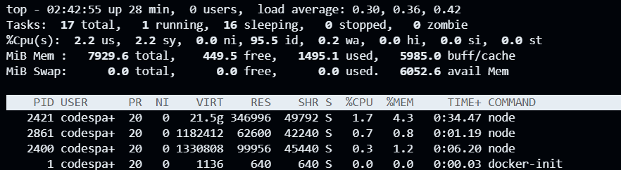

# OSProject Running Containers for Application Development

Group Name: __OS yeay__

Section: __1__ 

Team Mates:
1. __Ahmad Arif Aiman bin Ahmad Fauzi__ and __2113419__
2. __Nursyazira binti Mohd Naim__ and __2214076__
3. __Nur Raihan Syazwani binti Suhaimi__ and __2213262__
4. __Khairul Najmi bin Khairul Azam__ and __2016671__

## Forking this OS project repository

***Questions:***

1. What is the link of the fork OSProject in your repository. ***(1 mark)*** __https://github.com/aimaaan/OSProject.git__.
2. How many files and folders are in this repository. ***(1 mark)*** __1 files(README.md) and 1 folder(images)__.

## Exploring github codespaces

***Questions:***

1. What is default OS used to run the virtual environment for codespaces. ***(1 mark)*** __Ubuntu Linux__.
2. What are the two options of ram, disk and vcpu configuration you can have in running codespaces . ***(1 mark)*** __2 cores, 8 GB RAM, and 32 GB storage, up to 32 cores, 64 GB RAM, and 128 GB storage.__.
3. Why must we commit and sync our current work on source control? ***(1 mark)*** __Committing and syncing your work in source control is important because it keeps a record of all changes, helps team members work together, and protects your work from being lost. It also allows for automatic testing and deployment, keeps track of who made which changes, and helps resolve any conflicts early. Regular updates ensure everyone is on the same page and the project runs smoothly.__.

## Exploring the Terminal

1. Look at the TERMINAL tab. Explore and run commands according to the questions below. 
2. You can include your answers as images, or cut and paste the output here. If you are cutting and pasting your answers, wrap your answers in the codeblock clause in markdown. For example, if i run the command **whoami** the the output would look like the one below.
```bash
@joeynor ➜ /workspaces/OSProject (main) $ whoami 
codespace
```


***Questions:***

Look at the TERMINAL tab. Run the following commands and provide the output here. 

1. Run the command **pwd** . ***(1 mark)*** 
```bash
najmiazam@najmiazam-VirtualBox:~$ pwd
/home/najmiazam
```

2. Run the command **cat /etc/passwd** . ***(1 mark)*** 
```bash
najmiazam@najmiazam-VirtualBox:~$ cat /etc/passwd

root:x:0:0:root:/root:/bin/bash

daemon:x:1:1:daemon:/usr/sbin:/usr/sbin/nologin

bin:x:2:2:bin:/bin:/usr/sbin/nologin

sys:x:3:3:sys:/dev:/usr/sbin/nologin

sync:x:4:65534:sync:/bin:/bin/sync

games:x:5:60:games:/usr/games:/usr/sbin/nologin

man:x:6:12:man:/var/cache/man:/usr/sbin/nologin

lp:x:7:7:lp:/var/spool/lpd:/usr/sbin/nologin

mail:x:8:8:mail:/var/mail:/usr/sbin/nologin

news:x:9:9:news:/var/spool/news:/usr/sbin/nologin

uucp:x:10:10:uucp:/var/spool/uucp:/usr/sbin/nologin

proxy:x:13:13:proxy:/bin:/usr/sbin/nologin

www-data:x:33:33:www-data:/var/www:/usr/sbin/nologin

backup:x:34:34:backup:/var/backups:/usr/sbin/nologin

list:x:38:38:Mailing List Manager:/var/list:/usr/sbin/nologin

irc:x:39:39:ircd:/run/ircd:/usr/sbin/nologin

gnats:x:41:41:Gnats Bug-Reporting System (admin):/var/lib/gnats:/usr/sbin/nologin

nobody:x:65534:65534:nobody:/nonexistent:/usr/sbin/nologin

systemd-network:x:100:102:systemd Network Management,,,:/run/systemd:/usr/sbin/nologin

systemd-resolve:x:101:103:systemd Resolver,,,:/run/systemd:/usr/sbin/nologin

messagebus:x:102:105::/nonexistent:/usr/sbin/nologin

systemd-timesync:x:103:106:systemd Time Synchronization,,,:/run/systemd:/usr/sbin/nologin

syslog:x:104:111::/home/syslog:/usr/sbin/nologin

_apt:x:105:65534::/nonexistent:/usr/sbin/nologin

tss:x:106:113:TPM software stack,,,:/var/lib/tpm:/bin/false

uuidd:x:107:116::/run/uuidd:/usr/sbin/nologin

systemd-oom:x:108:117:systemd Userspace OOM Killer,,,:/run/systemd:/usr/sbin/nologin

tcpdump:x:109:118::/nonexistent:/usr/sbin/nologin

avahi-autoipd:x:110:119:Avahi autoip daemon,,,:/var/lib/avahi-autoipd:/usr/sbin/nologin

usbmux:x:111:46:usbmux daemon,,,:/var/lib/usbmux:/usr/sbin/nologin

dnsmasq:x:112:65534:dnsmasq,,,:/var/lib/misc:/usr/sbin/nologin

kernoops:x:113:65534:Kernel Oops Tracking Daemon,,,:/:/usr/sbin/nologin

avahi:x:114:121:Avahi mDNS daemon,,,:/run/avahi-daemon:/usr/sbin/nologin

cups-pk-helper:x:115:122:user for cups-pk-helper service,,,:/home/cups-pk-helper:/usr/sbin/nologin

rtkit:x:116:123:RealtimeKit,,,:/proc:/usr/sbin/nologin

whoopsie:x:117:124::/nonexistent:/bin/false

sssd:x:118:125:SSSD system user,,,:/var/lib/sss:/usr/sbin/nologin

speech-dispatcher:x:119:29:Speech Dispatcher,,,:/run/speech-dispatcher:/bin/false

fwupd-refresh:x:120:126:fwupd-refresh user,,,:/run/systemd:/usr/sbin/nologin

nm-openvpn:x:121:127:NetworkManager OpenVPN,,,:/var/lib/openvpn/chroot:/usr/sbin/nologin

saned:x:122:129::/var/lib/saned:/usr/sbin/nologin

colord:x:123:130:colord colour management daemon,,,:/var/lib/colord:/usr/sbin/nologin

geoclue:x:124:131::/var/lib/geoclue:/usr/sbin/nologin

pulse:x:125:132:PulseAudio daemon,,,:/run/pulse:/usr/sbin/nologin

gnome-initial-setup:x:126:65534::/run/gnome-initial-setup/:/bin/false

hplip:x:127:7:HPLIP system user,,,:/run/hplip:/bin/false

gdm:x:128:134:Gnome Display Manager:/var/lib/gdm3:/bin/false

najmiazam:x:1000:1000:Najmi's virtual box,,,:/home/najmiazam:/bin/bash

haproxy:x:129:138::/var/lib/haproxy:/usr/sbin/nologin

memcache:x:130:139:Memcached,,,:/nonexistent:/bin/false

sshd:x:131:65534::/run/sshd:/usr/sbin/nologin

postgres:x:132:140:PostgreSQL administrator,,,:/var/lib/postgresql:/bin/bash

pcp:x:999:999:Performance Co-Pilot:/var/lib/pcp:/usr/sbin/nologin

epmd:x:133:141::/run/epmd:/usr/sbin/nologin

rabbitmq:x:134:142:RabbitMQ messaging server,,,:/var/lib/rabbitmq:/usr/sbin/nologin

mysql:x:135:143:MySQL Server,,,:/nonexistent:/bin/false

systemd-coredump:x:136:144:systemd Core Dumper,,,:/run/systemd:/usr/sbin/nologin

swtpm:x:137:145:virtual TPM software stack,,,:/var/lib/swtpm:/bin/false

libvirt-qemu:x:64055:109:Libvirt Qemu,,,:/var/lib/libvirt:/usr/sbin/nologin

libvirt-dnsmasq:x:138:147:Libvirt Dnsmasq,,,:/var/lib/libvirt/dnsmasq:/usr/sbin/nologin

vboxadd:x:998:1::/var/run/vboxadd:/bin/false

```
3. Run the command **df** . ***(1 mark)*** 
```bash
najmiazam@najmiazam-VirtualBox:~$ df
Filesystem     1K-blocks     Used Available Use% Mounted on
tmpfs             504752     1784    502968   1% /run
/dev/sda3       25106692 19061660   4744348  81% /
tmpfs            2523756        0   2523756   0% /dev/shm
tmpfs               5120        4      5116   1% /run/lock
tmpfs            2523756        0   2523756   0% /run/qemu
/dev/sda2         524252     6220    518032   2% /boot/efi
tmpfs             504748      108    504640   1% /run/user/1000
/dev/sr0           51648    51648         0 100% /media/najmiazam/VBox_GAs_7.0.18
```
4. Run the command **du** . ***(1 mark)***.
```bash
najmiazam@najmiazam-VirtualBox:~$ du
4	./Downloads

4	./Documents

4	./Desktop

4	./Pictures

4	./.local/share/gnome-settings-daemon

4	./.local/share/nano

4	./.local/share/ibus-table

12	./.local/share/gnome-shell

8	./.local/share/virtualenv/py_info/1

12	./.local/share/virtualenv/py_info

7980	./.local/share/virtualenv/wheel/house

16	./.local/share/virtualenv/wheel/3.10/embed/3

20	./.local/share/virtualenv/wheel/3.10/embed

116	./.local/share/virtualenv/wheel/3.10/image/1/CopyPipInstall/pip-24.0-py3-none-any/pip-24.0.dist-info

76	./.local/share/virtualenv/wheel/3.10/image/1/CopyPipInstall/pip-24.0-py3-none-any/pip/_internal/vcs

28	./.local/share/virtualenv/wheel/3.10/image/1/CopyPipInstall/pip-24.0-py3-none-any/pip/_internal/distributions

84	./.local/share/virtualenv/wheel/3.10/image/1/CopyPipInstall/pip-24.0-py3-none-any/pip/_internal/models

40	./.local/share/virtualenv/wheel/3.10/image/1/CopyPipInstall/pip-24.0-py3-none-any/pip/_internal/locations

180	./.local/share/virtualenv/wheel/3.10/image/1/CopyPipInstall/pip-24.0-py3-none-any/pip/_internal/utils

124	./.local/share/virtualenv/wheel/3.10/image/1/CopyPipInstall/pip-24.0-py3-none-any/pip/_internal/cli

32	./.local/share/virtualenv/wheel/3.10/image/1/CopyPipInstall/pip-24.0-py3-none-any/pip/_internal/metadata/importlib

88	./.local/share/virtualenv/wheel/3.10/image/1/CopyPipInstall/pip-24.0-py3-none-any/pip/_internal/metadata

80	./.local/share/virtualenv/wheel/3.10/image/1/CopyPipInstall/pip-24.0-py3-none-any/pip/_internal/index

80	./.local/share/virtualenv/wheel/3.10/image/1/CopyPipInstall/pip-24.0-py3-none-any/pip/_internal/network

36	./.local/share/virtualenv/wheel/3.10/image/1/CopyPipInstall/pip-24.0-py3-none-any/pip/_internal/operations/build

40	./.local/share/virtualenv/wheel/3.10/image/1/CopyPipInstall/pip-24.0-py3-none-any/pip/_internal/operations/install

128	./.local/share/virtualenv/wheel/3.10/image/1/CopyPipInstall/pip-24.0-py3-none-any/pip/_internal/operations

156	./.local/share/virtualenv/wheel/3.10/image/1/CopyPipInstall/pip-24.0-py3-none-any/pip/_internal/commands

116	./.local/share/virtualenv/wheel/3.10/image/1/CopyPipInstall/pip-24.0-py3-none-any/pip/_internal/req

116	./.local/share/virtualenv/wheel/3.10/image/1/CopyPipInstall/pip-24.0-py3-none-any/pip/_internal/resolution/resolvelib

28	./.local/share/virtualenv/wheel/3.10/image/1/CopyPipInstall/pip-24.0-py3-none-any/pip/_internal/resolution/legacy

152	./.local/share/virtualenv/wheel/3.10/image/1/CopyPipInstall/pip-24.0-py3-none-any/pip/_internal/resolution

1440	./.local/share/virtualenv/wheel/3.10/image/1/CopyPipInstall/pip-24.0-py3-none-any/pip/_internal

128	./.local/share/virtualenv/wheel/3.10/image/1/CopyPipInstall/pip-24.0-py3-none-any/pip/_vendor/packaging

76	./.local/share/virtualenv/wheel/3.10/image/1/CopyPipInstall/pip-24.0-py3-none-any/pip/_vendor/platformdirs

288	./.local/share/virtualenv/wheel/3.10/image/1/CopyPipInstall/pip-24.0-py3-none-any/pip/_vendor/idna

220	./.local/share/virtualenv/wheel/3.10/image/1/CopyPipInstall/pip-24.0-py3-none-any/pip/_vendor/requests

40	./.local/share/virtualenv/wheel/3.10/image/1/CopyPipInstall/pip-24.0-py3-none-any/pip/_vendor/urllib3/contrib/_securetransport

132	./.local/share/virtualenv/wheel/3.10/image/1/CopyPipInstall/pip-24.0-py3-none-any/pip/_vendor/urllib3/contrib

16	./.local/share/virtualenv/wheel/3.10/image/1/CopyPipInstall/pip-24.0-py3-none-any/pip/_vendor/urllib3/packages/backports

56	./.local/share/virtualenv/wheel/3.10/image/1/CopyPipInstall/pip-24.0-py3-none-any/pip/_vendor/urllib3/packages

128	./.local/share/virtualenv/wheel/3.10/image/1/CopyPipInstall/pip-24.0-py3-none-any/pip/_vendor/urllib3/util

488	./.local/share/virtualenv/wheel/3.10/image/1/CopyPipInstall/pip-24.0-py3-none-any/pip/_vendor/urllib3

56	./.local/share/virtualenv/wheel/3.10/image/1/CopyPipInstall/pip-24.0-py3-none-any/pip/_vendor/msgpack

8	./.local/share/virtualenv/wheel/3.10/image/1/CopyPipInstall/pip-24.0-py3-none-any/pip/_vendor/chardet/cli

20	./.local/share/virtualenv/wheel/3.10/image/1/CopyPipInstall/pip-24.0-py3-none-any/pip/_vendor/chardet/metadata

1192	./.local/share/virtualenv/wheel/3.10/image/1/CopyPipInstall/pip-24.0-py3-none-any/pip/_vendor/chardet

48	./.local/share/virtualenv/wheel/3.10/image/1/CopyPipInstall/pip-24.0-py3-none-any/pip/_vendor/webencodings

44	./.local/share/virtualenv/wheel/3.10/image/1/CopyPipInstall/pip-24.0-py3-none-any/pip/_vendor/tomli

20	./.local/share/virtualenv/wheel/3.10/image/1/CopyPipInstall/pip-24.0-py3-none-any/pip/_vendor/pyproject_hooks/_in_process

44	./.local/share/virtualenv/wheel/3.10/image/1/CopyPipInstall/pip-24.0-py3-none-any/pip/_vendor/pyproject_hooks

20	./.local/share/virtualenv/wheel/3.10/image/1/CopyPipInstall/pip-24.0-py3-none-any/pip/_vendor/cachecontrol/caches

92	./.local/share/virtualenv/wheel/3.10/image/1/CopyPipInstall/pip-24.0-py3-none-any/pip/_vendor/cachecontrol

296	./.local/share/virtualenv/wheel/3.10/image/1/CopyPipInstall/pip-24.0-py3-none-any/pip/_vendor/certifi

8	./.local/share/virtualenv/wheel/3.10/image/1/CopyPipInstall/pip-24.0-py3-none-any/pip/_vendor/resolvelib/compat

60	./.local/share/virtualenv/wheel/3.10/image/1/CopyPipInstall/pip-24.0-py3-none-any/pip/_vendor/resolvelib

28	./.local/share/virtualenv/wheel/3.10/image/1/CopyPipInstall/pip-24.0-py3-none-any/pip/_vendor/pyparsing/diagram

408	./.local/share/virtualenv/wheel/3.10/image/1/CopyPipInstall/pip-24.0-py3-none-any/pip/_vendor/pyparsing

64	./.local/share/virtualenv/wheel/3.10/image/1/CopyPipInstall/pip-24.0-py3-none-any/pip/_vendor/distro

80	./.local/share/virtualenv/wheel/3.10/image/1/CopyPipInstall/pip-24.0-py3-none-any/pip/_vendor/tenacity

1048	./.local/share/virtualenv/wheel/3.10/image/1/CopyPipInstall/pip-24.0-py3-none-any/pip/_vendor/rich

1156	./.local/share/virtualenv/wheel/3.10/image/1/CopyPipInstall/pip-24.0-py3-none-any/pip/_vendor/distlib

112	./.local/share/virtualenv/wheel/3.10/image/1/CopyPipInstall/pip-24.0-py3-none-any/pip/_vendor/pkg_resources

168	./.local/share/virtualenv/wheel/3.10/image/1/CopyPipInstall/pip-24.0-py3-none-any/pip/_vendor/pygments/formatters

8	./.local/share/virtualenv/wheel/3.10/image/1/CopyPipInstall/pip-24.0-py3-none-any/pip/_vendor/pygments/styles

44	./.local/share/virtualenv/wheel/3.10/image/1/CopyPipInstall/pip-24.0-py3-none-any/pip/_vendor/pygments/filters

144	./.local/share/virtualenv/wheel/3.10/image/1/CopyPipInstall/pip-24.0-py3-none-any/pip/_vendor/pygments/lexers

568	./.local/share/virtualenv/wheel/3.10/image/1/CopyPipInstall/pip-24.0-py3-none-any/pip/_vendor/pygments

44	./.local/share/virtualenv/wheel/3.10/image/1/CopyPipInstall/pip-24.0-py3-none-any/pip/_vendor/colorama/tests

88	./.local/share/virtualenv/wheel/3.10/image/1/CopyPipInstall/pip-24.0-py3-none-any/pip/_vendor/colorama

68	./.local/share/virtualenv/wheel/3.10/image/1/CopyPipInstall/pip-24.0-py3-none-any/pip/_vendor/truststore

6788	./.local/share/virtualenv/wheel/3.10/image/1/CopyPipInstall/pip-24.0-py3-none-any/pip/_vendor

8248	./.local/share/virtualenv/wheel/3.10/image/1/CopyPipInstall/pip-24.0-py3-none-any/pip

8368	./.local/share/virtualenv/wheel/3.10/image/1/CopyPipInstall/pip-24.0-py3-none-any

72	./.local/share/virtualenv/wheel/3.10/image/1/CopyPipInstall/setuptools-69.1.0-py3-none-any/setuptools-69.1.0.dist-info

8	./.local/share/virtualenv/wheel/3.10/image/1/CopyPipInstall/setuptools-69.1.0-py3-none-any/setuptools/extern

172	./.local/share/virtualenv/wheel/3.10/image/1/CopyPipInstall/setuptools-69.1.0-py3-none-any/setuptools/_vendor/packaging

164	./.local/share/virtualenv/wheel/3.10/image/1/CopyPipInstall/setuptools-69.1.0-py3-none-any/setuptools/_vendor/more_itertools

20	./.local/share/virtualenv/wheel/3.10/image/1/CopyPipInstall/setuptools-69.1.0-py3-none-any/setuptools/_vendor/jaraco/text

48	./.local/share/virtualenv/wheel/3.10/image/1/CopyPipInstall/setuptools-69.1.0-py3-none-any/setuptools/_vendor/jaraco

44	./.local/share/virtualenv/wheel/3.10/image/1/CopyPipInstall/setuptools-69.1.0-py3-none-any/setuptools/_vendor/tomli

64	./.local/share/virtualenv/wheel/3.10/image/1/CopyPipInstall/setuptools-69.1.0-py3-none-any/setuptools/_vendor/importlib_metadata

52	./.local/share/virtualenv/wheel/3.10/image/1/CopyPipInstall/setuptools-69.1.0-py3-none-any/setuptools/_vendor/importlib_resources

664	./.local/share/virtualenv/wheel/3.10/image/1/CopyPipInstall/setuptools-69.1.0-py3-none-any/setuptools/_vendor

332	./.local/share/virtualenv/wheel/3.10/image/1/CopyPipInstall/setuptools-69.1.0-py3-none-any/setuptools/command

312	./.local/share/virtualenv/wheel/3.10/image/1/CopyPipInstall/setuptools-69.1.0-py3-none-any/setuptools/config/_validate_pyproject

404	./.local/share/virtualenv/wheel/3.10/image/1/CopyPipInstall/setuptools-69.1.0-py3-none-any/setuptools/config

12	./.local/share/virtualenv/wheel/3.10/image/1/CopyPipInstall/setuptools-69.1.0-py3-none-any/setuptools/compat

260	./.local/share/virtualenv/wheel/3.10/image/1/CopyPipInstall/setuptools-69.1.0-py3-none-any/setuptools/_distutils/command

736	./.local/share/virtualenv/wheel/3.10/image/1/CopyPipInstall/setuptools-69.1.0-py3-none-any/setuptools/_distutils

2624	./.local/share/virtualenv/wheel/3.10/image/1/CopyPipInstall/setuptools-69.1.0-py3-none-any/setuptools

16	./.local/share/virtualenv/wheel/3.10/image/1/CopyPipInstall/setuptools-69.1.0-py3-none-any/_distutils_hack

8	./.local/share/virtualenv/wheel/3.10/image/1/CopyPipInstall/setuptools-69.1.0-py3-none-any/pkg_resources/extern

172	./.local/share/virtualenv/wheel/3.10/image/1/CopyPipInstall/setuptools-69.1.0-py3-none-any/pkg_resources/_vendor/packaging

60	./.local/share/virtualenv/wheel/3.10/image/1/CopyPipInstall/setuptools-69.1.0-py3-none-any/pkg_resources/_vendor/platformdirs

196	./.local/share/virtualenv/wheel/3.10/image/1/CopyPipInstall/setuptools-69.1.0-py3-none-any/pkg_resources/_vendor/more_itertools

20	./.local/share/virtualenv/wheel/3.10/image/1/CopyPipInstall/setuptools-69.1.0-py3-none-any/pkg_resources/_vendor/jaraco/text

48	./.local/share/virtualenv/wheel/3.10/image/1/CopyPipInstall/setuptools-69.1.0-py3-none-any/pkg_resources/_vendor/jaraco

52	./.local/share/virtualenv/wheel/3.10/image/1/CopyPipInstall/setuptools-69.1.0-py3-none-any/pkg_resources/_vendor/importlib_resources

624	./.local/share/virtualenv/wheel/3.10/image/1/CopyPipInstall/setuptools-69.1.0-py3-none-any/pkg_resources/_vendor

744	./.local/share/virtualenv/wheel/3.10/image/1/CopyPipInstall/setuptools-69.1.0-py3-none-any/pkg_resources

3464	./.local/share/virtualenv/wheel/3.10/image/1/CopyPipInstall/setuptools-69.1.0-py3-none-any

32	./.local/share/virtualenv/wheel/3.10/image/1/CopyPipInstall/wheel-0.42.0-py3-none-any/wheel-0.42.0.dist-info

40	./.local/share/virtualenv/wheel/3.10/image/1/CopyPipInstall/wheel-0.42.0-py3-none-any/wheel/cli

148	./.local/share/virtualenv/wheel/3.10/image/1/CopyPipInstall/wheel-0.42.0-py3-none-any/wheel/vendored/packaging

156	./.local/share/virtualenv/wheel/3.10/image/1/CopyPipInstall/wheel-0.42.0-py3-none-any/wheel/vendored

272	./.local/share/virtualenv/wheel/3.10/image/1/CopyPipInstall/wheel-0.42.0-py3-none-any/wheel

308	./.local/share/virtualenv/wheel/3.10/image/1/CopyPipInstall/wheel-0.42.0-py3-none-any

12144	./.local/share/virtualenv/wheel/3.10/image/1/CopyPipInstall

12148	./.local/share/virtualenv/wheel/3.10/image/1

12152	./.local/share/virtualenv/wheel/3.10/image

12176	./.local/share/virtualenv/wheel/3.10

20160	./.local/share/virtualenv/wheel

20176	./.local/share/virtualenv

4	./.local/share/flatpak/db

8	./.local/share/flatpak

12	./.local/share/keyrings

4	./.local/share/applications

76	./.local/share/gvfs-metadata

8	./.local/share/evolution/tasks/system

4	./.local/share/evolution/tasks/trash

16	./.local/share/evolution/tasks

4	./.local/share/evolution/addressbook/system/photos

92	./.local/share/evolution/addressbook/system

4	./.local/share/evolution/addressbook/trash

100	./.local/share/evolution/addressbook

4	./.local/share/evolution/mail/trash

8	./.local/share/evolution/mail

4	./.local/share/evolution/memos/trash

8	./.local/share/evolution/memos

8	./.local/share/evolution/calendar/system

4	./.local/share/evolution/calendar/trash

16	./.local/share/evolution/calendar

152	./.local/share/evolution

4	./.local/share/icc

4	./.local/share/nautilus/scripts

324	./.local/share/nautilus/tags

332	./.local/share/nautilus

4	./.local/share/sounds

20804	./.local/share

20808	./.local

4	./.config/gnome-session/saved-session

8	./.config/gnome-session

4	./.config/update-notifier

8	./.config/dconf

12	./.config/ibus/bus

16	./.config/ibus

80	./.config/pulse

4	./.config/goa-1.0

4	./.config/procps

8	./.config/evolution/sources

12	./.config/evolution

8	./.config/gtk-3.0

4	./.config/nautilus

164	./.config

56	./devstack/inc

8	./devstack/roles/get-devstack-os-environment/tasks

8	./devstack/roles/get-devstack-os-environment/defaults

24	./devstack/roles/get-devstack-os-environment

8	./devstack/roles/capture-performance-data/tasks

8	./devstack/roles/capture-performance-data/defaults

24	./devstack/roles/capture-performance-data

8	./devstack/roles/devstack-ipv6-only-deployments-verification/tasks

8	./devstack/roles/devstack-ipv6-only-deployments-verification/defaults

24	./devstack/roles/devstack-ipv6-only-deployments-verification

8	./devstack/roles/devstack-project-conf/tasks

8	./devstack/roles/devstack-project-conf/defaults

24	./devstack/roles/devstack-project-conf

8	./devstack/roles/setup-stack-user/tasks

8	./devstack/roles/setup-stack-user/files

8	./devstack/roles/setup-stack-user/defaults

32	./devstack/roles/setup-stack-user

8	./devstack/roles/capture-system-logs/tasks

8	./devstack/roles/capture-system-logs/defaults

24	./devstack/roles/capture-system-logs

8	./devstack/roles/setup-devstack-cache/tasks

8	./devstack/roles/setup-devstack-cache/defaults

24	./devstack/roles/setup-devstack-cache

8	./devstack/roles/write-devstack-local-conf/tasks

8	./devstack/roles/write-devstack-local-conf/defaults

32	./devstack/roles/write-devstack-local-conf/library

56	./devstack/roles/write-devstack-local-conf

8	./devstack/roles/start-fresh-logging/tasks

8	./devstack/roles/start-fresh-logging/defaults

24	./devstack/roles/start-fresh-logging

8	./devstack/roles/run-devstack/tasks

8	./devstack/roles/run-devstack/defaults

24	./devstack/roles/run-devstack

8	./devstack/roles/setup-tempest-user/tasks

8	./devstack/roles/setup-tempest-user/files

24	./devstack/roles/setup-tempest-user

8	./devstack/roles/fetch-devstack-log-dir/tasks

8	./devstack/roles/fetch-devstack-log-dir/defaults

24	./devstack/roles/fetch-devstack-log-dir

8	./devstack/roles/setup-devstack-source-dirs/tasks

8	./devstack/roles/setup-devstack-source-dirs/defaults

24	./devstack/roles/setup-devstack-source-dirs

8	./devstack/roles/sync-devstack-data/tasks

8	./devstack/roles/sync-devstack-data/defaults

24	./devstack/roles/sync-devstack-data

8	./devstack/roles/process-stackviz/tasks

8	./devstack/roles/process-stackviz/defaults

24	./devstack/roles/process-stackviz

8	./devstack/roles/sync-controller-ceph-conf-and-keys/tasks

16	./devstack/roles/sync-controller-ceph-conf-and-keys

8	./devstack/roles/setup-devstack-log-dir/tasks

8	./devstack/roles/setup-devstack-log-dir/defaults

24	./devstack/roles/setup-devstack-log-dir

8	./devstack/roles/export-devstack-journal/tasks

8	./devstack/roles/export-devstack-journal/defaults

8	./devstack/roles/export-devstack-journal/templates

32	./devstack/roles/export-devstack-journal

8	./devstack/roles/orchestrate-devstack/tasks

8	./devstack/roles/orchestrate-devstack/defaults

24	./devstack/roles/orchestrate-devstack

8	./devstack/roles/apache-logs-conf/tasks

8	./devstack/roles/apache-logs-conf/defaults

24	./devstack/roles/apache-logs-conf

524	./devstack/roles

8	./devstack/releasenotes/notes

12	./devstack/releasenotes

12	./devstack/samples

8	./devstack/gate

88	./devstack/tests

4	./devstack/tools/dbcounter/build/bdist.linux-x86_64

12	./devstack/tools/dbcounter/build/lib

20	./devstack/tools/dbcounter/build

24	./devstack/tools/dbcounter/dbcounter.egg-info

64	./devstack/tools/dbcounter

192	./devstack/tools

8	./devstack/doc/source/contributor

88	./devstack/doc/source/guides

448	./devstack/doc/source/assets/images

452	./devstack/doc/source/assets

704	./devstack/doc/source

712	./devstack/doc

20	./devstack/files/ldap

12	./devstack/files/etcd-v3.4.27-linux-amd64/Documentation/rfc

116	./devstack/files/etcd-v3.4.27-linux-amd64/Documentation/upgrades

52	./devstack/files/etcd-v3.4.27-linux-amd64/Documentation/etcd-mixin

24	./devstack/files/etcd-v3.4.27-linux-amd64/Documentation/dev-internal

40	./devstack/files/etcd-v3.4.27-linux-amd64/Documentation/benchmarks

2352	./devstack/files/etcd-v3.4.27-linux-amd64/Documentation/learning/img

2452	./devstack/files/etcd-v3.4.27-linux-amd64/Documentation/learning

104	./devstack/files/etcd-v3.4.27-linux-amd64/Documentation/dev-guide/apispec/swagger

108	./devstack/files/etcd-v3.4.27-linux-amd64/Documentation/dev-guide/apispec

208	./devstack/files/etcd-v3.4.27-linux-amd64/Documentation/dev-guide

12	./devstack/files/etcd-v3.4.27-linux-amd64/Documentation/triage

28	./devstack/files/etcd-v3.4.27-linux-amd64/Documentation/platforms

12	./devstack/files/etcd-v3.4.27-linux-amd64/Documentation/v2/rfc

40	./devstack/files/etcd-v3.4.27-linux-amd64/Documentation/v2/benchmarks

8	./devstack/files/etcd-v3.4.27-linux-amd64/Documentation/v2/platforms

12	./devstack/files/etcd-v3.4.27-linux-amd64/Documentation/v2/dev

372	./devstack/files/etcd-v3.4.27-linux-amd64/Documentation/v2

1784	./devstack/files/etcd-v3.4.27-linux-amd64/Documentation/metrics

368	./devstack/files/etcd-v3.4.27-linux-amd64/Documentation/op-guide

5572	./devstack/files/etcd-v3.4.27-linux-amd64/Documentation

41476	./devstack/files/etcd-v3.4.27-linux-amd64

12	./devstack/files/swift

76	./devstack/files/debs

4	./devstack/files/images

68	./devstack/files/rpms

78420	./devstack/files

20	./devstack/playbooks/tox

12	./devstack/playbooks/unit-tests

48	./devstack/playbooks

16	./devstack/lib/cinder_backups

16	./devstack/lib/cinder_plugins

36	./devstack/lib/nova_plugins

24	./devstack/lib/databases

44	./devstack/lib/cinder_backends

48	./devstack/lib/neutron_plugins/services

148	./devstack/lib/neutron_plugins

692	./devstack/lib

12	./devstack/extras.d

8	./devstack/data

8	./devstack/.git/info

4	./devstack/.git/objects/info

11116	./devstack/.git/objects/pack

11124	./devstack/.git/objects

64	./devstack/.git/hooks

4	./devstack/.git/branches

8	./devstack/.git/refs/remotes/origin

12	./devstack/.git/refs/remotes

8	./devstack/.git/refs/heads

4	./devstack/.git/refs/tags

28	./devstack/.git/refs

8	./devstack/.git/logs/refs/remotes/origin

12	./devstack/.git/logs/refs/remotes

8	./devstack/.git/logs/refs/heads

24	./devstack/.git/logs/refs

32	./devstack/.git/logs

11312	./devstack/.git

92416	./devstack

4	./.novaclient/e3b0c44298fc1c149afbf4c8996fb92427ae41e4649b934ca495991b7852b855

8	./.novaclient

4	./Music

4	./OSProject

12	./.fontconfig

4	./Public

8	./.cache/ubuntu-report

4	./.cache/ibus-table

192	./.cache/ibus/bus

196	./.cache/ibus

956	./.cache/gstreamer-1.0

12	./.cache/update-manager-core

4	./.cache/evolution/tasks/trash

8	./.cache/evolution/tasks

4	./.cache/evolution/addressbook/trash

8	./.cache/evolution/addressbook

4	./.cache/evolution/mail/trash

8	./.cache/evolution/mail

4	./.cache/evolution/memos/trash

8	./.cache/evolution/memos

4	./.cache/evolution/calendar/trash

8	./.cache/evolution/calendar

4	./.cache/evolution/sources/trash

8	./.cache/evolution/sources

52	./.cache/evolution

4	./.cache/tracker3/files/errors

28312	./.cache/tracker3/files

28316	./.cache/tracker3

12	./.cache/pip/http/7/3/3/0/e

16	./.cache/pip/http/7/3/3/0

20	./.cache/pip/http/7/3/3

24	./.cache/pip/http/7/3

16	./.cache/pip/http/7/2/2/3/1

20	./.cache/pip/http/7/2/2/3

24	./.cache/pip/http/7/2/2

28	./.cache/pip/http/7/2

56	./.cache/pip/http/7

24	./.cache/pip/http/1/a/d/2/7

28	./.cache/pip/http/1/a/d/2

32	./.cache/pip/http/1/a/d

112	./.cache/pip/http/1/a/4/4/1

116	./.cache/pip/http/1/a/4/4

120	./.cache/pip/http/1/a/4

156	./.cache/pip/http/1/a

8	./.cache/pip/http/1/6/1/4/0

12	./.cache/pip/http/1/6/1/4

16	./.cache/pip/http/1/6/1

20	./.cache/pip/http/1/6

152	./.cache/pip/http/1/f/1/f/b

156	./.cache/pip/http/1/f/1/f

160	./.cache/pip/http/1/f/1

164	./.cache/pip/http/1/f

56	./.cache/pip/http/1/2/5/9/4

60	./.cache/pip/http/1/2/5/9

64	./.cache/pip/http/1/2/5

68	./.cache/pip/http/1/2

412	./.cache/pip/http/1

92	./.cache/pip/http/5/b/d/8/9

96	./.cache/pip/http/5/b/d/8

100	./.cache/pip/http/5/b/d

144	./.cache/pip/http/5/b/4/2/0

148	./.cache/pip/http/5/b/4/2

152	./.cache/pip/http/5/b/4

256	./.cache/pip/http/5/b

24	./.cache/pip/http/5/0/e/f/2

28	./.cache/pip/http/5/0/e/f

32	./.cache/pip/http/5/0/e

36	./.cache/pip/http/5/0

296	./.cache/pip/http/5

36	./.cache/pip/http/a/1/9/5/3

40	./.cache/pip/http/a/1/9/5

44	./.cache/pip/http/a/1/9

48	./.cache/pip/http/a/1

72	./.cache/pip/http/a/0/5/b/4

76	./.cache/pip/http/a/0/5/b

80	./.cache/pip/http/a/0/5

84	./.cache/pip/http/a/0

136	./.cache/pip/http/a

16	./.cache/pip/http/c/b/5/2/a

20	./.cache/pip/http/c/b/5/2

24	./.cache/pip/http/c/b/5

28	./.cache/pip/http/c/b

40	./.cache/pip/http/c/e/5/8/6

44	./.cache/pip/http/c/e/5/8

48	./.cache/pip/http/c/e/5

52	./.cache/pip/http/c/e

84	./.cache/pip/http/c

40	./.cache/pip/http/d/c/8/8/d

44	./.cache/pip/http/d/c/8/8

48	./.cache/pip/http/d/c/8

52	./.cache/pip/http/d/c

28	./.cache/pip/http/d/3/9/f/7

32	./.cache/pip/http/d/3/9/f

36	./.cache/pip/http/d/3/9

2068	./.cache/pip/http/d/3/3/a/b

2072	./.cache/pip/http/d/3/3/a

2076	./.cache/pip/http/d/3/3

2116	./.cache/pip/http/d/3

36	./.cache/pip/http/d/e/8/4/0

40	./.cache/pip/http/d/e/8/4

44	./.cache/pip/http/d/e/8

48	./.cache/pip/http/d/e

2220	./.cache/pip/http/d

148	./.cache/pip/http/b/b/7/4/8

152	./.cache/pip/http/b/b/7/4

156	./.cache/pip/http/b/b/7

160	./.cache/pip/http/b/b

696	./.cache/pip/http/b/0/b/a/b

700	./.cache/pip/http/b/0/b/a

704	./.cache/pip/http/b/0/b

708	./.cache/pip/http/b/0

48	./.cache/pip/http/b/8/6/2/6

52	./.cache/pip/http/b/8/6/2

56	./.cache/pip/http/b/8/6

60	./.cache/pip/http/b/8

932	./.cache/pip/http/b

60	./.cache/pip/http/6/d/5/c/2

64	./.cache/pip/http/6/d/5/c

68	./.cache/pip/http/6/d/5

72	./.cache/pip/http/6/d

168	./.cache/pip/http/6/9/8/c/7

172	./.cache/pip/http/6/9/8/c

176	./.cache/pip/http/6/9/8

180	./.cache/pip/http/6/9

256	./.cache/pip/http/6

96	./.cache/pip/http/0/7/9/6/8

100	./.cache/pip/http/0/7/9/6

104	./.cache/pip/http/0/7/9

108	./.cache/pip/http/0/7

8	./.cache/pip/http/0/4/5/6/1

12	./.cache/pip/http/0/4/5/6

16	./.cache/pip/http/0/4/5

20	./.cache/pip/http/0/4

20	./.cache/pip/http/0/3/9/8/e

24	./.cache/pip/http/0/3/9/8

28	./.cache/pip/http/0/3/9

32	./.cache/pip/http/0/3

164	./.cache/pip/http/0

68	./.cache/pip/http/4/7/f/f/0

72	./.cache/pip/http/4/7/f/f

76	./.cache/pip/http/4/7/f

80	./.cache/pip/http/4/7

20	./.cache/pip/http/4/b/e/0/7

24	./.cache/pip/http/4/b/e/0

28	./.cache/pip/http/4/b/e

32	./.cache/pip/http/4/b

12	./.cache/pip/http/4/0/7/9/a

16	./.cache/pip/http/4/0/7/9

20	./.cache/pip/http/4/0/7

24	./.cache/pip/http/4/0

16	./.cache/pip/http/4/4/e/5/b

20	./.cache/pip/http/4/4/e/5

24	./.cache/pip/http/4/4/e

28	./.cache/pip/http/4/4

168	./.cache/pip/http/4

12	./.cache/pip/http/9/f/9/3/3

16	./.cache/pip/http/9/f/9/3

20	./.cache/pip/http/9/f/9

24	./.cache/pip/http/9/f

88	./.cache/pip/http/9/2/e/e/d

92	./.cache/pip/http/9/2/e/e

96	./.cache/pip/http/9/2/e

100	./.cache/pip/http/9/2

128	./.cache/pip/http/9

36	./.cache/pip/http/3/5/f/3/f

40	./.cache/pip/http/3/5/f/3

44	./.cache/pip/http/3/5/f

48	./.cache/pip/http/3/5

28	./.cache/pip/http/3/0/9/6/6

32	./.cache/pip/http/3/0/9/6

36	./.cache/pip/http/3/0/9

40	./.cache/pip/http/3/0

92	./.cache/pip/http/3

32	./.cache/pip/http/e/a/c/6/1

36	./.cache/pip/http/e/a/c/6

40	./.cache/pip/http/e/a/c

44	./.cache/pip/http/e/a

68	./.cache/pip/http/e/3/5/1/4

72	./.cache/pip/http/e/3/5/1

76	./.cache/pip/http/e/3/5

80	./.cache/pip/http/e/3

128	./.cache/pip/http/e

28	./.cache/pip/http/8/d/0/e/1

32	./.cache/pip/http/8/d/0/e

36	./.cache/pip/http/8/d/0

40	./.cache/pip/http/8/d

68	./.cache/pip/http/8/b/7/f/d

72	./.cache/pip/http/8/b/7/f

76	./.cache/pip/http/8/b/7

12	./.cache/pip/http/8/b/2/4/2

16	./.cache/pip/http/8/b/2/4

20	./.cache/pip/http/8/b/2

100	./.cache/pip/http/8/b

24	./.cache/pip/http/8/4/8/0/1

28	./.cache/pip/http/8/4/8/0

32	./.cache/pip/http/8/4/8

36	./.cache/pip/http/8/4

180	./.cache/pip/http/8

12	./.cache/pip/http/f/d/8/4/c

16	./.cache/pip/http/f/d/8/4

20	./.cache/pip/http/f/d/8

24	./.cache/pip/http/f/d

36	./.cache/pip/http/f/2/3/e/9

40	./.cache/pip/http/f/2/3/e

44	./.cache/pip/http/f/2/3

48	./.cache/pip/http/f/2

76	./.cache/pip/http/f

12	./.cache/pip/http/2/e/d/f/c

16	./.cache/pip/http/2/e/d/f

20	./.cache/pip/http/2/e/d

24	./.cache/pip/http/2/e

12	./.cache/pip/http/2/2/d/d/0

16	./.cache/pip/http/2/2/d/d

20	./.cache/pip/http/2/2/d

24	./.cache/pip/http/2/2

52	./.cache/pip/http/2

5384	./.cache/pip/http

16	./.cache/pip/selfcheck

96	./.cache/pip/http-v2/7/7/7/6/6

100	./.cache/pip/http-v2/7/7/7/6

104	./.cache/pip/http-v2/7/7/7

204	./.cache/pip/http-v2/7/7/6/5/2

208	./.cache/pip/http-v2/7/7/6/5

212	./.cache/pip/http-v2/7/7/6

12	./.cache/pip/http-v2/7/7/9/3/3

16	./.cache/pip/http-v2/7/7/9/3

20	./.cache/pip/http-v2/7/7/9

340	./.cache/pip/http-v2/7/7

12	./.cache/pip/http-v2/7/1/6/6/e

16	./.cache/pip/http-v2/7/1/6/6

20	./.cache/pip/http-v2/7/1/6

16	./.cache/pip/http-v2/7/1/4/b/b

20	./.cache/pip/http-v2/7/1/4/b

24	./.cache/pip/http-v2/7/1/4

12	./.cache/pip/http-v2/7/1/3/7/d

16	./.cache/pip/http-v2/7/1/3/7

20	./.cache/pip/http-v2/7/1/3

164	./.cache/pip/http-v2/7/1/f/1/a

168	./.cache/pip/http-v2/7/1/f/1

172	./.cache/pip/http-v2/7/1/f

240	./.cache/pip/http-v2/7/1

20	./.cache/pip/http-v2/7/5/7/5/1

24	./.cache/pip/http-v2/7/5/7/5

28	./.cache/pip/http-v2/7/5/7

12	./.cache/pip/http-v2/7/5/3/0/d

16	./.cache/pip/http-v2/7/5/3/0

20	./.cache/pip/http-v2/7/5/3

52	./.cache/pip/http-v2/7/5

568	./.cache/pip/http-v2/7/a/5/8/b

572	./.cache/pip/http-v2/7/a/5/8

32	./.cache/pip/http-v2/7/a/5/f/7

36	./.cache/pip/http-v2/7/a/5/f

612	./.cache/pip/http-v2/7/a/5

124	./.cache/pip/http-v2/7/a/d/e/9

128	./.cache/pip/http-v2/7/a/d/e

132	./.cache/pip/http-v2/7/a/d

16	./.cache/pip/http-v2/7/a/6/1/b

20	./.cache/pip/http-v2/7/a/6/1

24	./.cache/pip/http-v2/7/a/6

12	./.cache/pip/http-v2/7/a/4/7/1

16	./.cache/pip/http-v2/7/a/4/7

20	./.cache/pip/http-v2/7/a/4

12212	./.cache/pip/http-v2/7/a/3/2/b

12216	./.cache/pip/http-v2/7/a/3/2

12220	./.cache/pip/http-v2/7/a/3

12	./.cache/pip/http-v2/7/a/e/5/c

16	./.cache/pip/http-v2/7/a/e/5

20	./.cache/pip/http-v2/7/a/e

24	./.cache/pip/http-v2/7/a/8/c/9

28	./.cache/pip/http-v2/7/a/8/c

32	./.cache/pip/http-v2/7/a/8

13064	./.cache/pip/http-v2/7/a

420	./.cache/pip/http-v2/7/c/a/d/a

424	./.cache/pip/http-v2/7/c/a/d

428	./.cache/pip/http-v2/7/c/a

12	./.cache/pip/http-v2/7/c/b/9/4

16	./.cache/pip/http-v2/7/c/b/9

20	./.cache/pip/http-v2/7/c/b

12	./.cache/pip/http-v2/7/c/6/2/9

16	./.cache/pip/http-v2/7/c/6/2

20	./.cache/pip/http-v2/7/c/6

12	./.cache/pip/http-v2/7/c/0/1/2

16	./.cache/pip/http-v2/7/c/0/1

20	./.cache/pip/http-v2/7/c/0

492	./.cache/pip/http-v2/7/c

68	./.cache/pip/http-v2/7/d/7/7/4

72	./.cache/pip/http-v2/7/d/7/7

76	./.cache/pip/http-v2/7/d/7

812	./.cache/pip/http-v2/7/d/c/7/f

816	./.cache/pip/http-v2/7/d/c/7

820	./.cache/pip/http-v2/7/d/c

236	./.cache/pip/http-v2/7/d/0/6/d

240	./.cache/pip/http-v2/7/d/0/6

244	./.cache/pip/http-v2/7/d/0

44	./.cache/pip/http-v2/7/d/9/5/a

48	./.cache/pip/http-v2/7/d/9/5

52	./.cache/pip/http-v2/7/d/9

64	./.cache/pip/http-v2/7/d/f/f/9

68	./.cache/pip/http-v2/7/d/f/f

72	./.cache/pip/http-v2/7/d/f

1268	./.cache/pip/http-v2/7/d

108	./.cache/pip/http-v2/7/b/1/9/0

112	./.cache/pip/http-v2/7/b/1/9

116	./.cache/pip/http-v2/7/b/1

44	./.cache/pip/http-v2/7/b/5/b/5

48	./.cache/pip/http-v2/7/b/5/b

52	./.cache/pip/http-v2/7/b/5

16	./.cache/pip/http-v2/7/b/4/a/d

20	./.cache/pip/http-v2/7/b/4/a

24	./.cache/pip/http-v2/7/b/4

40	./.cache/pip/http-v2/7/b/9/b/2

44	./.cache/pip/http-v2/7/b/9/b

48	./.cache/pip/http-v2/7/b/9

244	./.cache/pip/http-v2/7/b

12	./.cache/pip/http-v2/7/6/c/4/f

16	./.cache/pip/http-v2/7/6/c/4

20	./.cache/pip/http-v2/7/6/c

16	./.cache/pip/http-v2/7/6/f/a/7

20	./.cache/pip/http-v2/7/6/f/a

24	./.cache/pip/http-v2/7/6/f

48	./.cache/pip/http-v2/7/6

52	./.cache/pip/http-v2/7/0/7/7/1

56	./.cache/pip/http-v2/7/0/7/7

24	./.cache/pip/http-v2/7/0/7/e/3

28	./.cache/pip/http-v2/7/0/7/e

88	./.cache/pip/http-v2/7/0/7

12	./.cache/pip/http-v2/7/0/e/3/f

16	./.cache/pip/http-v2/7/0/e/3

20	./.cache/pip/http-v2/7/0/e

112	./.cache/pip/http-v2/7/0

12	./.cache/pip/http-v2/7/4/a/d/c

16	./.cache/pip/http-v2/7/4/a/d

20	./.cache/pip/http-v2/7/4/a

148	./.cache/pip/http-v2/7/4/b/d/f

152	./.cache/pip/http-v2/7/4/b/d

156	./.cache/pip/http-v2/7/4/b

180	./.cache/pip/http-v2/7/4

12	./.cache/pip/http-v2/7/9/5/0/4

16	./.cache/pip/http-v2/7/9/5/0

20	./.cache/pip/http-v2/7/9/5

24	./.cache/pip/http-v2/7/9

24	./.cache/pip/http-v2/7/3/c/5/a

28	./.cache/pip/http-v2/7/3/c/5

40	./.cache/pip/http-v2/7/3/c/3/a

44	./.cache/pip/http-v2/7/3/c/3

76	./.cache/pip/http-v2/7/3/c

80	./.cache/pip/http-v2/7/3

28	./.cache/pip/http-v2/7/e/1/9/b

32	./.cache/pip/http-v2/7/e/1/9

36	./.cache/pip/http-v2/7/e/1

816	./.cache/pip/http-v2/7/e/b/5/7

820	./.cache/pip/http-v2/7/e/b/5

824	./.cache/pip/http-v2/7/e/b

32	./.cache/pip/http-v2/7/e/e/7/e

36	./.cache/pip/http-v2/7/e/e/7

40	./.cache/pip/http-v2/7/e/e

12	./.cache/pip/http-v2/7/e/f/d/6

16	./.cache/pip/http-v2/7/e/f/d

20	./.cache/pip/http-v2/7/e/f

924	./.cache/pip/http-v2/7/e

1596	./.cache/pip/http-v2/7/8/1/a/d

1600	./.cache/pip/http-v2/7/8/1/a

1604	./.cache/pip/http-v2/7/8/1

12	./.cache/pip/http-v2/7/8/a/f/8

16	./.cache/pip/http-v2/7/8/a/f

20	./.cache/pip/http-v2/7/8/a

1628	./.cache/pip/http-v2/7/8

12	./.cache/pip/http-v2/7/f/d/2/3

16	./.cache/pip/http-v2/7/f/d/2

20	./.cache/pip/http-v2/7/f/d

24	./.cache/pip/http-v2/7/f

12	./.cache/pip/http-v2/7/2/4/c/f

16	./.cache/pip/http-v2/7/2/4/c

20	./.cache/pip/http-v2/7/2/4

20	./.cache/pip/http-v2/7/2/2/3/1

24	./.cache/pip/http-v2/7/2/2/3

28	./.cache/pip/http-v2/7/2/2

52	./.cache/pip/http-v2/7/2

18776	./.cache/pip/http-v2/7

12	./.cache/pip/http-v2/1/7/1/f/e

16	./.cache/pip/http-v2/1/7/1/f

20	./.cache/pip/http-v2/1/7/1

2176	./.cache/pip/http-v2/1/7/5/4/2

2180	./.cache/pip/http-v2/1/7/5/4

2184	./.cache/pip/http-v2/1/7/5

2208	./.cache/pip/http-v2/1/7

12	./.cache/pip/http-v2/1/1/c/4/e

16	./.cache/pip/http-v2/1/1/c/4

20	./.cache/pip/http-v2/1/1/c

24	./.cache/pip/http-v2/1/1

12	./.cache/pip/http-v2/1/5/d/e/7

16	./.cache/pip/http-v2/1/5/d/e

20	./.cache/pip/http-v2/1/5/d

12	./.cache/pip/http-v2/1/5/e/c/9

16	./.cache/pip/http-v2/1/5/e/c

20	./.cache/pip/http-v2/1/5/e

44	./.cache/pip/http-v2/1/5

12	./.cache/pip/http-v2/1/a/1/1/0

16	./.cache/pip/http-v2/1/a/1/1

20	./.cache/pip/http-v2/1/a/1

32	./.cache/pip/http-v2/1/a/d/2/7

36	./.cache/pip/http-v2/1/a/d/2

40	./.cache/pip/http-v2/1/a/d

116	./.cache/pip/http-v2/1/a/4/4/1

120	./.cache/pip/http-v2/1/a/4/4

124	./.cache/pip/http-v2/1/a/4

12	./.cache/pip/http-v2/1/a/9/9/1

16	./.cache/pip/http-v2/1/a/9/9

20	./.cache/pip/http-v2/1/a/9

12	./.cache/pip/http-v2/1/a/3/7/9

16	./.cache/pip/http-v2/1/a/3/7

20	./.cache/pip/http-v2/1/a/3

12	./.cache/pip/http-v2/1/a/e/a/9

16	./.cache/pip/http-v2/1/a/e/a

20	./.cache/pip/http-v2/1/a/e

248	./.cache/pip/http-v2/1/a

112	./.cache/pip/http-v2/1/c/1/8/9

116	./.cache/pip/http-v2/1/c/1/8

120	./.cache/pip/http-v2/1/c/1

16	./.cache/pip/http-v2/1/c/5/1/2

20	./.cache/pip/http-v2/1/c/5/1

24	./.cache/pip/http-v2/1/c/5/3/c

28	./.cache/pip/http-v2/1/c/5/3

52	./.cache/pip/http-v2/1/c/5

44	./.cache/pip/http-v2/1/c/b/f/a

48	./.cache/pip/http-v2/1/c/b/f

52	./.cache/pip/http-v2/1/c/b

228	./.cache/pip/http-v2/1/c

776	./.cache/pip/http-v2/1/d/1/e/f

780	./.cache/pip/http-v2/1/d/1/e

784	./.cache/pip/http-v2/1/d/1

24	./.cache/pip/http-v2/1/d/a/3/b

28	./.cache/pip/http-v2/1/d/a/3

32	./.cache/pip/http-v2/1/d/a

72	./.cache/pip/http-v2/1/d/c/5/a

76	./.cache/pip/http-v2/1/d/c/5

80	./.cache/pip/http-v2/1/d/c

12	./.cache/pip/http-v2/1/d/0/3/6

16	./.cache/pip/http-v2/1/d/0/3

20	./.cache/pip/http-v2/1/d/0

20	./.cache/pip/http-v2/1/d/8/1/d

24	./.cache/pip/http-v2/1/d/8/1

28	./.cache/pip/http-v2/1/d/8

948	./.cache/pip/http-v2/1/d

16	./.cache/pip/http-v2/1/b/1/2/1

20	./.cache/pip/http-v2/1/b/1/2

24	./.cache/pip/http-v2/1/b/1

12	./.cache/pip/http-v2/1/b/4/3/a

16	./.cache/pip/http-v2/1/b/4/3

20	./.cache/pip/http-v2/1/b/4

12	./.cache/pip/http-v2/1/b/e/a/3

16	./.cache/pip/http-v2/1/b/e/a

20	./.cache/pip/http-v2/1/b/e

300	./.cache/pip/http-v2/1/b/2/5/7

304	./.cache/pip/http-v2/1/b/2/5

308	./.cache/pip/http-v2/1/b/2

376	./.cache/pip/http-v2/1/b

12	./.cache/pip/http-v2/1/6/b/3/f

16	./.cache/pip/http-v2/1/6/b/3

20	./.cache/pip/http-v2/1/6/b

260	./.cache/pip/http-v2/1/6/9/3/2

264	./.cache/pip/http-v2/1/6/9/3

268	./.cache/pip/http-v2/1/6/9

292	./.cache/pip/http-v2/1/6

20	./.cache/pip/http-v2/1/0/7/e/f

24	./.cache/pip/http-v2/1/0/7/e

28	./.cache/pip/http-v2/1/0/7

44	./.cache/pip/http-v2/1/0/e/9/2

48	./.cache/pip/http-v2/1/0/e/9

52	./.cache/pip/http-v2/1/0/e

20	./.cache/pip/http-v2/1/0/2/5/0

24	./.cache/pip/http-v2/1/0/2/5

28	./.cache/pip/http-v2/1/0/2

112	./.cache/pip/http-v2/1/0

3004	./.cache/pip/http-v2/1/4/6/c/8

3008	./.cache/pip/http-v2/1/4/6/c

3012	./.cache/pip/http-v2/1/4/6

32	./.cache/pip/http-v2/1/4/8/c/e

36	./.cache/pip/http-v2/1/4/8/c

12	./.cache/pip/http-v2/1/4/8/6/d

16	./.cache/pip/http-v2/1/4/8/6

56	./.cache/pip/http-v2/1/4/8

3072	./.cache/pip/http-v2/1/4

12	./.cache/pip/http-v2/1/9/5/1/d

16	./.cache/pip/http-v2/1/9/5/1

12	./.cache/pip/http-v2/1/9/5/a/8

16	./.cache/pip/http-v2/1/9/5/a

36	./.cache/pip/http-v2/1/9/5

504	./.cache/pip/http-v2/1/9/4/b/f

508	./.cache/pip/http-v2/1/9/4/b

512	./.cache/pip/http-v2/1/9/4

552	./.cache/pip/http-v2/1/9

848	./.cache/pip/http-v2/1/3/2/2/8

852	./.cache/pip/http-v2/1/3/2/2

856	./.cache/pip/http-v2/1/3/2

860	./.cache/pip/http-v2/1/3

16	./.cache/pip/http-v2/1/e/7/9/8

20	./.cache/pip/http-v2/1/e/7/9

24	./.cache/pip/http-v2/1/e/7

16	./.cache/pip/http-v2/1/e/c/3/e

20	./.cache/pip/http-v2/1/e/c/3

24	./.cache/pip/http-v2/1/e/c

24	./.cache/pip/http-v2/1/e/6/f/2

28	./.cache/pip/http-v2/1/e/6/f

12	./.cache/pip/http-v2/1/e/6/2/0

16	./.cache/pip/http-v2/1/e/6/2

48	./.cache/pip/http-v2/1/e/6

20	./.cache/pip/http-v2/1/e/e/1/8

24	./.cache/pip/http-v2/1/e/e/1

28	./.cache/pip/http-v2/1/e/e

128	./.cache/pip/http-v2/1/e

1092	./.cache/pip/http-v2/1/8/9/4/1

1096	./.cache/pip/http-v2/1/8/9/4

1100	./.cache/pip/http-v2/1/8/9

32	./.cache/pip/http-v2/1/8/8/4/1

36	./.cache/pip/http-v2/1/8/8/4

40	./.cache/pip/http-v2/1/8/8

1144	./.cache/pip/http-v2/1/8

152	./.cache/pip/http-v2/1/f/1/f/b

156	./.cache/pip/http-v2/1/f/1/f

160	./.cache/pip/http-v2/1/f/1

20	./.cache/pip/http-v2/1/f/a/3/0

24	./.cache/pip/http-v2/1/f/a/3

28	./.cache/pip/http-v2/1/f/a

248	./.cache/pip/http-v2/1/f/6/5/5

252	./.cache/pip/http-v2/1/f/6/5

256	./.cache/pip/http-v2/1/f/6

96	./.cache/pip/http-v2/1/f/9/c/5

12	./.cache/pip/http-v2/1/f/9/c/3

112	./.cache/pip/http-v2/1/f/9/c

116	./.cache/pip/http-v2/1/f/9

564	./.cache/pip/http-v2/1/f

60	./.cache/pip/http-v2/1/2/5/9/4

64	./.cache/pip/http-v2/1/2/5/9

68	./.cache/pip/http-v2/1/2/5

36	./.cache/pip/http-v2/1/2/c/1/c

40	./.cache/pip/http-v2/1/2/c/1

44	./.cache/pip/http-v2/1/2/c

116	./.cache/pip/http-v2/1/2

10920	./.cache/pip/http-v2/1

1068	./.cache/pip/http-v2/5/7/a/4/f

1072	./.cache/pip/http-v2/5/7/a/4

1076	./.cache/pip/http-v2/5/7/a

52	./.cache/pip/http-v2/5/7/4/4/3

56	./.cache/pip/http-v2/5/7/4/4

60	./.cache/pip/http-v2/5/7/4

16	./.cache/pip/http-v2/5/7/8/a/d

20	./.cache/pip/http-v2/5/7/8/a

24	./.cache/pip/http-v2/5/7/8

1164	./.cache/pip/http-v2/5/7

20	./.cache/pip/http-v2/5/1/2/5/e

24	./.cache/pip/http-v2/5/1/2/5

28	./.cache/pip/http-v2/5/1/2

32	./.cache/pip/http-v2/5/1

160	./.cache/pip/http-v2/5/5/b/4/1

164	./.cache/pip/http-v2/5/5/b/4

168	./.cache/pip/http-v2/5/5/b

128	./.cache/pip/http-v2/5/5/9/0/a

132	./.cache/pip/http-v2/5/5/9/0

136	./.cache/pip/http-v2/5/5/9

308	./.cache/pip/http-v2/5/5

36	./.cache/pip/http-v2/5/a/1/6/8

40	./.cache/pip/http-v2/5/a/1/6

44	./.cache/pip/http-v2/5/a/1

772	./.cache/pip/http-v2/5/a/0/e/8

776	./.cache/pip/http-v2/5/a/0/e

780	./.cache/pip/http-v2/5/a/0

828	./.cache/pip/http-v2/5/a

12	./.cache/pip/http-v2/5/c/a/c/9

16	./.cache/pip/http-v2/5/c/a/c

20	./.cache/pip/http-v2/5/c/a

12	./.cache/pip/http-v2/5/c/b/1/7

16	./.cache/pip/http-v2/5/c/b/1

20	./.cache/pip/http-v2/5/c/b

156	./.cache/pip/http-v2/5/c/3/f/f

160	./.cache/pip/http-v2/5/c/3/f

164	./.cache/pip/http-v2/5/c/3

16	./.cache/pip/http-v2/5/c/8/d/8

20	./.cache/pip/http-v2/5/c/8/d

24	./.cache/pip/http-v2/5/c/8

232	./.cache/pip/http-v2/5/c

148	./.cache/pip/http-v2/5/d/e/9/0

152	./.cache/pip/http-v2/5/d/e/9

156	./.cache/pip/http-v2/5/d/e

160	./.cache/pip/http-v2/5/d

12	./.cache/pip/http-v2/5/b/7/6/8

16	./.cache/pip/http-v2/5/b/7/6

20	./.cache/pip/http-v2/5/b/7

16	./.cache/pip/http-v2/5/b/1/e/5

20	./.cache/pip/http-v2/5/b/1/e

24	./.cache/pip/http-v2/5/b/1

12	./.cache/pip/http-v2/5/b/5/7/6

16	./.cache/pip/http-v2/5/b/5/7

20	./.cache/pip/http-v2/5/b/5

104	./.cache/pip/http-v2/5/b/d/8/9

108	./.cache/pip/http-v2/5/b/d/8

112	./.cache/pip/http-v2/5/b/d

16	./.cache/pip/http-v2/5/b/4/9/2

20	./.cache/pip/http-v2/5/b/4/9

24	./.cache/pip/http-v2/5/b/4/e/4

28	./.cache/pip/http-v2/5/b/4/e

148	./.cache/pip/http-v2/5/b/4/2/0

152	./.cache/pip/http-v2/5/b/4/2

204	./.cache/pip/http-v2/5/b/4

28	./.cache/pip/http-v2/5/b/9/7/a

32	./.cache/pip/http-v2/5/b/9/7

36	./.cache/pip/http-v2/5/b/9

20	./.cache/pip/http-v2/5/b/3/5/c

24	./.cache/pip/http-v2/5/b/3/5

28	./.cache/pip/http-v2/5/b/3

20	./.cache/pip/http-v2/5/b/e/1/1

24	./.cache/pip/http-v2/5/b/e/1

28	./.cache/pip/http-v2/5/b/e

476	./.cache/pip/http-v2/5/b

32	./.cache/pip/http-v2/5/6/1/c/c

36	./.cache/pip/http-v2/5/6/1/c

40	./.cache/pip/http-v2/5/6/1

16	./.cache/pip/http-v2/5/6/2/f/b

20	./.cache/pip/http-v2/5/6/2/f

24	./.cache/pip/http-v2/5/6/2

68	./.cache/pip/http-v2/5/6

396	./.cache/pip/http-v2/5/0/1/b/f

400	./.cache/pip/http-v2/5/0/1/b

404	./.cache/pip/http-v2/5/0/1

12	./.cache/pip/http-v2/5/0/d/5/7

16	./.cache/pip/http-v2/5/0/d/5

16	./.cache/pip/http-v2/5/0/d/a/4

20	./.cache/pip/http-v2/5/0/d/a

40	./.cache/pip/http-v2/5/0/d

32	./.cache/pip/http-v2/5/0/6/4/3

36	./.cache/pip/http-v2/5/0/6/4

40	./.cache/pip/http-v2/5/0/6

28	./.cache/pip/http-v2/5/0/e/f/2

32	./.cache/pip/http-v2/5/0/e/f

36	./.cache/pip/http-v2/5/0/e

524	./.cache/pip/http-v2/5/0

444	./.cache/pip/http-v2/5/4/3/5/b

448	./.cache/pip/http-v2/5/4/3/5

452	./.cache/pip/http-v2/5/4/3

456	./.cache/pip/http-v2/5/4

1948	./.cache/pip/http-v2/5/9/7/2/e

1952	./.cache/pip/http-v2/5/9/7/2

1956	./.cache/pip/http-v2/5/9/7

96	./.cache/pip/http-v2/5/9/6/f/1

100	./.cache/pip/http-v2/5/9/6/f

104	./.cache/pip/http-v2/5/9/6

812	./.cache/pip/http-v2/5/9/4/1/3

816	./.cache/pip/http-v2/5/9/4/1

820	./.cache/pip/http-v2/5/9/4

16	./.cache/pip/http-v2/5/9/3/9/3

20	./.cache/pip/http-v2/5/9/3/9

24	./.cache/pip/http-v2/5/9/3

2908	./.cache/pip/http-v2/5/9

12	./.cache/pip/http-v2/5/3/1/a/a

16	./.cache/pip/http-v2/5/3/1/a

20	./.cache/pip/http-v2/5/3/1

56	./.cache/pip/http-v2/5/3/d/d/2

60	./.cache/pip/http-v2/5/3/d/d

64	./.cache/pip/http-v2/5/3/d

396	./.cache/pip/http-v2/5/3/8/6/4

400	./.cache/pip/http-v2/5/3/8/6

404	./.cache/pip/http-v2/5/3/8

16	./.cache/pip/http-v2/5/3/f/7/3

20	./.cache/pip/http-v2/5/3/f/7

48	./.cache/pip/http-v2/5/3/f/d/3

52	./.cache/pip/http-v2/5/3/f/d

76	./.cache/pip/http-v2/5/3/f

568	./.cache/pip/http-v2/5/3

20	./.cache/pip/http-v2/5/e/3/e/b

24	./.cache/pip/http-v2/5/e/3/e

28	./.cache/pip/http-v2/5/e/3

32	./.cache/pip/http-v2/5/e

24	./.cache/pip/http-v2/5/8/7/1/4

28	./.cache/pip/http-v2/5/8/7/1

32	./.cache/pip/http-v2/5/8/7

12	./.cache/pip/http-v2/5/8/5/8/4

16	./.cache/pip/http-v2/5/8/5/8

20	./.cache/pip/http-v2/5/8/5

28	./.cache/pip/http-v2/5/8/0/5/3

32	./.cache/pip/http-v2/5/8/0/5

36	./.cache/pip/http-v2/5/8/0

20	./.cache/pip/http-v2/5/8/8/8/c

24	./.cache/pip/http-v2/5/8/8/8

28	./.cache/pip/http-v2/5/8/8

104	./.cache/pip/http-v2/5/8/2/f/2

108	./.cache/pip/http-v2/5/8/2/f

24	./.cache/pip/http-v2/5/8/2/2/e

28	./.cache/pip/http-v2/5/8/2/2

140	./.cache/pip/http-v2/5/8/2

260	./.cache/pip/http-v2/5/8

36	./.cache/pip/http-v2/5/f/7/9/0

40	./.cache/pip/http-v2/5/f/7/9

44	./.cache/pip/http-v2/5/f/7

28	./.cache/pip/http-v2/5/f/1/7/7

32	./.cache/pip/http-v2/5/f/1/7

12	./.cache/pip/http-v2/5/f/1/a/8

16	./.cache/pip/http-v2/5/f/1/a

52	./.cache/pip/http-v2/5/f/1

12	./.cache/pip/http-v2/5/f/b/f/b

16	./.cache/pip/http-v2/5/f/b/f

20	./.cache/pip/http-v2/5/f/b

12	./.cache/pip/http-v2/5/f/9/a/1

16	./.cache/pip/http-v2/5/f/9/a

20	./.cache/pip/http-v2/5/f/9

16	./.cache/pip/http-v2/5/f/2/8/1

20	./.cache/pip/http-v2/5/f/2/8

24	./.cache/pip/http-v2/5/f/2

164	./.cache/pip/http-v2/5/f

64	./.cache/pip/http-v2/5/2/8/c/5

68	./.cache/pip/http-v2/5/2/8/c

72	./.cache/pip/http-v2/5/2/8

76	./.cache/pip/http-v2/5/2

8260	./.cache/pip/http-v2/5

16	./.cache/pip/http-v2/a/7/1/e/c

20	./.cache/pip/http-v2/a/7/1/e

24	./.cache/pip/http-v2/a/7/1

16	./.cache/pip/http-v2/a/7/5/9/8

20	./.cache/pip/http-v2/a/7/5/9

24	./.cache/pip/http-v2/a/7/5

140	./.cache/pip/http-v2/a/7/c/c/c

144	./.cache/pip/http-v2/a/7/c/c

12	./.cache/pip/http-v2/a/7/c/4/f

16	./.cache/pip/http-v2/a/7/c/4

164	./.cache/pip/http-v2/a/7/c

40	./.cache/pip/http-v2/a/7/8/6/f

44	./.cache/pip/http-v2/a/7/8/6

17824	./.cache/pip/http-v2/a/7/8/0/3

17828	./.cache/pip/http-v2/a/7/8/0

17876	./.cache/pip/http-v2/a/7/8

36	./.cache/pip/http-v2/a/7/2/a/3

40	./.cache/pip/http-v2/a/7/2/a

44	./.cache/pip/http-v2/a/7/2

18136	./.cache/pip/http-v2/a/7

232	./.cache/pip/http-v2/a/1/4/5/b

236	./.cache/pip/http-v2/a/1/4/5

240	./.cache/pip/http-v2/a/1/4

44	./.cache/pip/http-v2/a/1/9/5/3

48	./.cache/pip/http-v2/a/1/9/5

52	./.cache/pip/http-v2/a/1/9

12	./.cache/pip/http-v2/a/1/f/4/9

16	./.cache/pip/http-v2/a/1/f/4

20	./.cache/pip/http-v2/a/1/f

316	./.cache/pip/http-v2/a/1

20	./.cache/pip/http-v2/a/5/1/d/e

24	./.cache/pip/http-v2/a/5/1/d

28	./.cache/pip/http-v2/a/5/1

28	./.cache/pip/http-v2/a/5/e/8/a

32	./.cache/pip/http-v2/a/5/e/8

36	./.cache/pip/http-v2/a/5/e

68	./.cache/pip/http-v2/a/5

16	./.cache/pip/http-v2/a/a/1/9/5

20	./.cache/pip/http-v2/a/a/1/9

24	./.cache/pip/http-v2/a/a/1

64	./.cache/pip/http-v2/a/a/b/b/8

68	./.cache/pip/http-v2/a/a/b/b

72	./.cache/pip/http-v2/a/a/b

12	./.cache/pip/http-v2/a/a/3/1/5

16	./.cache/pip/http-v2/a/a/3/1

20	./.cache/pip/http-v2/a/a/3

120	./.cache/pip/http-v2/a/a

20	./.cache/pip/http-v2/a/c/c/1/b

24	./.cache/pip/http-v2/a/c/c/1

28	./.cache/pip/http-v2/a/c/c

12	./.cache/pip/http-v2/a/c/b/3/3

16	./.cache/pip/http-v2/a/c/b/3

20	./.cache/pip/http-v2/a/c/b

68	./.cache/pip/http-v2/a/c/f/7/c

72	./.cache/pip/http-v2/a/c/f/7

76	./.cache/pip/http-v2/a/c/f

128	./.cache/pip/http-v2/a/c

28	./.cache/pip/http-v2/a/d/6/9/0

32	./.cache/pip/http-v2/a/d/6/9

36	./.cache/pip/http-v2/a/d/6

84	./.cache/pip/http-v2/a/d/0/8/5

88	./.cache/pip/http-v2/a/d/0/8

92	./.cache/pip/http-v2/a/d/0

40	./.cache/pip/http-v2/a/d/2/c/c

44	./.cache/pip/http-v2/a/d/2/c

48	./.cache/pip/http-v2/a/d/2

180	./.cache/pip/http-v2/a/d

12	./.cache/pip/http-v2/a/b/d/a/c

16	./.cache/pip/http-v2/a/b/d/a

20	./.cache/pip/http-v2/a/b/d

816	./.cache/pip/http-v2/a/b/b/1/e

820	./.cache/pip/http-v2/a/b/b/1

824	./.cache/pip/http-v2/a/b/b

16	./.cache/pip/http-v2/a/b/0/e/1

20	./.cache/pip/http-v2/a/b/0/e

24	./.cache/pip/http-v2/a/b/0

32	./.cache/pip/http-v2/a/b/2/7/3

36	./.cache/pip/http-v2/a/b/2/7

40	./.cache/pip/http-v2/a/b/2

912	./.cache/pip/http-v2/a/b

56	./.cache/pip/http-v2/a/6/6/7/4

60	./.cache/pip/http-v2/a/6/6/7

64	./.cache/pip/http-v2/a/6/6

12	./.cache/pip/http-v2/a/6/f/7/a

16	./.cache/pip/http-v2/a/6/f/7

12	./.cache/pip/http-v2/a/6/f/6/5

16	./.cache/pip/http-v2/a/6/f/6

36	./.cache/pip/http-v2/a/6/f

104	./.cache/pip/http-v2/a/6

72	./.cache/pip/http-v2/a/0/5/b/4

76	./.cache/pip/http-v2/a/0/5/b

80	./.cache/pip/http-v2/a/0/5

44	./.cache/pip/http-v2/a/0/d/b/8

48	./.cache/pip/http-v2/a/0/d/b

52	./.cache/pip/http-v2/a/0/d

16	./.cache/pip/http-v2/a/0/9/0/4

20	./.cache/pip/http-v2/a/0/9/0

24	./.cache/pip/http-v2/a/0/9

12	./.cache/pip/http-v2/a/0/2/f/1

16	./.cache/pip/http-v2/a/0/2/f

20	./.cache/pip/http-v2/a/0/2

180	./.cache/pip/http-v2/a/0

512	./.cache/pip/http-v2/a/4/1/9/c

516	./.cache/pip/http-v2/a/4/1/9

520	./.cache/pip/http-v2/a/4/1

284	./.cache/pip/http-v2/a/4/6/b/7

288	./.cache/pip/http-v2/a/4/6/b

292	./.cache/pip/http-v2/a/4/6

816	./.cache/pip/http-v2/a/4

12	./.cache/pip/http-v2/a/9/d/f/f

16	./.cache/pip/http-v2/a/9/d/f

20	./.cache/pip/http-v2/a/9/d

340	./.cache/pip/http-v2/a/9/b/9/1

344	./.cache/pip/http-v2/a/9/b/9

348	./.cache/pip/http-v2/a/9/b

372	./.cache/pip/http-v2/a/9

12	./.cache/pip/http-v2/a/3/b/f/b

16	./.cache/pip/http-v2/a/3/b/f

20	./.cache/pip/http-v2/a/3/b

20	./.cache/pip/http-v2/a/3/9/4/f

24	./.cache/pip/http-v2/a/3/9/4

28	./.cache/pip/http-v2/a/3/9

52	./.cache/pip/http-v2/a/3

16	./.cache/pip/http-v2/a/e/1/3/6

20	./.cache/pip/http-v2/a/e/1/3

468	./.cache/pip/http-v2/a/e/1/2/b

472	./.cache/pip/http-v2/a/e/1/2

496	./.cache/pip/http-v2/a/e/1

12	./.cache/pip/http-v2/a/e/c/c/e

16	./.cache/pip/http-v2/a/e/c/c

20	./.cache/pip/http-v2/a/e/c

16	./.cache/pip/http-v2/a/e/b/9/f

20	./.cache/pip/http-v2/a/e/b/9

24	./.cache/pip/http-v2/a/e/b

544	./.cache/pip/http-v2/a/e

12	./.cache/pip/http-v2/a/8/5/c/1

16	./.cache/pip/http-v2/a/8/5/c

20	./.cache/pip/http-v2/a/8/5

24	./.cache/pip/http-v2/a/8/0/6/6

28	./.cache/pip/http-v2/a/8/0/6

32	./.cache/pip/http-v2/a/8/0

40	./.cache/pip/http-v2/a/8/e/d/2

44	./.cache/pip/http-v2/a/8/e/d

48	./.cache/pip/http-v2/a/8/e

104	./.cache/pip/http-v2/a/8

20	./.cache/pip/http-v2/a/f/5/3/d

24	./.cache/pip/http-v2/a/f/5/3

28	./.cache/pip/http-v2/a/f/5

16	./.cache/pip/http-v2/a/f/a/7/3

20	./.cache/pip/http-v2/a/f/a/7

24	./.cache/pip/http-v2/a/f/a

56	./.cache/pip/http-v2/a/f

36	./.cache/pip/http-v2/a/2/c/c/6

40	./.cache/pip/http-v2/a/2/c/c

44	./.cache/pip/http-v2/a/2/c

264	./.cache/pip/http-v2/a/2/d/2/3

268	./.cache/pip/http-v2/a/2/d/2

272	./.cache/pip/http-v2/a/2/d

12	./.cache/pip/http-v2/a/2/9/d/7

16	./.cache/pip/http-v2/a/2/9/d

20	./.cache/pip/http-v2/a/2/9

340	./.cache/pip/http-v2/a/2

22432	./.cache/pip/http-v2/a

12	./.cache/pip/http-v2/c/7/7/5/b

16	./.cache/pip/http-v2/c/7/7/5

20	./.cache/pip/http-v2/c/7/7

36	./.cache/pip/http-v2/c/7/c/6/4

40	./.cache/pip/http-v2/c/7/c/6

44	./.cache/pip/http-v2/c/7/c

36	./.cache/pip/http-v2/c/7/b/9/1

40	./.cache/pip/http-v2/c/7/b/9

44	./.cache/pip/http-v2/c/7/b

112	./.cache/pip/http-v2/c/7

204	./.cache/pip/http-v2/c/1/1/3/4

208	./.cache/pip/http-v2/c/1/1/3

312	./.cache/pip/http-v2/c/1/1/8/a

316	./.cache/pip/http-v2/c/1/1/8

528	./.cache/pip/http-v2/c/1/1

12	./.cache/pip/http-v2/c/1/a/b/5

16	./.cache/pip/http-v2/c/1/a/b

20	./.cache/pip/http-v2/c/1/a

612	./.cache/pip/http-v2/c/1/4/f/c

616	./.cache/pip/http-v2/c/1/4/f

620	./.cache/pip/http-v2/c/1/4

12	./.cache/pip/http-v2/c/1/8/1/0

16	./.cache/pip/http-v2/c/1/8/1

20	./.cache/pip/http-v2/c/1/8

12	./.cache/pip/http-v2/c/1/2/0/2

16	./.cache/pip/http-v2/c/1/2/0

20	./.cache/pip/http-v2/c/1/2

1212	./.cache/pip/http-v2/c/1

88	./.cache/pip/http-v2/c/5/5/d/2

92	./.cache/pip/http-v2/c/5/5/d

96	./.cache/pip/http-v2/c/5/5

12	./.cache/pip/http-v2/c/5/c/6/d

16	./.cache/pip/http-v2/c/5/c/6

12	./.cache/pip/http-v2/c/5/c/3/d

16	./.cache/pip/http-v2/c/5/c/3

36	./.cache/pip/http-v2/c/5/c

32	./.cache/pip/http-v2/c/5/d/c/a

36	./.cache/pip/http-v2/c/5/d/c

40	./.cache/pip/http-v2/c/5/d

32	./.cache/pip/http-v2/c/5/f/4/7

36	./.cache/pip/http-v2/c/5/f/4

40	./.cache/pip/http-v2/c/5/f

216	./.cache/pip/http-v2/c/5

16	./.cache/pip/http-v2/c/a/1/4/7

20	./.cache/pip/http-v2/c/a/1/4

24	./.cache/pip/http-v2/c/a/1

32	./.cache/pip/http-v2/c/a/a/3/a

36	./.cache/pip/http-v2/c/a/a/3

40	./.cache/pip/http-v2/c/a/a

12	./.cache/pip/http-v2/c/a/6/2/1

16	./.cache/pip/http-v2/c/a/6/2

20	./.cache/pip/http-v2/c/a/6

60	./.cache/pip/http-v2/c/a/4/9/6

64	./.cache/pip/http-v2/c/a/4/9

68	./.cache/pip/http-v2/c/a/4

16	./.cache/pip/http-v2/c/a/9/e/3

20	./.cache/pip/http-v2/c/a/9/e

24	./.cache/pip/http-v2/c/a/9

28	./.cache/pip/http-v2/c/a/8/3/1

32	./.cache/pip/http-v2/c/a/8/3

36	./.cache/pip/http-v2/c/a/8

216	./.cache/pip/http-v2/c/a

288	./.cache/pip/http-v2/c/c/1/3/3

292	./.cache/pip/http-v2/c/c/1/3

296	./.cache/pip/http-v2/c/c/1

12	./.cache/pip/http-v2/c/c/b/e/f

16	./.cache/pip/http-v2/c/c/b/e

20	./.cache/pip/http-v2/c/c/b

164	./.cache/pip/http-v2/c/c/6/b/a

168	./.cache/pip/http-v2/c/c/6/b

172	./.cache/pip/http-v2/c/c/6

108	./.cache/pip/http-v2/c/c/4/f/1

112	./.cache/pip/http-v2/c/c/4/f

116	./.cache/pip/http-v2/c/c/4

188	./.cache/pip/http-v2/c/c/8/3/8

192	./.cache/pip/http-v2/c/c/8/3

24	./.cache/pip/http-v2/c/c/8/2/b

28	./.cache/pip/http-v2/c/c/8/2

224	./.cache/pip/http-v2/c/c/8

832	./.cache/pip/http-v2/c/c

16	./.cache/pip/http-v2/c/d/7/5/2

20	./.cache/pip/http-v2/c/d/7/5

24	./.cache/pip/http-v2/c/d/7

68	./.cache/pip/http-v2/c/d/5/e/f

72	./.cache/pip/http-v2/c/d/5/e

76	./.cache/pip/http-v2/c/d/5

496	./.cache/pip/http-v2/c/d/c/d/f

500	./.cache/pip/http-v2/c/d/c/d

504	./.cache/pip/http-v2/c/d/c

100	./.cache/pip/http-v2/c/d/b/e/4

104	./.cache/pip/http-v2/c/d/b/e

108	./.cache/pip/http-v2/c/d/b

716	./.cache/pip/http-v2/c/d

12	./.cache/pip/http-v2/c/b/7/7/e

16	./.cache/pip/http-v2/c/b/7/7

20	./.cache/pip/http-v2/c/b/7

12	./.cache/pip/http-v2/c/b/5/0/6

16	./.cache/pip/http-v2/c/b/5/0

16	./.cache/pip/http-v2/c/b/5/2/a

20	./.cache/pip/http-v2/c/b/5/2

40	./.cache/pip/http-v2/c/b/5

348	./.cache/pip/http-v2/c/b/a/2/8

352	./.cache/pip/http-v2/c/b/a/2

356	./.cache/pip/http-v2/c/b/a

12	./.cache/pip/http-v2/c/b/e/1/7

16	./.cache/pip/http-v2/c/b/e/1

12	./.cache/pip/http-v2/c/b/e/8/0

16	./.cache/pip/http-v2/c/b/e/8

36	./.cache/pip/http-v2/c/b/e

456	./.cache/pip/http-v2/c/b

44	./.cache/pip/http-v2/c/6/b/7/7

48	./.cache/pip/http-v2/c/6/b/7

52	./.cache/pip/http-v2/c/6/b

20	./.cache/pip/http-v2/c/6/3/6/6

24	./.cache/pip/http-v2/c/6/3/6

28	./.cache/pip/http-v2/c/6/3

84	./.cache/pip/http-v2/c/6

24	./.cache/pip/http-v2/c/0/d/2/5

28	./.cache/pip/http-v2/c/0/d/2

32	./.cache/pip/http-v2/c/0/d

16	./.cache/pip/http-v2/c/0/b/1/8

20	./.cache/pip/http-v2/c/0/b/1

24	./.cache/pip/http-v2/c/0/b

16	./.cache/pip/http-v2/c/0/4/0/0

20	./.cache/pip/http-v2/c/0/4/0

24	./.cache/pip/http-v2/c/0/4

24	./.cache/pip/http-v2/c/0/9/8/a

28	./.cache/pip/http-v2/c/0/9/8

32	./.cache/pip/http-v2/c/0/9

24	./.cache/pip/http-v2/c/0/e/8/5

28	./.cache/pip/http-v2/c/0/e/8

32	./.cache/pip/http-v2/c/0/e

632	./.cache/pip/http-v2/c/0/8/c/e

636	./.cache/pip/http-v2/c/0/8/c

640	./.cache/pip/http-v2/c/0/8

788	./.cache/pip/http-v2/c/0

44	./.cache/pip/http-v2/c/4/7/5/6

48	./.cache/pip/http-v2/c/4/7/5

52	./.cache/pip/http-v2/c/4/7

20	./.cache/pip/http-v2/c/4/b/4/3

24	./.cache/pip/http-v2/c/4/b/4

28	./.cache/pip/http-v2/c/4/b

16	./.cache/pip/http-v2/c/4/0/8/3

20	./.cache/pip/http-v2/c/4/0/8

24	./.cache/pip/http-v2/c/4/0

184	./.cache/pip/http-v2/c/4/9/5/2

188	./.cache/pip/http-v2/c/4/9/5

192	./.cache/pip/http-v2/c/4/9

300	./.cache/pip/http-v2/c/4

20	./.cache/pip/http-v2/c/9/d/d/4

24	./.cache/pip/http-v2/c/9/d/d

28	./.cache/pip/http-v2/c/9/d

24	./.cache/pip/http-v2/c/9/0/2/6

28	./.cache/pip/http-v2/c/9/0/2

32	./.cache/pip/http-v2/c/9/0

64	./.cache/pip/http-v2/c/9

4480	./.cache/pip/http-v2/c/e/1/8/6

4484	./.cache/pip/http-v2/c/e/1/8

4488	./.cache/pip/http-v2/c/e/1

12	./.cache/pip/http-v2/c/e/a/2/a

16	./.cache/pip/http-v2/c/e/a/2

20	./.cache/pip/http-v2/c/e/a

40	./.cache/pip/http-v2/c/e/9/1/2

44	./.cache/pip/http-v2/c/e/9/1

44	./.cache/pip/http-v2/c/e/9/4/c

48	./.cache/pip/http-v2/c/e/9/4

96	./.cache/pip/http-v2/c/e/9

4608	./.cache/pip/http-v2/c/e

16	./.cache/pip/http-v2/c/8/4/6/0

20	./.cache/pip/http-v2/c/8/4/6

24	./.cache/pip/http-v2/c/8/4

28	./.cache/pip/http-v2/c/8

28	./.cache/pip/http-v2/c/f/e/0/3

32	./.cache/pip/http-v2/c/f/e/0

36	./.cache/pip/http-v2/c/f/e

40	./.cache/pip/http-v2/c/f

12	./.cache/pip/http-v2/c/2/1/5/4

16	./.cache/pip/http-v2/c/2/1/5

20	./.cache/pip/http-v2/c/2/1

20	./.cache/pip/http-v2/c/2/a/9/7

24	./.cache/pip/http-v2/c/2/a/9

28	./.cache/pip/http-v2/c/2/a

52	./.cache/pip/http-v2/c/2

9728	./.cache/pip/http-v2/c

16	./.cache/pip/http-v2/d/7/a/e/1

20	./.cache/pip/http-v2/d/7/a/e

24	./.cache/pip/http-v2/d/7/a

12	./.cache/pip/http-v2/d/7/0/d/1

16	./.cache/pip/http-v2/d/7/0/d

20	./.cache/pip/http-v2/d/7/0

328	./.cache/pip/http-v2/d/7/4/4/3

332	./.cache/pip/http-v2/d/7/4/4

12	./.cache/pip/http-v2/d/7/4/2/e

16	./.cache/pip/http-v2/d/7/4/2

352	./.cache/pip/http-v2/d/7/4

12	./.cache/pip/http-v2/d/7/2/3/a

16	./.cache/pip/http-v2/d/7/2/3

20	./.cache/pip/http-v2/d/7/2

420	./.cache/pip/http-v2/d/7

32	./.cache/pip/http-v2/d/1/4/6/d

36	./.cache/pip/http-v2/d/1/4/6

40	./.cache/pip/http-v2/d/1/4

12	./.cache/pip/http-v2/d/1/3/4/d

16	./.cache/pip/http-v2/d/1/3/4

20	./.cache/pip/http-v2/d/1/3

64	./.cache/pip/http-v2/d/1

96	./.cache/pip/http-v2/d/5/a/7/d

100	./.cache/pip/http-v2/d/5/a/7

20	./.cache/pip/http-v2/d/5/a/b/7

24	./.cache/pip/http-v2/d/5/a/b

128	./.cache/pip/http-v2/d/5/a

16	./.cache/pip/http-v2/d/5/b/8/f

20	./.cache/pip/http-v2/d/5/b/8

24	./.cache/pip/http-v2/d/5/b

156	./.cache/pip/http-v2/d/5

124	./.cache/pip/http-v2/d/a/a/a/0

128	./.cache/pip/http-v2/d/a/a/a

132	./.cache/pip/http-v2/d/a/a

28	./.cache/pip/http-v2/d/a/c/8/2

32	./.cache/pip/http-v2/d/a/c/8

36	./.cache/pip/http-v2/d/a/c

64	./.cache/pip/http-v2/d/a/9/9/3

68	./.cache/pip/http-v2/d/a/9/9

72	./.cache/pip/http-v2/d/a/9

12	./.cache/pip/http-v2/d/a/8/2/2

16	./.cache/pip/http-v2/d/a/8/2

20	./.cache/pip/http-v2/d/a/8

264	./.cache/pip/http-v2/d/a

24	./.cache/pip/http-v2/d/c/1/6/5

28	./.cache/pip/http-v2/d/c/1/6

32	./.cache/pip/http-v2/d/c/1

24	./.cache/pip/http-v2/d/c/0/9/b

28	./.cache/pip/http-v2/d/c/0/9

32	./.cache/pip/http-v2/d/c/0

12	./.cache/pip/http-v2/d/c/8/c/c

16	./.cache/pip/http-v2/d/c/8/c

32	./.cache/pip/http-v2/d/c/8/d/4

36	./.cache/pip/http-v2/d/c/8/d

44	./.cache/pip/http-v2/d/c/8/8/d

48	./.cache/pip/http-v2/d/c/8/8

104	./.cache/pip/http-v2/d/c/8

172	./.cache/pip/http-v2/d/c

12	./.cache/pip/http-v2/d/d/5/b/2

16	./.cache/pip/http-v2/d/d/5/b

24	./.cache/pip/http-v2/d/d/5/8/c

28	./.cache/pip/http-v2/d/d/5/8

48	./.cache/pip/http-v2/d/d/5

88	./.cache/pip/http-v2/d/d/3/5/c

92	./.cache/pip/http-v2/d/d/3/5

96	./.cache/pip/http-v2/d/d/3

16	./.cache/pip/http-v2/d/d/f/d/7

20	./.cache/pip/http-v2/d/d/f/d

24	./.cache/pip/http-v2/d/d/f

172	./.cache/pip/http-v2/d/d

12	./.cache/pip/http-v2/d/6/b/5/e

16	./.cache/pip/http-v2/d/6/b/5

16	./.cache/pip/http-v2/d/6/b/d/f

20	./.cache/pip/http-v2/d/6/b/d

40	./.cache/pip/http-v2/d/6/b

20	./.cache/pip/http-v2/d/6/3/b/3

24	./.cache/pip/http-v2/d/6/3/b

28	./.cache/pip/http-v2/d/6/3

72	./.cache/pip/http-v2/d/6

16	./.cache/pip/http-v2/d/0/5/0/7

20	./.cache/pip/http-v2/d/0/5/0

24	./.cache/pip/http-v2/d/0/5

16	./.cache/pip/http-v2/d/0/a/7/9

20	./.cache/pip/http-v2/d/0/a/7

12	./.cache/pip/http-v2/d/0/a/1/1

16	./.cache/pip/http-v2/d/0/a/1

40	./.cache/pip/http-v2/d/0/a

88	./.cache/pip/http-v2/d/0/e/a/c

92	./.cache/pip/http-v2/d/0/e/a

96	./.cache/pip/http-v2/d/0/e

24	./.cache/pip/http-v2/d/0/8/d/0

28	./.cache/pip/http-v2/d/0/8/d

32	./.cache/pip/http-v2/d/0/8

196	./.cache/pip/http-v2/d/0

16	./.cache/pip/http-v2/d/4/a/5/a

20	./.cache/pip/http-v2/d/4/a/5

24	./.cache/pip/http-v2/d/4/a

20	./.cache/pip/http-v2/d/4/c/1/8

24	./.cache/pip/http-v2/d/4/c/1

28	./.cache/pip/http-v2/d/4/c

36	./.cache/pip/http-v2/d/4/8/5/5

40	./.cache/pip/http-v2/d/4/8/5

44	./.cache/pip/http-v2/d/4/8

100	./.cache/pip/http-v2/d/4

32	./.cache/pip/http-v2/d/9/c/8/9

36	./.cache/pip/http-v2/d/9/c/8

40	./.cache/pip/http-v2/d/9/c

16	./.cache/pip/http-v2/d/9/0/0/f

20	./.cache/pip/http-v2/d/9/0/0

24	./.cache/pip/http-v2/d/9/0

12	./.cache/pip/http-v2/d/9/4/3/4

16	./.cache/pip/http-v2/d/9/4/3

20	./.cache/pip/http-v2/d/9/4

88	./.cache/pip/http-v2/d/9

16	./.cache/pip/http-v2/d/3/7/5/3

20	./.cache/pip/http-v2/d/3/7/5

12	./.cache/pip/http-v2/d/3/7/0/7

16	./.cache/pip/http-v2/d/3/7/0

40	./.cache/pip/http-v2/d/3/7

12	./.cache/pip/http-v2/d/3/c/9/7

16	./.cache/pip/http-v2/d/3/c/9

20	./.cache/pip/http-v2/d/3/c

32	./.cache/pip/http-v2/d/3/9/f/7

36	./.cache/pip/http-v2/d/3/9/f

40	./.cache/pip/http-v2/d/3/9

12	./.cache/pip/http-v2/d/3/e/1/9

16	./.cache/pip/http-v2/d/3/e/1

20	./.cache/pip/http-v2/d/3/e

124	./.cache/pip/http-v2/d/3

12	./.cache/pip/http-v2/d/e/6/c/d

16	./.cache/pip/http-v2/d/e/6/c

20	./.cache/pip/http-v2/d/e/6

12	./.cache/pip/http-v2/d/e/9/b/a

16	./.cache/pip/http-v2/d/e/9/b

20	./.cache/pip/http-v2/d/e/9

36	./.cache/pip/http-v2/d/e/8/4/0

40	./.cache/pip/http-v2/d/e/8/4

44	./.cache/pip/http-v2/d/e/8

88	./.cache/pip/http-v2/d/e

40	./.cache/pip/http-v2/d/8/7/b/2

44	./.cache/pip/http-v2/d/8/7/b

48	./.cache/pip/http-v2/d/8/7

12	./.cache/pip/http-v2/d/8/6/c/5

16	./.cache/pip/http-v2/d/8/6/c

20	./.cache/pip/http-v2/d/8/6

72	./.cache/pip/http-v2/d/8

16	./.cache/pip/http-v2/d/f/0/2/8

20	./.cache/pip/http-v2/d/f/0/2

24	./.cache/pip/http-v2/d/f/0

28	./.cache/pip/http-v2/d/f

20	./.cache/pip/http-v2/d/2/0/1/3

24	./.cache/pip/http-v2/d/2/0/1

28	./.cache/pip/http-v2/d/2/0

32	./.cache/pip/http-v2/d/2

2052	./.cache/pip/http-v2/d

232	./.cache/pip/http-v2/b/7/a/8/3

236	./.cache/pip/http-v2/b/7/a/8

240	./.cache/pip/http-v2/b/7/a

5404	./.cache/pip/http-v2/b/7/9/7/c

5408	./.cache/pip/http-v2/b/7/9/7

36	./.cache/pip/http-v2/b/7/9/8/9

40	./.cache/pip/http-v2/b/7/9/8

5452	./.cache/pip/http-v2/b/7/9

5696	./.cache/pip/http-v2/b/7

12	./.cache/pip/http-v2/b/1/1/a/b

16	./.cache/pip/http-v2/b/1/1/a

20	./.cache/pip/http-v2/b/1/1

16	./.cache/pip/http-v2/b/1/c/4/f

20	./.cache/pip/http-v2/b/1/c/4

24	./.cache/pip/http-v2/b/1/c

16	./.cache/pip/http-v2/b/1/f/d/9

20	./.cache/pip/http-v2/b/1/f/d

24	./.cache/pip/http-v2/b/1/f

72	./.cache/pip/http-v2/b/1

88	./.cache/pip/http-v2/b/5/1/c/0

92	./.cache/pip/http-v2/b/5/1/c

96	./.cache/pip/http-v2/b/5/1

12	./.cache/pip/http-v2/b/5/b/f/b

16	./.cache/pip/http-v2/b/5/b/f

20	./.cache/pip/http-v2/b/5/b

120	./.cache/pip/http-v2/b/5

100	./.cache/pip/http-v2/b/a/f/8/8

104	./.cache/pip/http-v2/b/a/f/8

108	./.cache/pip/http-v2/b/a/f

112	./.cache/pip/http-v2/b/a

12	./.cache/pip/http-v2/b/c/1/3/b

16	./.cache/pip/http-v2/b/c/1/3

20	./.cache/pip/http-v2/b/c/1

24	./.cache/pip/http-v2/b/c/5/4/0

28	./.cache/pip/http-v2/b/c/5/4

32	./.cache/pip/http-v2/b/c/5

56	./.cache/pip/http-v2/b/c

152	./.cache/pip/http-v2/b/b/7/4/8

156	./.cache/pip/http-v2/b/b/7/4

160	./.cache/pip/http-v2/b/b/7

12	./.cache/pip/http-v2/b/b/b/c/0

16	./.cache/pip/http-v2/b/b/b/c

20	./.cache/pip/http-v2/b/b/b

28	./.cache/pip/http-v2/b/b/6/8/2

32	./.cache/pip/http-v2/b/b/6/8

36	./.cache/pip/http-v2/b/b/6

12	./.cache/pip/http-v2/b/b/3/c/2

16	./.cache/pip/http-v2/b/b/3/c

20	./.cache/pip/http-v2/b/b/3

124	./.cache/pip/http-v2/b/b/f/4/8

128	./.cache/pip/http-v2/b/b/f/4

132	./.cache/pip/http-v2/b/b/f

372	./.cache/pip/http-v2/b/b

32	./.cache/pip/http-v2/b/6/7/e/c

36	./.cache/pip/http-v2/b/6/7/e

40	./.cache/pip/http-v2/b/6/7

20	./.cache/pip/http-v2/b/6/5/f/5

24	./.cache/pip/http-v2/b/6/5/f

28	./.cache/pip/http-v2/b/6/5

20	./.cache/pip/http-v2/b/6/b/0/d

24	./.cache/pip/http-v2/b/6/b/0

28	./.cache/pip/http-v2/b/6/b

100	./.cache/pip/http-v2/b/6

12	./.cache/pip/http-v2/b/0/c/3/2

16	./.cache/pip/http-v2/b/0/c/3

20	./.cache/pip/http-v2/b/0/c

700	./.cache/pip/http-v2/b/0/b/a/b

704	./.cache/pip/http-v2/b/0/b/a

72	./.cache/pip/http-v2/b/0/b/e/e

76	./.cache/pip/http-v2/b/0/b/e

784	./.cache/pip/http-v2/b/0/b

36	./.cache/pip/http-v2/b/0/4/f/2

40	./.cache/pip/http-v2/b/0/4/f

44	./.cache/pip/http-v2/b/0/4

16	./.cache/pip/http-v2/b/0/2/1/8

20	./.cache/pip/http-v2/b/0/2/1

24	./.cache/pip/http-v2/b/0/2

876	./.cache/pip/http-v2/b/0

24	./.cache/pip/http-v2/b/4/8/3/0

28	./.cache/pip/http-v2/b/4/8/3

32	./.cache/pip/http-v2/b/4/8

36	./.cache/pip/http-v2/b/4

12	./.cache/pip/http-v2/b/9/d/c/5

16	./.cache/pip/http-v2/b/9/d/c

20	./.cache/pip/http-v2/b/9/d

12	./.cache/pip/http-v2/b/9/4/9/3

16	./.cache/pip/http-v2/b/9/4/9

20	./.cache/pip/http-v2/b/9/4

16	./.cache/pip/http-v2/b/9/3/f/2

20	./.cache/pip/http-v2/b/9/3/f

24	./.cache/pip/http-v2/b/9/3

68	./.cache/pip/http-v2/b/9

12	./.cache/pip/http-v2/b/3/1/2/9

16	./.cache/pip/http-v2/b/3/1/2

20	./.cache/pip/http-v2/b/3/1

12	./.cache/pip/http-v2/b/3/c/c/1

16	./.cache/pip/http-v2/b/3/c/c

20	./.cache/pip/http-v2/b/3/c

44	./.cache/pip/http-v2/b/3

212	./.cache/pip/http-v2/b/e/b/6/b

216	./.cache/pip/http-v2/b/e/b/6

220	./.cache/pip/http-v2/b/e/b

16	./.cache/pip/http-v2/b/e/3/1/c

20	./.cache/pip/http-v2/b/e/3/1

16	./.cache/pip/http-v2/b/e/3/d/b

20	./.cache/pip/http-v2/b/e/3/d

44	./.cache/pip/http-v2/b/e/3

268	./.cache/pip/http-v2/b/e

12	./.cache/pip/http-v2/b/8/5/c/9

16	./.cache/pip/http-v2/b/8/5/c

20	./.cache/pip/http-v2/b/8/5

56	./.cache/pip/http-v2/b/8/6/2/6

60	./.cache/pip/http-v2/b/8/6/2

64	./.cache/pip/http-v2/b/8/6

108	./.cache/pip/http-v2/b/8/9/4/4

112	./.cache/pip/http-v2/b/8/9/4

116	./.cache/pip/http-v2/b/8/9

12	./.cache/pip/http-v2/b/8/8/a/2

16	./.cache/pip/http-v2/b/8/8/a

20	./.cache/pip/http-v2/b/8/8

16	./.cache/pip/http-v2/b/8/f/7/8

20	./.cache/pip/http-v2/b/8/f/7

12	./.cache/pip/http-v2/b/8/f/f/6

16	./.cache/pip/http-v2/b/8/f/f

40	./.cache/pip/http-v2/b/8/f

264	./.cache/pip/http-v2/b/8

16	./.cache/pip/http-v2/b/f/d/f/f

20	./.cache/pip/http-v2/b/f/d/f

24	./.cache/pip/http-v2/b/f/d

16	./.cache/pip/http-v2/b/f/2/8/a

20	./.cache/pip/http-v2/b/f/2/8

24	./.cache/pip/http-v2/b/f/2

52	./.cache/pip/http-v2/b/f

8140	./.cache/pip/http-v2/b

88	./.cache/pip/http-v2/6/7/1/f/d

92	./.cache/pip/http-v2/6/7/1/f

96	./.cache/pip/http-v2/6/7/1

100	./.cache/pip/http-v2/6/7

12	./.cache/pip/http-v2/6/1/5/0/f

16	./.cache/pip/http-v2/6/1/5/0

20	./.cache/pip/http-v2/6/1/5

40	./.cache/pip/http-v2/6/1/d/7/d

44	./.cache/pip/http-v2/6/1/d/7

48	./.cache/pip/http-v2/6/1/d

72	./.cache/pip/http-v2/6/1

20	./.cache/pip/http-v2/6/5/a/f/8

24	./.cache/pip/http-v2/6/5/a/f

28	./.cache/pip/http-v2/6/5/a

24	./.cache/pip/http-v2/6/5/d/4/2

28	./.cache/pip/http-v2/6/5/d/4

32	./.cache/pip/http-v2/6/5/d

388	./.cache/pip/http-v2/6/5/0/8/a

392	./.cache/pip/http-v2/6/5/0/8

396	./.cache/pip/http-v2/6/5/0

28	./.cache/pip/http-v2/6/5/e/6/b

32	./.cache/pip/http-v2/6/5/e/6

12	./.cache/pip/http-v2/6/5/e/2/1

16	./.cache/pip/http-v2/6/5/e/2

52	./.cache/pip/http-v2/6/5/e

512	./.cache/pip/http-v2/6/5

40	./.cache/pip/http-v2/6/a/d/6/e

44	./.cache/pip/http-v2/6/a/d/6

48	./.cache/pip/http-v2/6/a/d

20	./.cache/pip/http-v2/6/a/4/6/4

24	./.cache/pip/http-v2/6/a/4/6

28	./.cache/pip/http-v2/6/a/4

96	./.cache/pip/http-v2/6/a/2/a/3

100	./.cache/pip/http-v2/6/a/2/a

104	./.cache/pip/http-v2/6/a/2

184	./.cache/pip/http-v2/6/a

12	./.cache/pip/http-v2/6/c/c/a/3

16	./.cache/pip/http-v2/6/c/c/a

20	./.cache/pip/http-v2/6/c/c

16	./.cache/pip/http-v2/6/c/d/9/4

20	./.cache/pip/http-v2/6/c/d/9

24	./.cache/pip/http-v2/6/c/d

48	./.cache/pip/http-v2/6/c

64	./.cache/pip/http-v2/6/d/5/c/2

68	./.cache/pip/http-v2/6/d/5/c

72	./.cache/pip/http-v2/6/d/5

16	./.cache/pip/http-v2/6/d/d/6/4

20	./.cache/pip/http-v2/6/d/d/6

24	./.cache/pip/http-v2/6/d/d

12	./.cache/pip/http-v2/6/d/e/a/e

16	./.cache/pip/http-v2/6/d/e/a

20	./.cache/pip/http-v2/6/d/e

120	./.cache/pip/http-v2/6/d

16	./.cache/pip/http-v2/6/b/7/0/1

20	./.cache/pip/http-v2/6/b/7/0

24	./.cache/pip/http-v2/6/b/7

28	./.cache/pip/http-v2/6/b/1/d/0

32	./.cache/pip/http-v2/6/b/1/d

36	./.cache/pip/http-v2/6/b/1

64	./.cache/pip/http-v2/6/b

12	./.cache/pip/http-v2/6/0/5/f/1

16	./.cache/pip/http-v2/6/0/5/f

20	./.cache/pip/http-v2/6/0/5

24	./.cache/pip/http-v2/6/0

24	./.cache/pip/http-v2/6/4/9/8/a

28	./.cache/pip/http-v2/6/4/9/8

32	./.cache/pip/http-v2/6/4/9

36	./.cache/pip/http-v2/6/4

104	./.cache/pip/http-v2/6/9/c/8/7

108	./.cache/pip/http-v2/6/9/c/8

112	./.cache/pip/http-v2/6/9/c

168	./.cache/pip/http-v2/6/9/8/c/7

172	./.cache/pip/http-v2/6/9/8/c

176	./.cache/pip/http-v2/6/9/8

292	./.cache/pip/http-v2/6/9

20	./.cache/pip/http-v2/6/3/7/a/f

24	./.cache/pip/http-v2/6/3/7/a

28	./.cache/pip/http-v2/6/3/7

12	./.cache/pip/http-v2/6/3/c/c/b

16	./.cache/pip/http-v2/6/3/c/c

20	./.cache/pip/http-v2/6/3/c

52	./.cache/pip/http-v2/6/3/8/0/4

56	./.cache/pip/http-v2/6/3/8/0

60	./.cache/pip/http-v2/6/3/8

112	./.cache/pip/http-v2/6/3

1176	./.cache/pip/http-v2/6/e/d/4/e

1180	./.cache/pip/http-v2/6/e/d/4

1184	./.cache/pip/http-v2/6/e/d

12	./.cache/pip/http-v2/6/e/4/7/f

16	./.cache/pip/http-v2/6/e/4/7

20	./.cache/pip/http-v2/6/e/4

12	./.cache/pip/http-v2/6/e/9/a/2

16	./.cache/pip/http-v2/6/e/9/a

20	./.cache/pip/http-v2/6/e/9

1228	./.cache/pip/http-v2/6/e

12	./.cache/pip/http-v2/6/8/d/f/7

16	./.cache/pip/http-v2/6/8/d/f

20	./.cache/pip/http-v2/6/8/d

12	./.cache/pip/http-v2/6/8/b/7/6

16	./.cache/pip/http-v2/6/8/b/7

20	./.cache/pip/http-v2/6/8/b

12	./.cache/pip/http-v2/6/8/6/0/4

16	./.cache/pip/http-v2/6/8/6/0

20	./.cache/pip/http-v2/6/8/6

448	./.cache/pip/http-v2/6/8/0/d/4

128	./.cache/pip/http-v2/6/8/0/d/3

580	./.cache/pip/http-v2/6/8/0/d

584	./.cache/pip/http-v2/6/8/0

12	./.cache/pip/http-v2/6/8/f/8/4

16	./.cache/pip/http-v2/6/8/f/8

20	./.cache/pip/http-v2/6/8/f

668	./.cache/pip/http-v2/6/8

16	./.cache/pip/http-v2/6/f/4/e/2

20	./.cache/pip/http-v2/6/f/4/e

24	./.cache/pip/http-v2/6/f/4

32	./.cache/pip/http-v2/6/f/8/3/9

36	./.cache/pip/http-v2/6/f/8/3

40	./.cache/pip/http-v2/6/f/8

68	./.cache/pip/http-v2/6/f

24	./.cache/pip/http-v2/6/2/9/c/6

28	./.cache/pip/http-v2/6/2/9/c

32	./.cache/pip/http-v2/6/2/9

36	./.cache/pip/http-v2/6/2

3568	./.cache/pip/http-v2/6

16	./.cache/pip/http-v2/0/7/c/0/3

20	./.cache/pip/http-v2/0/7/c/0

24	./.cache/pip/http-v2/0/7/c

200	./.cache/pip/http-v2/0/7/6/6/9

204	./.cache/pip/http-v2/0/7/6/6

208	./.cache/pip/http-v2/0/7/6

1048	./.cache/pip/http-v2/0/7/9/7/2

1052	./.cache/pip/http-v2/0/7/9/7

624	./.cache/pip/http-v2/0/7/9/2/c

628	./.cache/pip/http-v2/0/7/9/2

1684	./.cache/pip/http-v2/0/7/9

1920	./.cache/pip/http-v2/0/7

32	./.cache/pip/http-v2/0/1/a/4/0

36	./.cache/pip/http-v2/0/1/a/4

40	./.cache/pip/http-v2/0/1/a

12	./.cache/pip/http-v2/0/1/4/f/9

16	./.cache/pip/http-v2/0/1/4/f

20	./.cache/pip/http-v2/0/1/4

64	./.cache/pip/http-v2/0/1

76	./.cache/pip/http-v2/0/5/0/7/b

80	./.cache/pip/http-v2/0/5/0/7

12	./.cache/pip/http-v2/0/5/0/1/9

16	./.cache/pip/http-v2/0/5/0/1

100	./.cache/pip/http-v2/0/5/0

12	./.cache/pip/http-v2/0/5/e/c/3

16	./.cache/pip/http-v2/0/5/e/c

20	./.cache/pip/http-v2/0/5/e

124	./.cache/pip/http-v2/0/5

20	./.cache/pip/http-v2/0/a/5/b/0

24	./.cache/pip/http-v2/0/a/5/b

28	./.cache/pip/http-v2/0/a/5

12	./.cache/pip/http-v2/0/a/a/d/c

16	./.cache/pip/http-v2/0/a/a/d

20	./.cache/pip/http-v2/0/a/a

16	./.cache/pip/http-v2/0/a/9/8/e

20	./.cache/pip/http-v2/0/a/9/8

24	./.cache/pip/http-v2/0/a/9

76	./.cache/pip/http-v2/0/a

16	./.cache/pip/http-v2/0/c/6/2/f

20	./.cache/pip/http-v2/0/c/6/2

24	./.cache/pip/http-v2/0/c/6

12	./.cache/pip/http-v2/0/c/3/d/6

16	./.cache/pip/http-v2/0/c/3/d

20	./.cache/pip/http-v2/0/c/3

16	./.cache/pip/http-v2/0/c/8/f/2

20	./.cache/pip/http-v2/0/c/8/f

24	./.cache/pip/http-v2/0/c/8

16	./.cache/pip/http-v2/0/c/f/6/e

20	./.cache/pip/http-v2/0/c/f/6

24	./.cache/pip/http-v2/0/c/f

96	./.cache/pip/http-v2/0/c

12	./.cache/pip/http-v2/0/d/6/9/b

16	./.cache/pip/http-v2/0/d/6/9

20	./.cache/pip/http-v2/0/d/6

12	./.cache/pip/http-v2/0/d/0/9/d

16	./.cache/pip/http-v2/0/d/0/9

20	./.cache/pip/http-v2/0/d/0

136	./.cache/pip/http-v2/0/d/4/9/3

140	./.cache/pip/http-v2/0/d/4/9

144	./.cache/pip/http-v2/0/d/4

124	./.cache/pip/http-v2/0/d/2/2/a

128	./.cache/pip/http-v2/0/d/2/2

132	./.cache/pip/http-v2/0/d/2

320	./.cache/pip/http-v2/0/d

144	./.cache/pip/http-v2/0/b/a/d/b

148	./.cache/pip/http-v2/0/b/a/d

152	./.cache/pip/http-v2/0/b/a

24	./.cache/pip/http-v2/0/b/6/b/9

28	./.cache/pip/http-v2/0/b/6/b

32	./.cache/pip/http-v2/0/b/6

188	./.cache/pip/http-v2/0/b

16	./.cache/pip/http-v2/0/6/5/8/4

20	./.cache/pip/http-v2/0/6/5/8

24	./.cache/pip/http-v2/0/6/5

72	./.cache/pip/http-v2/0/6/b/5/1

76	./.cache/pip/http-v2/0/6/b/5

80	./.cache/pip/http-v2/0/6/b

84	./.cache/pip/http-v2/0/6/6/0/a

88	./.cache/pip/http-v2/0/6/6/0

92	./.cache/pip/http-v2/0/6/6

12	./.cache/pip/http-v2/0/6/e/0/8

16	./.cache/pip/http-v2/0/6/e/0

20	./.cache/pip/http-v2/0/6/e

220	./.cache/pip/http-v2/0/6

12	./.cache/pip/http-v2/0/0/e/6/3

16	./.cache/pip/http-v2/0/0/e/6

20	./.cache/pip/http-v2/0/0/e

24	./.cache/pip/http-v2/0/0

24	./.cache/pip/http-v2/0/4/7/4/a

28	./.cache/pip/http-v2/0/4/7/4

32	./.cache/pip/http-v2/0/4/7

180	./.cache/pip/http-v2/0/4/1/8/c

184	./.cache/pip/http-v2/0/4/1/8

188	./.cache/pip/http-v2/0/4/1

12	./.cache/pip/http-v2/0/4/c/f/6

16	./.cache/pip/http-v2/0/4/c/f

20	./.cache/pip/http-v2/0/4/c

12	./.cache/pip/http-v2/0/4/d/f/7

16	./.cache/pip/http-v2/0/4/d/f

20	./.cache/pip/http-v2/0/4/d

24	./.cache/pip/http-v2/0/4/4/0/9

28	./.cache/pip/http-v2/0/4/4/0

32	./.cache/pip/http-v2/0/4/4

12	./.cache/pip/http-v2/0/4/e/6/5

16	./.cache/pip/http-v2/0/4/e/6

20	./.cache/pip/http-v2/0/4/e/0/1

24	./.cache/pip/http-v2/0/4/e/0

44	./.cache/pip/http-v2/0/4/e

12	./.cache/pip/http-v2/0/4/8/a/b

16	./.cache/pip/http-v2/0/4/8/a

20	./.cache/pip/http-v2/0/4/8

360	./.cache/pip/http-v2/0/4

276	./.cache/pip/http-v2/0/9/4/d/6

280	./.cache/pip/http-v2/0/9/4/d

148	./.cache/pip/http-v2/0/9/4/b/5

152	./.cache/pip/http-v2/0/9/4/b

436	./.cache/pip/http-v2/0/9/4

16	./.cache/pip/http-v2/0/9/8/e/6

20	./.cache/pip/http-v2/0/9/8/e

24	./.cache/pip/http-v2/0/9/8

464	./.cache/pip/http-v2/0/9

12	./.cache/pip/http-v2/0/3/e/d/9

16	./.cache/pip/http-v2/0/3/e/d

20	./.cache/pip/http-v2/0/3/e

16	./.cache/pip/http-v2/0/3/2/9/e

20	./.cache/pip/http-v2/0/3/2/9

24	./.cache/pip/http-v2/0/3/2

48	./.cache/pip/http-v2/0/3

16	./.cache/pip/http-v2/0/e/7/f/e

20	./.cache/pip/http-v2/0/e/7/f

24	./.cache/pip/http-v2/0/e/7

92	./.cache/pip/http-v2/0/e/5/4/1

96	./.cache/pip/http-v2/0/e/5/4

100	./.cache/pip/http-v2/0/e/5

12	./.cache/pip/http-v2/0/e/8/3/2

16	./.cache/pip/http-v2/0/e/8/3

20	./.cache/pip/http-v2/0/e/8

148	./.cache/pip/http-v2/0/e

12	./.cache/pip/http-v2/0/8/5/6/0

16	./.cache/pip/http-v2/0/8/5/6

20	./.cache/pip/http-v2/0/8/5

24	./.cache/pip/http-v2/0/8

11836	./.cache/pip/http-v2/0/f/d/6/d

11840	./.cache/pip/http-v2/0/f/d/6

11844	./.cache/pip/http-v2/0/f/d

364	./.cache/pip/http-v2/0/f/3/d/f

368	./.cache/pip/http-v2/0/f/3/d

372	./.cache/pip/http-v2/0/f/3

12220	./.cache/pip/http-v2/0/f

12	./.cache/pip/http-v2/0/2/d/9/f

16	./.cache/pip/http-v2/0/2/d/9

20	./.cache/pip/http-v2/0/2/d

24	./.cache/pip/http-v2/0/2

16324	./.cache/pip/http-v2/0

12	./.cache/pip/http-v2/4/7/4/8/5

16	./.cache/pip/http-v2/4/7/4/8

20	./.cache/pip/http-v2/4/7/4

72	./.cache/pip/http-v2/4/7/f/f/0

76	./.cache/pip/http-v2/4/7/f/f

80	./.cache/pip/http-v2/4/7/f

104	./.cache/pip/http-v2/4/7

32	./.cache/pip/http-v2/4/1/1/5/b

36	./.cache/pip/http-v2/4/1/1/5

40	./.cache/pip/http-v2/4/1/1

16	./.cache/pip/http-v2/4/1/0/2/b

20	./.cache/pip/http-v2/4/1/0/2

24	./.cache/pip/http-v2/4/1/0

16	./.cache/pip/http-v2/4/1/f/f/1

20	./.cache/pip/http-v2/4/1/f/f

24	./.cache/pip/http-v2/4/1/f

32	./.cache/pip/http-v2/4/1/2/d/f

36	./.cache/pip/http-v2/4/1/2/d

40	./.cache/pip/http-v2/4/1/2

132	./.cache/pip/http-v2/4/1

32	./.cache/pip/http-v2/4/5/6/0/9

36	./.cache/pip/http-v2/4/5/6/0

40	./.cache/pip/http-v2/4/5/6

20	./.cache/pip/http-v2/4/5/9/7/6

24	./.cache/pip/http-v2/4/5/9/7

28	./.cache/pip/http-v2/4/5/9

72	./.cache/pip/http-v2/4/5

16	./.cache/pip/http-v2/4/a/1/b/f

20	./.cache/pip/http-v2/4/a/1/b

24	./.cache/pip/http-v2/4/a/1

328	./.cache/pip/http-v2/4/a/a/0/7

332	./.cache/pip/http-v2/4/a/a/0

112	./.cache/pip/http-v2/4/a/a/2/d

116	./.cache/pip/http-v2/4/a/a/2

452	./.cache/pip/http-v2/4/a/a

24	./.cache/pip/http-v2/4/a/f/e/7

28	./.cache/pip/http-v2/4/a/f/e

32	./.cache/pip/http-v2/4/a/f

512	./.cache/pip/http-v2/4/a

72	./.cache/pip/http-v2/4/c/d/c/f

76	./.cache/pip/http-v2/4/c/d/c

80	./.cache/pip/http-v2/4/c/d

84	./.cache/pip/http-v2/4/c

16	./.cache/pip/http-v2/4/d/c/0/7

20	./.cache/pip/http-v2/4/d/c/0

24	./.cache/pip/http-v2/4/d/c

12	./.cache/pip/http-v2/4/d/d/f/b

16	./.cache/pip/http-v2/4/d/d/f

20	./.cache/pip/http-v2/4/d/d

3144	./.cache/pip/http-v2/4/d/4/d/8

3148	./.cache/pip/http-v2/4/d/4/d

3152	./.cache/pip/http-v2/4/d/4

20	./.cache/pip/http-v2/4/d/8/d/a

24	./.cache/pip/http-v2/4/d/8/d

28	./.cache/pip/http-v2/4/d/8

28	./.cache/pip/http-v2/4/d/2/7/2

32	./.cache/pip/http-v2/4/d/2/7

1752	./.cache/pip/http-v2/4/d/2/c/1

1756	./.cache/pip/http-v2/4/d/2/c

1792	./.cache/pip/http-v2/4/d/2

5020	./.cache/pip/http-v2/4/d

16	./.cache/pip/http-v2/4/b/7/f/6

20	./.cache/pip/http-v2/4/b/7/f

24	./.cache/pip/http-v2/4/b/7

12	./.cache/pip/http-v2/4/b/a/b/f

16	./.cache/pip/http-v2/4/b/a/b

20	./.cache/pip/http-v2/4/b/a

28	./.cache/pip/http-v2/4/b/b/a/4

32	./.cache/pip/http-v2/4/b/b/a

36	./.cache/pip/http-v2/4/b/b

20	./.cache/pip/http-v2/4/b/4/d/e

24	./.cache/pip/http-v2/4/b/4/d

28	./.cache/pip/http-v2/4/b/4

24	./.cache/pip/http-v2/4/b/e/0/7

28	./.cache/pip/http-v2/4/b/e/0

32	./.cache/pip/http-v2/4/b/e

144	./.cache/pip/http-v2/4/b

104	./.cache/pip/http-v2/4/6/7/7/4

108	./.cache/pip/http-v2/4/6/7/7

112	./.cache/pip/http-v2/4/6/7

28	./.cache/pip/http-v2/4/6/b/4/5

32	./.cache/pip/http-v2/4/6/b/4

36	./.cache/pip/http-v2/4/6/b

24	./.cache/pip/http-v2/4/6/9/9/f

28	./.cache/pip/http-v2/4/6/9/9

32	./.cache/pip/http-v2/4/6/9

84	./.cache/pip/http-v2/4/6/e/2/8

88	./.cache/pip/http-v2/4/6/e/2

92	./.cache/pip/http-v2/4/6/e

400	./.cache/pip/http-v2/4/6/f/d/c

404	./.cache/pip/http-v2/4/6/f/d

408	./.cache/pip/http-v2/4/6/f

684	./.cache/pip/http-v2/4/6

12	./.cache/pip/http-v2/4/0/7/9/a

16	./.cache/pip/http-v2/4/0/7/9

20	./.cache/pip/http-v2/4/0/7

24	./.cache/pip/http-v2/4/0/f/f/c

28	./.cache/pip/http-v2/4/0/f/f

32	./.cache/pip/http-v2/4/0/f

56	./.cache/pip/http-v2/4/0

12	./.cache/pip/http-v2/4/4/c/a/e

16	./.cache/pip/http-v2/4/4/c/a

20	./.cache/pip/http-v2/4/4/c

20	./.cache/pip/http-v2/4/4/e/5/b

24	./.cache/pip/http-v2/4/4/e/5

16	./.cache/pip/http-v2/4/4/e/9/0

20	./.cache/pip/http-v2/4/4/e/9

48	./.cache/pip/http-v2/4/4/e

12	./.cache/pip/http-v2/4/4/8/3/d

16	./.cache/pip/http-v2/4/4/8/3

20	./.cache/pip/http-v2/4/4/8

92	./.cache/pip/http-v2/4/4

304	./.cache/pip/http-v2/4/9/b/9/1

308	./.cache/pip/http-v2/4/9/b/9

312	./.cache/pip/http-v2/4/9/b

316	./.cache/pip/http-v2/4/9

36	./.cache/pip/http-v2/4/3/7/4/d

40	./.cache/pip/http-v2/4/3/7/4

44	./.cache/pip/http-v2/4/3/7

48	./.cache/pip/http-v2/4/3/1/1/5

52	./.cache/pip/http-v2/4/3/1/1

56	./.cache/pip/http-v2/4/3/1

3700	./.cache/pip/http-v2/4/3/c/f/5

3704	./.cache/pip/http-v2/4/3/c/f

3708	./.cache/pip/http-v2/4/3/c

32	./.cache/pip/http-v2/4/3/b/e/8

36	./.cache/pip/http-v2/4/3/b/e

40	./.cache/pip/http-v2/4/3/b

16	./.cache/pip/http-v2/4/3/0/d/6

20	./.cache/pip/http-v2/4/3/0/d

24	./.cache/pip/http-v2/4/3/0

3876	./.cache/pip/http-v2/4/3

28	./.cache/pip/http-v2/4/e/5/f/6

32	./.cache/pip/http-v2/4/e/5/f

36	./.cache/pip/http-v2/4/e/5

20	./.cache/pip/http-v2/4/e/b/6/f

24	./.cache/pip/http-v2/4/e/b/6

16	./.cache/pip/http-v2/4/e/b/4/5

20	./.cache/pip/http-v2/4/e/b/4

48	./.cache/pip/http-v2/4/e/b

68	./.cache/pip/http-v2/4/e/2/a/0

72	./.cache/pip/http-v2/4/e/2/a

16	./.cache/pip/http-v2/4/e/2/9/8

20	./.cache/pip/http-v2/4/e/2/9

96	./.cache/pip/http-v2/4/e/2

184	./.cache/pip/http-v2/4/e

16	./.cache/pip/http-v2/4/8/7/8/3

20	./.cache/pip/http-v2/4/8/7/8

24	./.cache/pip/http-v2/4/8/7

312	./.cache/pip/http-v2/4/8/a/d/d

316	./.cache/pip/http-v2/4/8/a/d

320	./.cache/pip/http-v2/4/8/a

308	./.cache/pip/http-v2/4/8/0/d/6

312	./.cache/pip/http-v2/4/8/0/d

12	./.cache/pip/http-v2/4/8/0/2/c

16	./.cache/pip/http-v2/4/8/0/2

332	./.cache/pip/http-v2/4/8/0

1164	./.cache/pip/http-v2/4/8/f/a/0

1168	./.cache/pip/http-v2/4/8/f/a

1172	./.cache/pip/http-v2/4/8/f

1852	./.cache/pip/http-v2/4/8

12	./.cache/pip/http-v2/4/f/a/1/d

16	./.cache/pip/http-v2/4/f/a/1

20	./.cache/pip/http-v2/4/f/a

28	./.cache/pip/http-v2/4/f/b/4/2

32	./.cache/pip/http-v2/4/f/b/4

36	./.cache/pip/http-v2/4/f/b

52	./.cache/pip/http-v2/4/f/9/9/8

56	./.cache/pip/http-v2/4/f/9/9

60	./.cache/pip/http-v2/4/f/9

20	./.cache/pip/http-v2/4/f/f/8/6

24	./.cache/pip/http-v2/4/f/f/8

28	./.cache/pip/http-v2/4/f/f

148	./.cache/pip/http-v2/4/f

52	./.cache/pip/http-v2/4/2/0/8/1

56	./.cache/pip/http-v2/4/2/0/8

60	./.cache/pip/http-v2/4/2/0

20	./.cache/pip/http-v2/4/2/4/9/e

24	./.cache/pip/http-v2/4/2/4/9

28	./.cache/pip/http-v2/4/2/4

16	./.cache/pip/http-v2/4/2/8/e/9

20	./.cache/pip/http-v2/4/2/8/e

24	./.cache/pip/http-v2/4/2/8

116	./.cache/pip/http-v2/4/2

13396	./.cache/pip/http-v2/4

12	./.cache/pip/http-v2/9/7/2/5/2

16	./.cache/pip/http-v2/9/7/2/5

20	./.cache/pip/http-v2/9/7/2/3/f

24	./.cache/pip/http-v2/9/7/2/3

44	./.cache/pip/http-v2/9/7/2

48	./.cache/pip/http-v2/9/7

12	./.cache/pip/http-v2/9/1/7/9/0

16	./.cache/pip/http-v2/9/1/7/9

20	./.cache/pip/http-v2/9/1/7

28	./.cache/pip/http-v2/9/1/6/3/2

32	./.cache/pip/http-v2/9/1/6/3

36	./.cache/pip/http-v2/9/1/6

72	./.cache/pip/http-v2/9/1/4/b/2

76	./.cache/pip/http-v2/9/1/4/b

80	./.cache/pip/http-v2/9/1/4

16	./.cache/pip/http-v2/9/1/3/3/f

20	./.cache/pip/http-v2/9/1/3/3

24	./.cache/pip/http-v2/9/1/3

12	./.cache/pip/http-v2/9/1/e/8/9

16	./.cache/pip/http-v2/9/1/e/8

20	./.cache/pip/http-v2/9/1/e

12	./.cache/pip/http-v2/9/1/2/f/3

16	./.cache/pip/http-v2/9/1/2/f

20	./.cache/pip/http-v2/9/1/2

204	./.cache/pip/http-v2/9/1

16	./.cache/pip/http-v2/9/5/5/1/9

20	./.cache/pip/http-v2/9/5/5/1

24	./.cache/pip/http-v2/9/5/5

12	./.cache/pip/http-v2/9/5/4/d/3

16	./.cache/pip/http-v2/9/5/4/d

20	./.cache/pip/http-v2/9/5/4

48	./.cache/pip/http-v2/9/5

28	./.cache/pip/http-v2/9/a/7/f/c

32	./.cache/pip/http-v2/9/a/7/f

36	./.cache/pip/http-v2/9/a/7

100	./.cache/pip/http-v2/9/a/c/c/c

104	./.cache/pip/http-v2/9/a/c/c

108	./.cache/pip/http-v2/9/a/c

12	./.cache/pip/http-v2/9/a/d/8/1

16	./.cache/pip/http-v2/9/a/d/8

20	./.cache/pip/http-v2/9/a/d

40	./.cache/pip/http-v2/9/a/b/5/6

44	./.cache/pip/http-v2/9/a/b/5

48	./.cache/pip/http-v2/9/a/b

24	./.cache/pip/http-v2/9/a/e/d/5

28	./.cache/pip/http-v2/9/a/e/d

32	./.cache/pip/http-v2/9/a/e

248	./.cache/pip/http-v2/9/a

48	./.cache/pip/http-v2/9/c/a/a/c

52	./.cache/pip/http-v2/9/c/a/a

56	./.cache/pip/http-v2/9/c/a

32	./.cache/pip/http-v2/9/c/c/6/9

36	./.cache/pip/http-v2/9/c/c/6

40	./.cache/pip/http-v2/9/c/c

100	./.cache/pip/http-v2/9/c

44	./.cache/pip/http-v2/9/d/c/7/5

48	./.cache/pip/http-v2/9/d/c/7

92	./.cache/pip/http-v2/9/d/c/c/e

96	./.cache/pip/http-v2/9/d/c/c

148	./.cache/pip/http-v2/9/d/c

16	./.cache/pip/http-v2/9/d/d/3/5

20	./.cache/pip/http-v2/9/d/d/3

12	./.cache/pip/http-v2/9/d/d/f/f

16	./.cache/pip/http-v2/9/d/d/f

40	./.cache/pip/http-v2/9/d/d

40	./.cache/pip/http-v2/9/d/b/4/b

44	./.cache/pip/http-v2/9/d/b/4

48	./.cache/pip/http-v2/9/d/b

20	./.cache/pip/http-v2/9/d/2/8/0

24	./.cache/pip/http-v2/9/d/2/8

28	./.cache/pip/http-v2/9/d/2

268	./.cache/pip/http-v2/9/d

12	./.cache/pip/http-v2/9/b/d/7/9

16	./.cache/pip/http-v2/9/b/d/7

20	./.cache/pip/http-v2/9/b/d

32	./.cache/pip/http-v2/9/b/b/9/c

36	./.cache/pip/http-v2/9/b/b/9

40	./.cache/pip/http-v2/9/b/b

16	./.cache/pip/http-v2/9/b/6/2/5

20	./.cache/pip/http-v2/9/b/6/2

24	./.cache/pip/http-v2/9/b/6

88	./.cache/pip/http-v2/9/b

12	./.cache/pip/http-v2/9/0/c/0/a

16	./.cache/pip/http-v2/9/0/c/0

20	./.cache/pip/http-v2/9/0/c

28	./.cache/pip/http-v2/9/0/b/e/f

32	./.cache/pip/http-v2/9/0/b/e

36	./.cache/pip/http-v2/9/0/b

20	./.cache/pip/http-v2/9/0/6/3/7

24	./.cache/pip/http-v2/9/0/6/3

28	./.cache/pip/http-v2/9/0/6

48	./.cache/pip/http-v2/9/0/4/8/7

52	./.cache/pip/http-v2/9/0/4/8

56	./.cache/pip/http-v2/9/0/4

48	./.cache/pip/http-v2/9/0/f/5/c

52	./.cache/pip/http-v2/9/0/f/5

56	./.cache/pip/http-v2/9/0/f

200	./.cache/pip/http-v2/9/0

72	./.cache/pip/http-v2/9/4/5/2/4

76	./.cache/pip/http-v2/9/4/5/2

80	./.cache/pip/http-v2/9/4/5

92	./.cache/pip/http-v2/9/4/e/6/8

96	./.cache/pip/http-v2/9/4/e/6

100	./.cache/pip/http-v2/9/4/e

152	./.cache/pip/http-v2/9/4/8/0/d

156	./.cache/pip/http-v2/9/4/8/0

160	./.cache/pip/http-v2/9/4/8

344	./.cache/pip/http-v2/9/4

1360	./.cache/pip/http-v2/9/9/1/2/c

1364	./.cache/pip/http-v2/9/9/1/2

1368	./.cache/pip/http-v2/9/9/1

224	./.cache/pip/http-v2/9/9/a/4/c

228	./.cache/pip/http-v2/9/9/a/4

232	./.cache/pip/http-v2/9/9/a

16	./.cache/pip/http-v2/9/9/4/1/2

20	./.cache/pip/http-v2/9/9/4/1

24	./.cache/pip/http-v2/9/9/4

20	./.cache/pip/http-v2/9/9/f/7/9

24	./.cache/pip/http-v2/9/9/f/7

28	./.cache/pip/http-v2/9/9/f

1656	./.cache/pip/http-v2/9/9

16	./.cache/pip/http-v2/9/3/a/a/3

20	./.cache/pip/http-v2/9/3/a/a

24	./.cache/pip/http-v2/9/3/a

16	./.cache/pip/http-v2/9/3/d/a/1

20	./.cache/pip/http-v2/9/3/d/a

24	./.cache/pip/http-v2/9/3/d

12	./.cache/pip/http-v2/9/3/b/4/7

16	./.cache/pip/http-v2/9/3/b/4

20	./.cache/pip/http-v2/9/3/b

1688	./.cache/pip/http-v2/9/3/6/a/0

1692	./.cache/pip/http-v2/9/3/6/a

1696	./.cache/pip/http-v2/9/3/6

1768	./.cache/pip/http-v2/9/3

36	./.cache/pip/http-v2/9/e/a/4/e

40	./.cache/pip/http-v2/9/e/a/4

44	./.cache/pip/http-v2/9/e/a

20	./.cache/pip/http-v2/9/e/c/0/f

24	./.cache/pip/http-v2/9/e/c/0

28	./.cache/pip/http-v2/9/e/c

12	./.cache/pip/http-v2/9/e/6/4/c

16	./.cache/pip/http-v2/9/e/6/4

12	./.cache/pip/http-v2/9/e/6/f/2

16	./.cache/pip/http-v2/9/e/6/f

36	./.cache/pip/http-v2/9/e/6

12	./.cache/pip/http-v2/9/e/3/f/3

16	./.cache/pip/http-v2/9/e/3/f

20	./.cache/pip/http-v2/9/e/3

132	./.cache/pip/http-v2/9/e

92	./.cache/pip/http-v2/9/8/b/7/4

96	./.cache/pip/http-v2/9/8/b/7

100	./.cache/pip/http-v2/9/8/b

604	./.cache/pip/http-v2/9/8/0/7/1

608	./.cache/pip/http-v2/9/8/0/7

612	./.cache/pip/http-v2/9/8/0

20	./.cache/pip/http-v2/9/8/4/6/3

24	./.cache/pip/http-v2/9/8/4/6

28	./.cache/pip/http-v2/9/8/4

32	./.cache/pip/http-v2/9/8/3/f/7

36	./.cache/pip/http-v2/9/8/3/f

40	./.cache/pip/http-v2/9/8/3

216	./.cache/pip/http-v2/9/8/f/1/b

220	./.cache/pip/http-v2/9/8/f/1

224	./.cache/pip/http-v2/9/8/f

1008	./.cache/pip/http-v2/9/8

52	./.cache/pip/http-v2/9/f/1/0/a

56	./.cache/pip/http-v2/9/f/1/0

12	./.cache/pip/http-v2/9/f/1/2/8

16	./.cache/pip/http-v2/9/f/1/2

76	./.cache/pip/http-v2/9/f/1

16	./.cache/pip/http-v2/9/f/9/3/3

20	./.cache/pip/http-v2/9/f/9/3

24	./.cache/pip/http-v2/9/f/9

48	./.cache/pip/http-v2/9/f/2/9/2

52	./.cache/pip/http-v2/9/f/2/9

56	./.cache/pip/http-v2/9/f/2

160	./.cache/pip/http-v2/9/f

20	./.cache/pip/http-v2/9/2/7/e/7

24	./.cache/pip/http-v2/9/2/7/e

28	./.cache/pip/http-v2/9/2/7

16	./.cache/pip/http-v2/9/2/a/9/7

20	./.cache/pip/http-v2/9/2/a/9

24	./.cache/pip/http-v2/9/2/a

20	./.cache/pip/http-v2/9/2/4/c/b

24	./.cache/pip/http-v2/9/2/4/c

28	./.cache/pip/http-v2/9/2/4

12	./.cache/pip/http-v2/9/2/9/5/c

16	./.cache/pip/http-v2/9/2/9/5

20	./.cache/pip/http-v2/9/2/9

88	./.cache/pip/http-v2/9/2/e/e/d

92	./.cache/pip/http-v2/9/2/e/e

12	./.cache/pip/http-v2/9/2/e/f/7

16	./.cache/pip/http-v2/9/2/e/f

112	./.cache/pip/http-v2/9/2/e

216	./.cache/pip/http-v2/9/2

6492	./.cache/pip/http-v2/9

12	./.cache/pip/http-v2/3/7/4/b/8

16	./.cache/pip/http-v2/3/7/4/b

20	./.cache/pip/http-v2/3/7/4

24	./.cache/pip/http-v2/3/7

16	./.cache/pip/http-v2/3/1/e/0/0

20	./.cache/pip/http-v2/3/1/e/0

24	./.cache/pip/http-v2/3/1/e

12	./.cache/pip/http-v2/3/1/8/f/4

16	./.cache/pip/http-v2/3/1/8/f

20	./.cache/pip/http-v2/3/1/8

48	./.cache/pip/http-v2/3/1

44	./.cache/pip/http-v2/3/5/d/c/1

48	./.cache/pip/http-v2/3/5/d/c

20	./.cache/pip/http-v2/3/5/d/0/f

24	./.cache/pip/http-v2/3/5/d/0

76	./.cache/pip/http-v2/3/5/d

20	./.cache/pip/http-v2/3/5/9/6/8

24	./.cache/pip/http-v2/3/5/9/6

28	./.cache/pip/http-v2/3/5/9

44	./.cache/pip/http-v2/3/5/f/3/f

48	./.cache/pip/http-v2/3/5/f/3

52	./.cache/pip/http-v2/3/5/f

12	./.cache/pip/http-v2/3/5/2/4/9

16	./.cache/pip/http-v2/3/5/2/4

20	./.cache/pip/http-v2/3/5/2

180	./.cache/pip/http-v2/3/5

16	./.cache/pip/http-v2/3/a/7/f/f

20	./.cache/pip/http-v2/3/a/7/f

24	./.cache/pip/http-v2/3/a/7

72	./.cache/pip/http-v2/3/a/3/a/6

76	./.cache/pip/http-v2/3/a/3/a

80	./.cache/pip/http-v2/3/a/3

108	./.cache/pip/http-v2/3/a

36	./.cache/pip/http-v2/3/d/a/3/4

40	./.cache/pip/http-v2/3/d/a/3

44	./.cache/pip/http-v2/3/d/a

524	./.cache/pip/http-v2/3/d/8/c/3

528	./.cache/pip/http-v2/3/d/8/c

532	./.cache/pip/http-v2/3/d/8

580	./.cache/pip/http-v2/3/d

16	./.cache/pip/http-v2/3/b/5/d/3

20	./.cache/pip/http-v2/3/b/5/d

24	./.cache/pip/http-v2/3/b/5

12	./.cache/pip/http-v2/3/b/a/b/b

16	./.cache/pip/http-v2/3/b/a/b

884	./.cache/pip/http-v2/3/b/a/f/f

888	./.cache/pip/http-v2/3/b/a/f

908	./.cache/pip/http-v2/3/b/a

936	./.cache/pip/http-v2/3/b

176	./.cache/pip/http-v2/3/6/1/b/f

180	./.cache/pip/http-v2/3/6/1/b

184	./.cache/pip/http-v2/3/6/1

44	./.cache/pip/http-v2/3/6/5/6/1

48	./.cache/pip/http-v2/3/6/5/6

52	./.cache/pip/http-v2/3/6/5

240	./.cache/pip/http-v2/3/6

16	./.cache/pip/http-v2/3/0/d/4/e

20	./.cache/pip/http-v2/3/0/d/4

24	./.cache/pip/http-v2/3/0/d

28	./.cache/pip/http-v2/3/0/9/6/6

32	./.cache/pip/http-v2/3/0/9/6

36	./.cache/pip/http-v2/3/0/9

64	./.cache/pip/http-v2/3/0

260	./.cache/pip/http-v2/3/4/1/b/a

264	./.cache/pip/http-v2/3/4/1/b

268	./.cache/pip/http-v2/3/4/1

44	./.cache/pip/http-v2/3/4/5/7/c

48	./.cache/pip/http-v2/3/4/5/7

24	./.cache/pip/http-v2/3/4/5/0/1

28	./.cache/pip/http-v2/3/4/5/0

80	./.cache/pip/http-v2/3/4/5

60	./.cache/pip/http-v2/3/4/e/5/4

64	./.cache/pip/http-v2/3/4/e/5

68	./.cache/pip/http-v2/3/4/e

420	./.cache/pip/http-v2/3/4

48	./.cache/pip/http-v2/3/9/0/9/4

52	./.cache/pip/http-v2/3/9/0/9

32	./.cache/pip/http-v2/3/9/0/f/c

36	./.cache/pip/http-v2/3/9/0/f

92	./.cache/pip/http-v2/3/9/0

96	./.cache/pip/http-v2/3/9

12	./.cache/pip/http-v2/3/3/7/9/5

16	./.cache/pip/http-v2/3/3/7/9

20	./.cache/pip/http-v2/3/3/7

12	./.cache/pip/http-v2/3/3/1/e/9

16	./.cache/pip/http-v2/3/3/1/e

20	./.cache/pip/http-v2/3/3/1

668	./.cache/pip/http-v2/3/3/d/5/7

672	./.cache/pip/http-v2/3/3/d/5

676	./.cache/pip/http-v2/3/3/d

16	./.cache/pip/http-v2/3/3/9/7/4

20	./.cache/pip/http-v2/3/3/9/7

24	./.cache/pip/http-v2/3/3/9

20	./.cache/pip/http-v2/3/3/e/d/f

24	./.cache/pip/http-v2/3/3/e/d

28	./.cache/pip/http-v2/3/3/e

772	./.cache/pip/http-v2/3/3

16	./.cache/pip/http-v2/3/e/7/9/1

20	./.cache/pip/http-v2/3/e/7/9

24	./.cache/pip/http-v2/3/e/7

12	./.cache/pip/http-v2/3/e/1/3/d

16	./.cache/pip/http-v2/3/e/1/3

20	./.cache/pip/http-v2/3/e/1

1608	./.cache/pip/http-v2/3/e/4/1/f

1612	./.cache/pip/http-v2/3/e/4/1

124	./.cache/pip/http-v2/3/e/4/5/2

128	./.cache/pip/http-v2/3/e/4/5

1744	./.cache/pip/http-v2/3/e/4

152	./.cache/pip/http-v2/3/e/3/c/6

156	./.cache/pip/http-v2/3/e/3/c

160	./.cache/pip/http-v2/3/e/3

1952	./.cache/pip/http-v2/3/e

20	./.cache/pip/http-v2/3/8/7/9/f

24	./.cache/pip/http-v2/3/8/7/9

28	./.cache/pip/http-v2/3/8/7

32	./.cache/pip/http-v2/3/8

36	./.cache/pip/http-v2/3/f/b/8/d

40	./.cache/pip/http-v2/3/f/b/8

44	./.cache/pip/http-v2/3/f/b

12	./.cache/pip/http-v2/3/f/6/6/d

16	./.cache/pip/http-v2/3/f/6/6

20	./.cache/pip/http-v2/3/f/6

20	./.cache/pip/http-v2/3/f/4/9/c

24	./.cache/pip/http-v2/3/f/4/9

28	./.cache/pip/http-v2/3/f/4

96	./.cache/pip/http-v2/3/f

120	./.cache/pip/http-v2/3/2/c/8/0

124	./.cache/pip/http-v2/3/2/c/8

128	./.cache/pip/http-v2/3/2/c

132	./.cache/pip/http-v2/3/2

5684	./.cache/pip/http-v2/3

20	./.cache/pip/http-v2/e/7/7/c/4

24	./.cache/pip/http-v2/e/7/7/c

28	./.cache/pip/http-v2/e/7/7

32	./.cache/pip/http-v2/e/7

36	./.cache/pip/http-v2/e/1/7/f/b

40	./.cache/pip/http-v2/e/1/7/f

44	./.cache/pip/http-v2/e/1/7

12	./.cache/pip/http-v2/e/1/1/a/e

16	./.cache/pip/http-v2/e/1/1/a

20	./.cache/pip/http-v2/e/1/1

16	./.cache/pip/http-v2/e/1/a/1/0

20	./.cache/pip/http-v2/e/1/a/1

24	./.cache/pip/http-v2/e/1/a

40	./.cache/pip/http-v2/e/1/6/2/5

44	./.cache/pip/http-v2/e/1/6/2

48	./.cache/pip/http-v2/e/1/6

1620	./.cache/pip/http-v2/e/1/0/6/c

1624	./.cache/pip/http-v2/e/1/0/6

20	./.cache/pip/http-v2/e/1/0/2/1

24	./.cache/pip/http-v2/e/1/0/2

1652	./.cache/pip/http-v2/e/1/0

1792	./.cache/pip/http-v2/e/1

16	./.cache/pip/http-v2/e/5/1/0/5

20	./.cache/pip/http-v2/e/5/1/0

24	./.cache/pip/http-v2/e/5/1

60	./.cache/pip/http-v2/e/5/d/0/3

64	./.cache/pip/http-v2/e/5/d/0

68	./.cache/pip/http-v2/e/5/d

20	./.cache/pip/http-v2/e/5/0/4/5

24	./.cache/pip/http-v2/e/5/0/4

28	./.cache/pip/http-v2/e/5/0

12	./.cache/pip/http-v2/e/5/4/a/7

16	./.cache/pip/http-v2/e/5/4/a

20	./.cache/pip/http-v2/e/5/4

20	./.cache/pip/http-v2/e/5/8/5/9

24	./.cache/pip/http-v2/e/5/8/5

28	./.cache/pip/http-v2/e/5/8

172	./.cache/pip/http-v2/e/5

12	./.cache/pip/http-v2/e/a/5/a/d

16	./.cache/pip/http-v2/e/a/5/a

20	./.cache/pip/http-v2/e/a/5

36	./.cache/pip/http-v2/e/a/c/6/1

40	./.cache/pip/http-v2/e/a/c/6

44	./.cache/pip/http-v2/e/a/c

68	./.cache/pip/http-v2/e/a

16	./.cache/pip/http-v2/e/c/6/f/a

20	./.cache/pip/http-v2/e/c/6/f

24	./.cache/pip/http-v2/e/c/6

28	./.cache/pip/http-v2/e/c

36	./.cache/pip/http-v2/e/d/7/9/a

40	./.cache/pip/http-v2/e/d/7/9

44	./.cache/pip/http-v2/e/d/7

12	./.cache/pip/http-v2/e/d/9/4/7

16	./.cache/pip/http-v2/e/d/9/4

20	./.cache/pip/http-v2/e/d/9

488	./.cache/pip/http-v2/e/d/8/1/5

492	./.cache/pip/http-v2/e/d/8/1

496	./.cache/pip/http-v2/e/d/8

40	./.cache/pip/http-v2/e/d/2/5/d

44	./.cache/pip/http-v2/e/d/2/5

48	./.cache/pip/http-v2/e/d/2

612	./.cache/pip/http-v2/e/d

16	./.cache/pip/http-v2/e/b/c/7/6

20	./.cache/pip/http-v2/e/b/c/7

24	./.cache/pip/http-v2/e/b/c

28	./.cache/pip/http-v2/e/b/d/2/8

32	./.cache/pip/http-v2/e/b/d/2

36	./.cache/pip/http-v2/e/b/d

64	./.cache/pip/http-v2/e/b/e/7/a

68	./.cache/pip/http-v2/e/b/e/7

72	./.cache/pip/http-v2/e/b/e

136	./.cache/pip/http-v2/e/b

12	./.cache/pip/http-v2/e/6/6/8/0

16	./.cache/pip/http-v2/e/6/6/8

20	./.cache/pip/http-v2/e/6/6

24	./.cache/pip/http-v2/e/6

12	./.cache/pip/http-v2/e/0/1/d/9

16	./.cache/pip/http-v2/e/0/1/d

20	./.cache/pip/http-v2/e/0/1

12	./.cache/pip/http-v2/e/0/c/0/9

16	./.cache/pip/http-v2/e/0/c/0

20	./.cache/pip/http-v2/e/0/c

56	./.cache/pip/http-v2/e/0/d/7/6

60	./.cache/pip/http-v2/e/0/d/7

64	./.cache/pip/http-v2/e/0/d

16	./.cache/pip/http-v2/e/0/f/1/3

20	./.cache/pip/http-v2/e/0/f/1

24	./.cache/pip/http-v2/e/0/f

36	./.cache/pip/http-v2/e/0/2/7/6

40	./.cache/pip/http-v2/e/0/2/7

44	./.cache/pip/http-v2/e/0/2

176	./.cache/pip/http-v2/e/0

16	./.cache/pip/http-v2/e/4/1/b/d

20	./.cache/pip/http-v2/e/4/1/b

12	./.cache/pip/http-v2/e/4/1/9/7

16	./.cache/pip/http-v2/e/4/1/9

40	./.cache/pip/http-v2/e/4/1

44	./.cache/pip/http-v2/e/4

20	./.cache/pip/http-v2/e/9/b/c/b

24	./.cache/pip/http-v2/e/9/b/c

28	./.cache/pip/http-v2/e/9/b

12	./.cache/pip/http-v2/e/9/e/1/3

16	./.cache/pip/http-v2/e/9/e/1

32	./.cache/pip/http-v2/e/9/e/0/b

36	./.cache/pip/http-v2/e/9/e/0

56	./.cache/pip/http-v2/e/9/e

88	./.cache/pip/http-v2/e/9

12	./.cache/pip/http-v2/e/3/1/b/a

16	./.cache/pip/http-v2/e/3/1/b

20	./.cache/pip/http-v2/e/3/1

68	./.cache/pip/http-v2/e/3/5/1/4

72	./.cache/pip/http-v2/e/3/5/1

76	./.cache/pip/http-v2/e/3/5

68	./.cache/pip/http-v2/e/3/0/8/0

72	./.cache/pip/http-v2/e/3/0/8

76	./.cache/pip/http-v2/e/3/0

16	./.cache/pip/http-v2/e/3/f/2/0

20	./.cache/pip/http-v2/e/3/f/2

24	./.cache/pip/http-v2/e/3/f

200	./.cache/pip/http-v2/e/3

48	./.cache/pip/http-v2/e/e/e/9/6

52	./.cache/pip/http-v2/e/e/e/9

56	./.cache/pip/http-v2/e/e/e

60	./.cache/pip/http-v2/e/e

80	./.cache/pip/http-v2/e/8/c/7/5

84	./.cache/pip/http-v2/e/8/c/7

88	./.cache/pip/http-v2/e/8/c

92	./.cache/pip/http-v2/e/8

12	./.cache/pip/http-v2/e/f/9/1/1

16	./.cache/pip/http-v2/e/f/9/1

20	./.cache/pip/http-v2/e/f/9

12	./.cache/pip/http-v2/e/f/e/2/f

16	./.cache/pip/http-v2/e/f/e/2

20	./.cache/pip/http-v2/e/f/e

44	./.cache/pip/http-v2/e/f

20	./.cache/pip/http-v2/e/2/0/7/4

24	./.cache/pip/http-v2/e/2/0/7

28	./.cache/pip/http-v2/e/2/0

68	./.cache/pip/http-v2/e/2/8/4/e

72	./.cache/pip/http-v2/e/2/8/4

76	./.cache/pip/http-v2/e/2/8

108	./.cache/pip/http-v2/e/2

3680	./.cache/pip/http-v2/e

12	./.cache/pip/http-v2/8/7/c/a/2

16	./.cache/pip/http-v2/8/7/c/a

20	./.cache/pip/http-v2/8/7/c

12	./.cache/pip/http-v2/8/7/b/6/a

16	./.cache/pip/http-v2/8/7/b/6

20	./.cache/pip/http-v2/8/7/b

44	./.cache/pip/http-v2/8/7

16	./.cache/pip/http-v2/8/1/1/2/6

20	./.cache/pip/http-v2/8/1/1/2

24	./.cache/pip/http-v2/8/1/1

12	./.cache/pip/http-v2/8/1/a/1/a

16	./.cache/pip/http-v2/8/1/a/1

20	./.cache/pip/http-v2/8/1/a

12	./.cache/pip/http-v2/8/1/c/3/6

16	./.cache/pip/http-v2/8/1/c/3

20	./.cache/pip/http-v2/8/1/c

96	./.cache/pip/http-v2/8/1/9/c/1

100	./.cache/pip/http-v2/8/1/9/c

104	./.cache/pip/http-v2/8/1/9

20	./.cache/pip/http-v2/8/1/e/f/c

24	./.cache/pip/http-v2/8/1/e/f

28	./.cache/pip/http-v2/8/1/e

200	./.cache/pip/http-v2/8/1

20	./.cache/pip/http-v2/8/5/1/5/9

24	./.cache/pip/http-v2/8/5/1/5

28	./.cache/pip/http-v2/8/5/1

12	./.cache/pip/http-v2/8/5/b/7/1

16	./.cache/pip/http-v2/8/5/b/7

24	./.cache/pip/http-v2/8/5/b/6/e

28	./.cache/pip/http-v2/8/5/b/6

48	./.cache/pip/http-v2/8/5/b

16	./.cache/pip/http-v2/8/5/3/8/5

20	./.cache/pip/http-v2/8/5/3/8

24	./.cache/pip/http-v2/8/5/3

32	./.cache/pip/http-v2/8/5/e/c/e

36	./.cache/pip/http-v2/8/5/e/c

40	./.cache/pip/http-v2/8/5/e

144	./.cache/pip/http-v2/8/5

108	./.cache/pip/http-v2/8/a/7/5/b

112	./.cache/pip/http-v2/8/a/7/5

116	./.cache/pip/http-v2/8/a/7

884	./.cache/pip/http-v2/8/a/5/c/2

888	./.cache/pip/http-v2/8/a/5/c

892	./.cache/pip/http-v2/8/a/5

24	./.cache/pip/http-v2/8/a/c/4/d

28	./.cache/pip/http-v2/8/a/c/4

32	./.cache/pip/http-v2/8/a/c

16	./.cache/pip/http-v2/8/a/b/e/3

20	./.cache/pip/http-v2/8/a/b/e

24	./.cache/pip/http-v2/8/a/b

1068	./.cache/pip/http-v2/8/a

12	./.cache/pip/http-v2/8/c/3/e/c

16	./.cache/pip/http-v2/8/c/3/e

20	./.cache/pip/http-v2/8/c/3

56	./.cache/pip/http-v2/8/c/8/0/0

60	./.cache/pip/http-v2/8/c/8/0

64	./.cache/pip/http-v2/8/c/8

88	./.cache/pip/http-v2/8/c

24	./.cache/pip/http-v2/8/d/d/5/8

28	./.cache/pip/http-v2/8/d/d/5

32	./.cache/pip/http-v2/8/d/d

32	./.cache/pip/http-v2/8/d/0/e/1

36	./.cache/pip/http-v2/8/d/0/e

40	./.cache/pip/http-v2/8/d/0

692	./.cache/pip/http-v2/8/d/e/1/8

696	./.cache/pip/http-v2/8/d/e/1

700	./.cache/pip/http-v2/8/d/e

776	./.cache/pip/http-v2/8/d

12	./.cache/pip/http-v2/8/b/7/4/b

16	./.cache/pip/http-v2/8/b/7/4

72	./.cache/pip/http-v2/8/b/7/f/d

76	./.cache/pip/http-v2/8/b/7/f

96	./.cache/pip/http-v2/8/b/7

156	./.cache/pip/http-v2/8/b/5/1/9

160	./.cache/pip/http-v2/8/b/5/1

12	./.cache/pip/http-v2/8/b/5/4/4

16	./.cache/pip/http-v2/8/b/5/4

180	./.cache/pip/http-v2/8/b/5

12	./.cache/pip/http-v2/8/b/a/e/0

16	./.cache/pip/http-v2/8/b/a/e

10788	./.cache/pip/http-v2/8/b/a/f/b

10792	./.cache/pip/http-v2/8/b/a/f

10812	./.cache/pip/http-v2/8/b/a

12	./.cache/pip/http-v2/8/b/c/9/a

16	./.cache/pip/http-v2/8/b/c/9

20	./.cache/pip/http-v2/8/b/c

28	./.cache/pip/http-v2/8/b/0/a/8

32	./.cache/pip/http-v2/8/b/0/a

36	./.cache/pip/http-v2/8/b/0

16	./.cache/pip/http-v2/8/b/2/4/2

20	./.cache/pip/http-v2/8/b/2/4

24	./.cache/pip/http-v2/8/b/2

11172	./.cache/pip/http-v2/8/b

292	./.cache/pip/http-v2/8/6/c/0/1

296	./.cache/pip/http-v2/8/6/c/0

300	./.cache/pip/http-v2/8/6/c

92	./.cache/pip/http-v2/8/6/9/f/1

96	./.cache/pip/http-v2/8/6/9/f

100	./.cache/pip/http-v2/8/6/9

232	./.cache/pip/http-v2/8/6/8/7/6

236	./.cache/pip/http-v2/8/6/8/7

240	./.cache/pip/http-v2/8/6/8

644	./.cache/pip/http-v2/8/6

12	./.cache/pip/http-v2/8/0/1/e/d

16	./.cache/pip/http-v2/8/0/1/e

20	./.cache/pip/http-v2/8/0/1

20	./.cache/pip/http-v2/8/0/c/5/3

24	./.cache/pip/http-v2/8/0/c/5

28	./.cache/pip/http-v2/8/0/c

20	./.cache/pip/http-v2/8/0/4/5/b

24	./.cache/pip/http-v2/8/0/4/5

28	./.cache/pip/http-v2/8/0/4

80	./.cache/pip/http-v2/8/0

16	./.cache/pip/http-v2/8/4/a/a/f

20	./.cache/pip/http-v2/8/4/a/a

24	./.cache/pip/http-v2/8/4/a

12	./.cache/pip/http-v2/8/4/c/1/5

16	./.cache/pip/http-v2/8/4/c/1

20	./.cache/pip/http-v2/8/4/c

12	./.cache/pip/http-v2/8/4/4/6/e

16	./.cache/pip/http-v2/8/4/4/6

20	./.cache/pip/http-v2/8/4/4

12	./.cache/pip/http-v2/8/4/8/c/b

16	./.cache/pip/http-v2/8/4/8/c

28	./.cache/pip/http-v2/8/4/8/0/1

32	./.cache/pip/http-v2/8/4/8/0

12	./.cache/pip/http-v2/8/4/8/4/5

16	./.cache/pip/http-v2/8/4/8/4

20	./.cache/pip/http-v2/8/4/8/3/7

24	./.cache/pip/http-v2/8/4/8/3

92	./.cache/pip/http-v2/8/4/8

160	./.cache/pip/http-v2/8/4

12	./.cache/pip/http-v2/8/9/1/1/3

16	./.cache/pip/http-v2/8/9/1/1

20	./.cache/pip/http-v2/8/9/1

16	./.cache/pip/http-v2/8/9/a/c/f

20	./.cache/pip/http-v2/8/9/a/c

24	./.cache/pip/http-v2/8/9/a

24	./.cache/pip/http-v2/8/9/c/0/e

28	./.cache/pip/http-v2/8/9/c/0

32	./.cache/pip/http-v2/8/9/c

20	./.cache/pip/http-v2/8/9/d/4/f

24	./.cache/pip/http-v2/8/9/d/4

28	./.cache/pip/http-v2/8/9/d

12	./.cache/pip/http-v2/8/9/0/b/4

16	./.cache/pip/http-v2/8/9/0/b

20	./.cache/pip/http-v2/8/9/0

88	./.cache/pip/http-v2/8/9/3/a/9

92	./.cache/pip/http-v2/8/9/3/a

96	./.cache/pip/http-v2/8/9/3

16	./.cache/pip/http-v2/8/9/2/4/c

20	./.cache/pip/http-v2/8/9/2/4

24	./.cache/pip/http-v2/8/9/2

248	./.cache/pip/http-v2/8/9

12	./.cache/pip/http-v2/8/3/7/a/3

16	./.cache/pip/http-v2/8/3/7/a

20	./.cache/pip/http-v2/8/3/7

12	./.cache/pip/http-v2/8/3/d/a/b

16	./.cache/pip/http-v2/8/3/d/a

16	./.cache/pip/http-v2/8/3/d/4/a

20	./.cache/pip/http-v2/8/3/d/4

40	./.cache/pip/http-v2/8/3/d

36	./.cache/pip/http-v2/8/3/b/d/e

40	./.cache/pip/http-v2/8/3/b/d

44	./.cache/pip/http-v2/8/3/b

12	./.cache/pip/http-v2/8/3/4/c/b

16	./.cache/pip/http-v2/8/3/4/c

20	./.cache/pip/http-v2/8/3/4

128	./.cache/pip/http-v2/8/3

12	./.cache/pip/http-v2/8/e/1/4/c

16	./.cache/pip/http-v2/8/e/1/4

20	./.cache/pip/http-v2/8/e/1

12	./.cache/pip/http-v2/8/e/4/9/6

16	./.cache/pip/http-v2/8/e/4/9

20	./.cache/pip/http-v2/8/e/4

16	./.cache/pip/http-v2/8/e/2/a/4

20	./.cache/pip/http-v2/8/e/2/a

24	./.cache/pip/http-v2/8/e/2

68	./.cache/pip/http-v2/8/e

12	./.cache/pip/http-v2/8/f/d/7/4

16	./.cache/pip/http-v2/8/f/d/7

20	./.cache/pip/http-v2/8/f/d

208	./.cache/pip/http-v2/8/f/0/a/d

212	./.cache/pip/http-v2/8/f/0/a

216	./.cache/pip/http-v2/8/f/0

28	./.cache/pip/http-v2/8/f/3/6/2

32	./.cache/pip/http-v2/8/f/3/6

36	./.cache/pip/http-v2/8/f/3

64	./.cache/pip/http-v2/8/f/e/1/0

68	./.cache/pip/http-v2/8/f/e/1

72	./.cache/pip/http-v2/8/f/e

348	./.cache/pip/http-v2/8/f

8	./.cache/pip/http-v2/8/2/a/b/c

12	./.cache/pip/http-v2/8/2/a/b

16	./.cache/pip/http-v2/8/2/a

36	./.cache/pip/http-v2/8/2/c/b/6

40	./.cache/pip/http-v2/8/2/c/b

44	./.cache/pip/http-v2/8/2/c

16	./.cache/pip/http-v2/8/2/3/f/9

20	./.cache/pip/http-v2/8/2/3/f

24	./.cache/pip/http-v2/8/2/3

88	./.cache/pip/http-v2/8/2

15260	./.cache/pip/http-v2/8

12	./.cache/pip/http-v2/f/7/7/7/3

16	./.cache/pip/http-v2/f/7/7/7

20	./.cache/pip/http-v2/f/7/7

108	./.cache/pip/http-v2/f/7/1/2/0

112	./.cache/pip/http-v2/f/7/1/2

116	./.cache/pip/http-v2/f/7/1

16	./.cache/pip/http-v2/f/7/8/f/5

20	./.cache/pip/http-v2/f/7/8/f

24	./.cache/pip/http-v2/f/7/8

7816	./.cache/pip/http-v2/f/7/f/e/7

7820	./.cache/pip/http-v2/f/7/f/e

7824	./.cache/pip/http-v2/f/7/f

7988	./.cache/pip/http-v2/f/7

16	./.cache/pip/http-v2/f/1/d/d/7

20	./.cache/pip/http-v2/f/1/d/d

24	./.cache/pip/http-v2/f/1/d

20	./.cache/pip/http-v2/f/1/4/6/f

24	./.cache/pip/http-v2/f/1/4/6

28	./.cache/pip/http-v2/f/1/4

32	./.cache/pip/http-v2/f/1/9/c/b

36	./.cache/pip/http-v2/f/1/9/c

40	./.cache/pip/http-v2/f/1/9

96	./.cache/pip/http-v2/f/1

28	./.cache/pip/http-v2/f/5/b/4/0

32	./.cache/pip/http-v2/f/5/b/4

24	./.cache/pip/http-v2/f/5/b/f/6

20	./.cache/pip/http-v2/f/5/b/f/4

48	./.cache/pip/http-v2/f/5/b/f

84	./.cache/pip/http-v2/f/5/b

20	./.cache/pip/http-v2/f/5/4/5/9

24	./.cache/pip/http-v2/f/5/4/5

28	./.cache/pip/http-v2/f/5/4

256	./.cache/pip/http-v2/f/5/2/1/4

260	./.cache/pip/http-v2/f/5/2/1

264	./.cache/pip/http-v2/f/5/2

380	./.cache/pip/http-v2/f/5

60	./.cache/pip/http-v2/f/a/1/9/b

64	./.cache/pip/http-v2/f/a/1/9

68	./.cache/pip/http-v2/f/a/1

16	./.cache/pip/http-v2/f/a/a/5/3

20	./.cache/pip/http-v2/f/a/a/5

24	./.cache/pip/http-v2/f/a/a

144	./.cache/pip/http-v2/f/a/3/a/1

148	./.cache/pip/http-v2/f/a/3/a

152	./.cache/pip/http-v2/f/a/3

248	./.cache/pip/http-v2/f/a

12	./.cache/pip/http-v2/f/c/d/8/3

16	./.cache/pip/http-v2/f/c/d/8

20	./.cache/pip/http-v2/f/c/d

24	./.cache/pip/http-v2/f/c

12	./.cache/pip/http-v2/f/d/1/d/4

16	./.cache/pip/http-v2/f/d/1/d

20	./.cache/pip/http-v2/f/d/1/b/b

24	./.cache/pip/http-v2/f/d/1/b

44	./.cache/pip/http-v2/f/d/1

16	./.cache/pip/http-v2/f/d/4/b/5

20	./.cache/pip/http-v2/f/d/4/b

16	./.cache/pip/http-v2/f/d/4/0/4

20	./.cache/pip/http-v2/f/d/4/0

44	./.cache/pip/http-v2/f/d/4

16	./.cache/pip/http-v2/f/d/3/4/2

20	./.cache/pip/http-v2/f/d/3/4

24	./.cache/pip/http-v2/f/d/3

12	./.cache/pip/http-v2/f/d/e/a/2

16	./.cache/pip/http-v2/f/d/e/a

20	./.cache/pip/http-v2/f/d/e

12	./.cache/pip/http-v2/f/d/8/4/c

16	./.cache/pip/http-v2/f/d/8/4

20	./.cache/pip/http-v2/f/d/8

156	./.cache/pip/http-v2/f/d

5428	./.cache/pip/http-v2/f/b/5/9/6

5432	./.cache/pip/http-v2/f/b/5/9

5436	./.cache/pip/http-v2/f/b/5

12	./.cache/pip/http-v2/f/b/b/2/e

16	./.cache/pip/http-v2/f/b/b/2

20	./.cache/pip/http-v2/f/b/b

48	./.cache/pip/http-v2/f/b/e/0/c

52	./.cache/pip/http-v2/f/b/e/0

56	./.cache/pip/http-v2/f/b/e

20	./.cache/pip/http-v2/f/b/8/6/4

24	./.cache/pip/http-v2/f/b/8/6

28	./.cache/pip/http-v2/f/b/8

5544	./.cache/pip/http-v2/f/b

12	./.cache/pip/http-v2/f/6/1/0/d

16	./.cache/pip/http-v2/f/6/1/0

20	./.cache/pip/http-v2/f/6/1

24	./.cache/pip/http-v2/f/6/6/8/6

28	./.cache/pip/http-v2/f/6/6/8

32	./.cache/pip/http-v2/f/6/6

12	./.cache/pip/http-v2/f/6/e/8/4

16	./.cache/pip/http-v2/f/6/e/8

20	./.cache/pip/http-v2/f/6/e

76	./.cache/pip/http-v2/f/6

20	./.cache/pip/http-v2/f/0/7/e/5

24	./.cache/pip/http-v2/f/0/7/e

28	./.cache/pip/http-v2/f/0/7

32	./.cache/pip/http-v2/f/0/5/3/c

36	./.cache/pip/http-v2/f/0/5/3

40	./.cache/pip/http-v2/f/0/5

12	./.cache/pip/http-v2/f/0/d/f/7

16	./.cache/pip/http-v2/f/0/d/f

20	./.cache/pip/http-v2/f/0/d

12	./.cache/pip/http-v2/f/0/b/1/6

16	./.cache/pip/http-v2/f/0/b/1

20	./.cache/pip/http-v2/f/0/b

112	./.cache/pip/http-v2/f/0

12	./.cache/pip/http-v2/f/4/5/5/1

16	./.cache/pip/http-v2/f/4/5/5

20	./.cache/pip/http-v2/f/4/5

196	./.cache/pip/http-v2/f/4/4/f/1

200	./.cache/pip/http-v2/f/4/4/f

204	./.cache/pip/http-v2/f/4/4

16	./.cache/pip/http-v2/f/4/3/c/e

20	./.cache/pip/http-v2/f/4/3/c

24	./.cache/pip/http-v2/f/4/3

40	./.cache/pip/http-v2/f/4/8/d/7

44	./.cache/pip/http-v2/f/4/8/d

48	./.cache/pip/http-v2/f/4/8

12	./.cache/pip/http-v2/f/4/2/6/0

16	./.cache/pip/http-v2/f/4/2/6

20	./.cache/pip/http-v2/f/4/2

320	./.cache/pip/http-v2/f/4

20	./.cache/pip/http-v2/f/9/a/6/1

24	./.cache/pip/http-v2/f/9/a/6

28	./.cache/pip/http-v2/f/9/a

12	./.cache/pip/http-v2/f/9/4/4/b

16	./.cache/pip/http-v2/f/9/4/4

20	./.cache/pip/http-v2/f/9/4

12	./.cache/pip/http-v2/f/9/3/5/5

16	./.cache/pip/http-v2/f/9/3/5

20	./.cache/pip/http-v2/f/9/3

72	./.cache/pip/http-v2/f/9

12	./.cache/pip/http-v2/f/3/7/2/e

16	./.cache/pip/http-v2/f/3/7/2

20	./.cache/pip/http-v2/f/3/7

180	./.cache/pip/http-v2/f/3/e/3/d

184	./.cache/pip/http-v2/f/3/e/3

188	./.cache/pip/http-v2/f/3/e

32	./.cache/pip/http-v2/f/3/f/3/3

36	./.cache/pip/http-v2/f/3/f/3

40	./.cache/pip/http-v2/f/3/f

252	./.cache/pip/http-v2/f/3

100	./.cache/pip/http-v2/f/e/9/6/4

104	./.cache/pip/http-v2/f/e/9/6

108	./.cache/pip/http-v2/f/e/9

20	./.cache/pip/http-v2/f/e/8/7/d

24	./.cache/pip/http-v2/f/e/8/7

28	./.cache/pip/http-v2/f/e/8

140	./.cache/pip/http-v2/f/e

16	./.cache/pip/http-v2/f/8/c/e/4

20	./.cache/pip/http-v2/f/8/c/e

24	./.cache/pip/http-v2/f/8/c

12	./.cache/pip/http-v2/f/8/9/8/5

16	./.cache/pip/http-v2/f/8/9/8

20	./.cache/pip/http-v2/f/8/9

136	./.cache/pip/http-v2/f/8/8/0/0

140	./.cache/pip/http-v2/f/8/8/0

56	./.cache/pip/http-v2/f/8/8/9/a

60	./.cache/pip/http-v2/f/8/8/9

204	./.cache/pip/http-v2/f/8/8

252	./.cache/pip/http-v2/f/8

32	./.cache/pip/http-v2/f/f/0/e/0

36	./.cache/pip/http-v2/f/f/0/e

40	./.cache/pip/http-v2/f/f/0

44	./.cache/pip/http-v2/f/f

16	./.cache/pip/http-v2/f/2/a/2/3

20	./.cache/pip/http-v2/f/2/a/2

24	./.cache/pip/http-v2/f/2/a

40	./.cache/pip/http-v2/f/2/3/e/9

44	./.cache/pip/http-v2/f/2/3/e

48	./.cache/pip/http-v2/f/2/3

44	./.cache/pip/http-v2/f/2/f/c/9

48	./.cache/pip/http-v2/f/2/f/c

52	./.cache/pip/http-v2/f/2/f

12	./.cache/pip/http-v2/f/2/2/c/9

16	./.cache/pip/http-v2/f/2/2/c

32	./.cache/pip/http-v2/f/2/2/d/8

36	./.cache/pip/http-v2/f/2/2/d

56	./.cache/pip/http-v2/f/2/2

184	./.cache/pip/http-v2/f/2

15892	./.cache/pip/http-v2/f

4912	./.cache/pip/http-v2/2/7/a/3/0

4916	./.cache/pip/http-v2/2/7/a/3

4920	./.cache/pip/http-v2/2/7/a

48	./.cache/pip/http-v2/2/7/b/6/b

52	./.cache/pip/http-v2/2/7/b/6

56	./.cache/pip/http-v2/2/7/b

20	./.cache/pip/http-v2/2/7/6/c/c

24	./.cache/pip/http-v2/2/7/6/c

28	./.cache/pip/http-v2/2/7/6

12	./.cache/pip/http-v2/2/7/3/c/2

16	./.cache/pip/http-v2/2/7/3/c

20	./.cache/pip/http-v2/2/7/3

12	./.cache/pip/http-v2/2/7/e/3/0

16	./.cache/pip/http-v2/2/7/e/3

20	./.cache/pip/http-v2/2/7/e

5048	./.cache/pip/http-v2/2/7

28	./.cache/pip/http-v2/2/1/4/8/6

32	./.cache/pip/http-v2/2/1/4/8

36	./.cache/pip/http-v2/2/1/4

24	./.cache/pip/http-v2/2/1/9/5/d

28	./.cache/pip/http-v2/2/1/9/5

32	./.cache/pip/http-v2/2/1/9

72	./.cache/pip/http-v2/2/1

32	./.cache/pip/http-v2/2/5/3/a/c

36	./.cache/pip/http-v2/2/5/3/a

40	./.cache/pip/http-v2/2/5/3

44	./.cache/pip/http-v2/2/5

64	./.cache/pip/http-v2/2/a/c/1/3

68	./.cache/pip/http-v2/2/a/c/1

72	./.cache/pip/http-v2/2/a/c

20	./.cache/pip/http-v2/2/a/d/3/0

24	./.cache/pip/http-v2/2/a/d/3

28	./.cache/pip/http-v2/2/a/d

104	./.cache/pip/http-v2/2/a/0/3/7

108	./.cache/pip/http-v2/2/a/0/3

112	./.cache/pip/http-v2/2/a/0

24	./.cache/pip/http-v2/2/a/4/1/c

28	./.cache/pip/http-v2/2/a/4/1

32	./.cache/pip/http-v2/2/a/4

460	./.cache/pip/http-v2/2/a/8/a/8

464	./.cache/pip/http-v2/2/a/8/a

16	./.cache/pip/http-v2/2/a/8/c/5

20	./.cache/pip/http-v2/2/a/8/c

488	./.cache/pip/http-v2/2/a/8

736	./.cache/pip/http-v2/2/a

24	./.cache/pip/http-v2/2/c/e/0/a

28	./.cache/pip/http-v2/2/c/e/0

32	./.cache/pip/http-v2/2/c/e

284	./.cache/pip/http-v2/2/c/2/6/a

288	./.cache/pip/http-v2/2/c/2/6

292	./.cache/pip/http-v2/2/c/2

328	./.cache/pip/http-v2/2/c

64	./.cache/pip/http-v2/2/d/7/a/b

68	./.cache/pip/http-v2/2/d/7/a

16	./.cache/pip/http-v2/2/d/7/3/a

20	./.cache/pip/http-v2/2/d/7/3

92	./.cache/pip/http-v2/2/d/7

256	./.cache/pip/http-v2/2/d/4/4/b

260	./.cache/pip/http-v2/2/d/4/4

264	./.cache/pip/http-v2/2/d/4

360	./.cache/pip/http-v2/2/d

12	./.cache/pip/http-v2/2/b/5/d/9

16	./.cache/pip/http-v2/2/b/5/d

20	./.cache/pip/http-v2/2/b/5

16	./.cache/pip/http-v2/2/b/c/0/6

20	./.cache/pip/http-v2/2/b/c/0

24	./.cache/pip/http-v2/2/b/c/4/6

28	./.cache/pip/http-v2/2/b/c/4

52	./.cache/pip/http-v2/2/b/c

48	./.cache/pip/http-v2/2/b/9/2/8

52	./.cache/pip/http-v2/2/b/9/2

56	./.cache/pip/http-v2/2/b/9

132	./.cache/pip/http-v2/2/b

48	./.cache/pip/http-v2/2/6/0/e/8

52	./.cache/pip/http-v2/2/6/0/e

56	./.cache/pip/http-v2/2/6/0

16	./.cache/pip/http-v2/2/6/4/c/f

20	./.cache/pip/http-v2/2/6/4/c

24	./.cache/pip/http-v2/2/6/4

32	./.cache/pip/http-v2/2/6/8/a/d

36	./.cache/pip/http-v2/2/6/8/a

40	./.cache/pip/http-v2/2/6/8

124	./.cache/pip/http-v2/2/6

12	./.cache/pip/http-v2/2/0/c/4/8

16	./.cache/pip/http-v2/2/0/c/4

20	./.cache/pip/http-v2/2/0/c

96	./.cache/pip/http-v2/2/0/d/1/8

100	./.cache/pip/http-v2/2/0/d/1

104	./.cache/pip/http-v2/2/0/d

32	./.cache/pip/http-v2/2/0/e/c/6

36	./.cache/pip/http-v2/2/0/e/c

40	./.cache/pip/http-v2/2/0/e

24	./.cache/pip/http-v2/2/0/f/4/6

28	./.cache/pip/http-v2/2/0/f/4

32	./.cache/pip/http-v2/2/0/f

200	./.cache/pip/http-v2/2/0

16	./.cache/pip/http-v2/2/9/2/7/5

20	./.cache/pip/http-v2/2/9/2/7

24	./.cache/pip/http-v2/2/9/2

28	./.cache/pip/http-v2/2/9

12	./.cache/pip/http-v2/2/3/5/c/a

16	./.cache/pip/http-v2/2/3/5/c

20	./.cache/pip/http-v2/2/3/5

32	./.cache/pip/http-v2/2/3/6/7/3

36	./.cache/pip/http-v2/2/3/6/7

44	./.cache/pip/http-v2/2/3/6/a/5

48	./.cache/pip/http-v2/2/3/6/a

88	./.cache/pip/http-v2/2/3/6

112	./.cache/pip/http-v2/2/3

24	./.cache/pip/http-v2/2/e/5/b/6

28	./.cache/pip/http-v2/2/e/5/b

12	./.cache/pip/http-v2/2/e/5/0/7

16	./.cache/pip/http-v2/2/e/5/0

48	./.cache/pip/http-v2/2/e/5

16	./.cache/pip/http-v2/2/e/d/f/c

20	./.cache/pip/http-v2/2/e/d/f

24	./.cache/pip/http-v2/2/e/d

16	./.cache/pip/http-v2/2/e/b/f/6

20	./.cache/pip/http-v2/2/e/b/f

24	./.cache/pip/http-v2/2/e/b

492	./.cache/pip/http-v2/2/e/0/f/8

496	./.cache/pip/http-v2/2/e/0/f

500	./.cache/pip/http-v2/2/e/0

76	./.cache/pip/http-v2/2/e/3/0/3

80	./.cache/pip/http-v2/2/e/3/0

84	./.cache/pip/http-v2/2/e/3

296	./.cache/pip/http-v2/2/e/8/0/5

300	./.cache/pip/http-v2/2/e/8/0

304	./.cache/pip/http-v2/2/e/8

104	./.cache/pip/http-v2/2/e/2/d/8

108	./.cache/pip/http-v2/2/e/2/d

112	./.cache/pip/http-v2/2/e/2

1100	./.cache/pip/http-v2/2/e

16	./.cache/pip/http-v2/2/8/a/2/e

20	./.cache/pip/http-v2/2/8/a/2

24	./.cache/pip/http-v2/2/8/a

96	./.cache/pip/http-v2/2/8/0/a/2

100	./.cache/pip/http-v2/2/8/0/a

104	./.cache/pip/http-v2/2/8/0

132	./.cache/pip/http-v2/2/8

36	./.cache/pip/http-v2/2/f/7/d/c

40	./.cache/pip/http-v2/2/f/7/d

44	./.cache/pip/http-v2/2/f/7

28	./.cache/pip/http-v2/2/f/1/4/5

32	./.cache/pip/http-v2/2/f/1/4

36	./.cache/pip/http-v2/2/f/1

52	./.cache/pip/http-v2/2/f/5/e/0

56	./.cache/pip/http-v2/2/f/5/e

60	./.cache/pip/http-v2/2/f/5

12	./.cache/pip/http-v2/2/f/e/a/0

16	./.cache/pip/http-v2/2/f/e/a

20	./.cache/pip/http-v2/2/f/e

164	./.cache/pip/http-v2/2/f

16	./.cache/pip/http-v2/2/2/d/d/0

20	./.cache/pip/http-v2/2/2/d/d

24	./.cache/pip/http-v2/2/2/d

12	./.cache/pip/http-v2/2/2/6/e/2

16	./.cache/pip/http-v2/2/2/6/e

20	./.cache/pip/http-v2/2/2/6

48	./.cache/pip/http-v2/2/2

8632	./.cache/pip/http-v2/2

169240	./.cache/pip/http-v2

96	./.cache/pip/wheels/99/66/d4/0af08f2815fd680c37ac00c92a718f9a71d405a854d867844f

100	./.cache/pip/wheels/99/66/d4

104	./.cache/pip/wheels/99/66

108	./.cache/pip/wheels/99

32	./.cache/pip/wheels/e8/7d/58/481db2ddd004b0c0c33bac6edc380c014671776806b8dfef8e

36	./.cache/pip/wheels/e8/7d/58

40	./.cache/pip/wheels/e8/7d

44	./.cache/pip/wheels/e8

36	./.cache/pip/wheels/c8/e6/94/d10115432935b5daf653cc1341686f2b6b033d9341d4d32911

40	./.cache/pip/wheels/c8/e6/94

44	./.cache/pip/wheels/c8/e6

48	./.cache/pip/wheels/c8

96	./.cache/pip/wheels/22/44/ad/0574370ef591897c6eb0c3b1d2cf6e47a60d721e369b74c044

100	./.cache/pip/wheels/22/44/ad

104	./.cache/pip/wheels/22/44

108	./.cache/pip/wheels/22

44	./.cache/pip/wheels/48/65/b3/4c4cc6038b81ff21cc9df69f2b6774f5f52e23d3c275ed15aa

48	./.cache/pip/wheels/48/65/b3

52	./.cache/pip/wheels/48/65

56	./.cache/pip/wheels/48

20	./.cache/pip/wheels/04/24/fe/140a94a7f1036003ede94579e6b4227fe96c840c6f4dcbe307

24	./.cache/pip/wheels/04/24/fe

28	./.cache/pip/wheels/04/24

48	./.cache/pip/wheels/04/ae/dd/7b6e27a93bcaa96cfb8b5e78ae0f888190bd9d63a0613ddb89

52	./.cache/pip/wheels/04/ae/dd

56	./.cache/pip/wheels/04/ae

88	./.cache/pip/wheels/04

52	./.cache/pip/wheels/09/b3/a8/8178285849d9bce2054a9420bf6d7375ef1680b90f78c1f138

56	./.cache/pip/wheels/09/b3/a8

60	./.cache/pip/wheels/09/b3

64	./.cache/pip/wheels/09

1808	./.cache/pip/wheels/51/0f/df/87ef2d4a90858521dc79bc19cc76958a5882e725fe4be1cf53

1812	./.cache/pip/wheels/51/0f/df

1816	./.cache/pip/wheels/51/0f

1820	./.cache/pip/wheels/51

16	./.cache/pip/wheels/08/20/77/d3cde56e2c798a7258abc71048f54a64e85013971bf7f1fbd9

20	./.cache/pip/wheels/08/20/77

24	./.cache/pip/wheels/08/20

28	./.cache/pip/wheels/08

176	./.cache/pip/wheels/b8/5e/c2/fbd096064b1c382706e32dee34adc0a69a7b92457e9986df29

180	./.cache/pip/wheels/b8/5e/c2

184	./.cache/pip/wheels/b8/5e

188	./.cache/pip/wheels/b8

156	./.cache/pip/wheels/b7/56/9b/e780f317266465831a9cd4051101d95f457d29f92fa3b53d46

160	./.cache/pip/wheels/b7/56/9b

164	./.cache/pip/wheels/b7/56

168	./.cache/pip/wheels/b7

28	./.cache/pip/wheels/14/79/18/d4879c632aaa2097f00b8f19008f4833af5bc8c871544c4cb5

32	./.cache/pip/wheels/14/79/18

36	./.cache/pip/wheels/14/79

40	./.cache/pip/wheels/14

56	./.cache/pip/wheels/a1/ff/b8/edc93cdc7004dec9c68de3b0ff87f3294b1071dedaac2dd399

60	./.cache/pip/wheels/a1/ff/b8

64	./.cache/pip/wheels/a1/ff

68	./.cache/pip/wheels/a1

16	./.cache/pip/wheels/d3/fd/4e/fa23d5480d023488970bf710527d92412374c269b0dac431db

20	./.cache/pip/wheels/d3/fd/4e

24	./.cache/pip/wheels/d3/fd

28	./.cache/pip/wheels/d3

16	./.cache/pip/wheels/6a/88/e8/d4f4d830f0edaf91815bd9714e65b3c57ebc95c4ddfc6416a6

20	./.cache/pip/wheels/6a/88/e8

24	./.cache/pip/wheels/6a/88

28	./.cache/pip/wheels/6a

316	./.cache/pip/wheels/47/96/39/bf3eff48626b71879d5673b47ba6e34713c9448f54e9b2455f

320	./.cache/pip/wheels/47/96/39

324	./.cache/pip/wheels/47/96

328	./.cache/pip/wheels/47

3216	./.cache/pip/wheels

177860	./.cache/pip

12	./.cache/fontconfig

2612	./.cache/python-entrypoints

210044	./.cache

4	./Templates

4	./snap/firefox/2987/.local/share/glib-2.0/schemas

8	./snap/firefox/2987/.local/share/glib-2.0

4	./snap/firefox/2987/.local/share/icons

16	./snap/firefox/2987/.local/share

20	./snap/firefox/2987/.local

4	./snap/firefox/2987/.config/gtk-2.0

4	./snap/firefox/2987/.config/dconf

4	./snap/firefox/2987/.config/ibus

8	./snap/firefox/2987/.config/pulse

4	./snap/firefox/2987/.config/gtk-3.0

8	./snap/firefox/2987/.config/fontconfig

52	./snap/firefox/2987/.config

80	./snap/firefox/2987

4	./snap/firefox/4451/.local/share/glib-2.0/schemas

8	./snap/firefox/4451/.local/share/glib-2.0

4	./snap/firefox/4451/.local/share/icons

16	./snap/firefox/4451/.local/share

20	./snap/firefox/4451/.local

4	./snap/firefox/4451/.config/gtk-2.0

4	./snap/firefox/4451/.config/dconf

4	./snap/firefox/4451/.config/ibus

8	./snap/firefox/4451/.config/pulse

4	./snap/firefox/4451/.config/gtk-3.0

8	./snap/firefox/4451/.config/fontconfig

52	./snap/firefox/4451/.config

80	./snap/firefox/4451

12	./snap/firefox/common/.cache/mozilla/firefox/0988ofqp.default/settings/main/ms-language-packs/browser/newtab

16	./snap/firefox/common/.cache/mozilla/firefox/0988ofqp.default/settings/main/ms-language-packs/browser

20	./snap/firefox/common/.cache/mozilla/firefox/0988ofqp.default/settings/main/ms-language-packs

24	./snap/firefox/common/.cache/mozilla/firefox/0988ofqp.default/settings/main

28	./snap/firefox/common/.cache/mozilla/firefox/0988ofqp.default/settings

12704	./snap/firefox/common/.cache/mozilla/firefox/0988ofqp.default/safebrowsing/google4

14744	./snap/firefox/common/.cache/mozilla/firefox/0988ofqp.default/safebrowsing

12572	./snap/firefox/common/.cache/mozilla/firefox/0988ofqp.default/startupCache

28	./snap/firefox/common/.cache/mozilla/firefox/0988ofqp.default/thumbnails

128	./snap/firefox/common/.cache/mozilla/firefox/0988ofqp.default/cache2/doomed

39904	./snap/firefox/common/.cache/mozilla/firefox/0988ofqp.default/cache2/entries

40116	./snap/firefox/common/.cache/mozilla/firefox/0988ofqp.default/cache2

67492	./snap/firefox/common/.cache/mozilla/firefox/0988ofqp.default

67496	./snap/firefox/common/.cache/mozilla/firefox

67500	./snap/firefox/common/.cache/mozilla

72	./snap/firefox/common/.cache/immodules

44	./snap/firefox/common/.cache/fontconfig

24	./snap/firefox/common/.cache/gio-modules

67660	./snap/firefox/common/.cache

4	./snap/firefox/common/.mozilla/extensions

4	./snap/firefox/common/.mozilla/firefox/0988ofqp.default/saved-telemetry-pings

520	./snap/firefox/common/.mozilla/firefox/0988ofqp.default/extensions

8	./snap/firefox/common/.mozilla/firefox/0988ofqp.default/bookmarkbackups

1564	./snap/firefox/common/.mozilla/firefox/0988ofqp.default/gmp-gmpopenh264/2.3.2

1568	./snap/firefox/common/.mozilla/firefox/0988ofqp.default/gmp-gmpopenh264

8	./snap/firefox/common/.mozilla/firefox/0988ofqp.default/settings

2992	./snap/firefox/common/.mozilla/firefox/0988ofqp.default/security_state

4	./snap/firefox/common/.mozilla/firefox/0988ofqp.default/crashes/events

12	./snap/firefox/common/.mozilla/firefox/0988ofqp.default/crashes

12	./snap/firefox/common/.mozilla/firefox/0988ofqp.default/datareporting/glean/events

4	./snap/firefox/common/.mozilla/firefox/0988ofqp.default/datareporting/glean/tmp

40	./snap/firefox/common/.mozilla/firefox/0988ofqp.default/datareporting/glean/db

4	./snap/firefox/common/.mozilla/firefox/0988ofqp.default/datareporting/glean/pending_pings

64	./snap/firefox/common/.mozilla/firefox/0988ofqp.default/datareporting/glean

104	./snap/firefox/common/.mozilla/firefox/0988ofqp.default/datareporting/archived/2024-05

108	./snap/firefox/common/.mozilla/firefox/0988ofqp.default/datareporting/archived

184	./snap/firefox/common/.mozilla/firefox/0988ofqp.default/datareporting

12	./snap/firefox/common/.mozilla/firefox/0988ofqp.default/sessionstore-backups

36	./snap/firefox/common/.mozilla/firefox/0988ofqp.default/storage/default/https+++www.google.com/ls

44	./snap/firefox/common/.mozilla/firefox/0988ofqp.default/storage/default/https+++www.google.com

48	./snap/firefox/common/.mozilla/firefox/0988ofqp.default/storage/default

4	./snap/firefox/common/.mozilla/firefox/0988ofqp.default/storage/to-be-removed

4	./snap/firefox/common/.mozilla/firefox/0988ofqp.default/storage/permanent/chrome/idb/3870112724rsegmnoittet-es.files/journals

820	./snap/firefox/common/.mozilla/firefox/0988ofqp.default/storage/permanent/chrome/idb/3870112724rsegmnoittet-es.files

4	./snap/firefox/common/.mozilla/firefox/0988ofqp.default/storage/permanent/chrome/idb/2918063365piupsah.files

4	./snap/firefox/common/.mozilla/firefox/0988ofqp.default/storage/permanent/chrome/idb/2823318777ntouromlalnodry--naod.files

4	./snap/firefox/common/.mozilla/firefox/0988ofqp.default/storage/permanent/chrome/idb/1451318868ntouromlalnodry--epcr.files

4	./snap/firefox/common/.mozilla/firefox/0988ofqp.default/storage/permanent/chrome/idb/1657114595AmcateirvtiSty.files

4	./snap/firefox/common/.mozilla/firefox/0988ofqp.default/storage/permanent/chrome/idb/3561288849sdhlie.files

11992	./snap/firefox/common/.mozilla/firefox/0988ofqp.default/storage/permanent/chrome/idb

12000	./snap/firefox/common/.mozilla/firefox/0988ofqp.default/storage/permanent/chrome

12004	./snap/firefox/common/.mozilla/firefox/0988ofqp.default/storage/permanent

4	./snap/firefox/common/.mozilla/firefox/0988ofqp.default/storage/temporary

12192	./snap/firefox/common/.mozilla/firefox/0988ofqp.default/storage

4	./snap/firefox/common/.mozilla/firefox/0988ofqp.default/minidumps

29260	./snap/firefox/common/.mozilla/firefox/0988ofqp.default

4	./snap/firefox/common/.mozilla/firefox/Crash Reports/events

12	./snap/firefox/common/.mozilla/firefox/Crash Reports

4	./snap/firefox/common/.mozilla/firefox/Pending Pings

29284	./snap/firefox/common/.mozilla/firefox

29292	./snap/firefox/common/.mozilla

96956	./snap/firefox/common

97120	./snap/firefox

4	./snap/snapd-desktop-integration/83/.local/share/glib-2.0/schemas

8	./snap/snapd-desktop-integration/83/.local/share/glib-2.0

4	./snap/snapd-desktop-integration/83/.local/share/icons

16	./snap/snapd-desktop-integration/83/.local/share

20	./snap/snapd-desktop-integration/83/.local

4	./snap/snapd-desktop-integration/83/.config/gtk-2.0

4	./snap/snapd-desktop-integration/83/.config/dconf

4	./snap/snapd-desktop-integration/83/.config/ibus

4	./snap/snapd-desktop-integration/83/.config/gtk-3.0

8	./snap/snapd-desktop-integration/83/.config/fontconfig

44	./snap/snapd-desktop-integration/83/.config

72	./snap/snapd-desktop-integration/83

72	./snap/snapd-desktop-integration/common/.cache/immodules

68	./snap/snapd-desktop-integration/common/.cache/fontconfig

28	./snap/snapd-desktop-integration/common/.cache/gio-modules

176	./snap/snapd-desktop-integration/common/.cache

180	./snap/snapd-desktop-integration/common

4	./snap/snapd-desktop-integration/157/.local/share/glib-2.0/schemas

8	./snap/snapd-desktop-integration/157/.local/share/glib-2.0

4	./snap/snapd-desktop-integration/157/.local/share/icons

16	./snap/snapd-desktop-integration/157/.local/share

20	./snap/snapd-desktop-integration/157/.local

4	./snap/snapd-desktop-integration/157/.config/gtk-2.0

4	./snap/snapd-desktop-integration/157/.config/dconf

4	./snap/snapd-desktop-integration/157/.config/ibus

4	./snap/snapd-desktop-integration/157/.config/gtk-3.0

8	./snap/snapd-desktop-integration/157/.config/fontconfig

44	./snap/snapd-desktop-integration/157/.config

72	./snap/snapd-desktop-integration/157

328	./snap/snapd-desktop-integration

97452	./snap

4	./Videos

421004	.
```
5. Run the command **ls** . ***(1 mark)*** 
```bash
najmiazam@najmiazam-VirtualBox:~$ ls
Desktop   Documents  Music      Pictures  snap       Videos
devstack  Downloads  OSProject  Public    Templates
```
6. Run the command **ls -asl** . ***(1 mark)*** 
```bash
najmiazam@najmiazam-VirtualBox:~$ ls -asl
total 132
4 drwxr-x--- 18 najmiazam najmiazam 4096 Jun  28 12:34 .
4 drwxr-xr-x  3 root      root      4096 Mei   8 21:40 ..
4 -rw-------  1 najmiazam najmiazam  391 Jun  28 12:47 .bash_history
4 -rw-r--r--  1 najmiazam najmiazam  220 Mei   8 21:40 .bash_logout
4 -rw-r--r--  1 najmiazam najmiazam 3771 Mei   8 21:40 .bashrc
4 drwx------ 12 najmiazam najmiazam 4096 Mei  23 21:33 .cache
4 drwx------ 11 najmiazam najmiazam 4096 Jun  28 12:28 .config
4 drwxr-xr-x  2 najmiazam najmiazam 4096 Mei   8 21:49 Desktop
4 drwxrwxr-x 16 najmiazam najmiazam 4096 Mei   8 22:18 devstack
4 drwxr-xr-x  2 najmiazam najmiazam 4096 Mei   8 21:49 Documents
4 drwxr-xr-x  2 najmiazam najmiazam 4096 Mei   8 21:49 Downloads
4 drwxr-xr-x  2 najmiazam najmiazam 4096 Mei  23 21:33 .fontconfig
4 drwx------  3 najmiazam najmiazam 4096 Mei   8 21:49 .local
4 drwxr-xr-x  2 najmiazam najmiazam 4096 Mei   8 21:49 Music
4 -rw-------  1 najmiazam najmiazam   50 Mei   8 22:27 .my.cnf
4 drwxr-xr-x  3 najmiazam najmiazam 4096 Mei  23 21:12 .novaclient
4 drwxrwxr-x  2 najmiazam najmiazam 4096 Jun  28 12:17 OSProject
4 drwxr-xr-x  2 najmiazam najmiazam 4096 Mei   8 21:49 Pictures
4 -rw-r--r--  1 najmiazam najmiazam  807 Mei   8 21:40 .profile
4 drwxr-xr-x  2 najmiazam najmiazam 4096 Mei   8 21:49 Public
4 drwx------  4 najmiazam najmiazam 4096 Mei   8 21:50 snap
0 -rw-r--r--  1 najmiazam najmiazam    0 Mei   8 21:54 .sudo_as_admin_successful
4 drwxr-xr-x  2 najmiazam najmiazam 4096 Mei   8 21:49 Templates
4 -rw-r-----  1 najmiazam najmiazam    5 Jun  28 12:33 .vboxclient-clipboard-tty2-control.pid
4 -rw-r-----  1 najmiazam najmiazam    5 Jun  28 12:34 .vboxclient-clipboard-tty2-service.pid
4 -rw-r-----  1 najmiazam najmiazam    5 Jun  28 12:34 .vboxclient-draganddrop-tty2-control.pid
4 -rw-r-----  1 najmiazam najmiazam    5 Jun  28 12:34 .vboxclient-draganddrop-tty2-service.pid
4 -rw-r-----  1 najmiazam najmiazam    5 Jun  28 12:34 .vboxclient-hostversion-tty2-control.pid
4 -rw-r-----  1 najmiazam najmiazam    5 Jun  28 12:34 .vboxclient-seamless-tty2-control.pid
4 -rw-r-----  1 najmiazam najmiazam    5 Jun  28 12:34 .vboxclient-seamless-tty2-service.pid
4 -rw-r-----  1 najmiazam najmiazam    5 Jun  28 12:34 .vboxclient-vmsvga-session-tty2-control.pid
4 -rw-r-----  1 najmiazam najmiazam    5 Jun  28 12:34 .vboxclient-vmsvga-session-tty2-service.pid
4 drwxr-xr-x  2 najmiazam najmiazam 4096 Mei   8 21:49 Videos
4 -rw-r--r--  1 najmiazam najmiazam  165 Mei   8 23:30 .wget-hsts
```
7. Run the command **free -h** . ***(1 mark)***


8. Run the command **cat /proc/cpuinfo** . ***(1 mark)***.
```bash
najmiazam@najmiazam-VirtualBox:~$ cat /proc/cpuinfo

processor	: 0

vendor_id	: GenuineIntel

cpu family	: 6

model		: 186

model name	: 13th Gen Intel(R) Core(TM) i7-13700H

stepping	: 2

microcode	: 0xffffffff

cpu MHz		: 2918.400

cache size	: 24576 KB

physical id	: 0

siblings	: 10

core id		: 0

cpu cores	: 10

apicid		: 0

initial apicid	: 0

fpu		: yes

fpu_exception	: yes

cpuid level	: 22

wp		: yes

flags		: fpu vme de pse tsc msr pae mce cx8 apic sep mtrr pge mca cmov pat pse36 clflush mmx fxsr sse sse2 ht syscall nx rdtscp lm constant_tsc rep_good nopl xtopology nonstop_tsc cpuid tsc_known_freq pni pclmulqdq ssse3 cx16 sse4_1 sse4_2 movbe popcnt aes rdrand hypervisor lahf_lm abm 3dnowprefetch ibrs_enhanced fsgsbase bmi1 bmi2 invpcid rdseed clflushopt arat md_clear flush_l1d arch_capabilities

bugs		: spectre_v1 spectre_v2 spec_store_bypass swapgs retbleed eibrs_pbrsb

bogomips	: 5836.80

clflush size	: 64

cache_alignment	: 64

address sizes	: 39 bits physical, 48 bits virtual

power management:


processor	: 1

vendor_id	: GenuineIntel

cpu family	: 6

model		: 186

model name	: 13th Gen Intel(R) Core(TM) i7-13700H

stepping	: 2

microcode	: 0xffffffff

cpu MHz		: 2918.400

cache size	: 24576 KB

physical id	: 0

siblings	: 10

core id		: 1

cpu cores	: 10

apicid		: 1

initial apicid	: 1

fpu		: yes

fpu_exception	: yes

cpuid level	: 22

wp		: yes

flags		: fpu vme de pse tsc msr pae mce cx8 apic sep mtrr pge mca cmov pat pse36 clflush mmx fxsr sse sse2 ht syscall nx rdtscp lm constant_tsc rep_good nopl xtopology nonstop_tsc cpuid tsc_known_freq pni pclmulqdq ssse3 cx16 sse4_1 sse4_2 movbe popcnt aes rdrand hypervisor lahf_lm abm 3dnowprefetch ibrs_enhanced fsgsbase bmi1 bmi2 invpcid rdseed clflushopt arat md_clear flush_l1d arch_capabilities

bugs		: spectre_v1 spectre_v2 spec_store_bypass swapgs retbleed eibrs_pbrsb

bogomips	: 5836.80

clflush size	: 64

cache_alignment	: 64

address sizes	: 39 bits physical, 48 bits virtual

power management:


processor	: 2

vendor_id	: GenuineIntel

cpu family	: 6

model		: 186

model name	: 13th Gen Intel(R) Core(TM) i7-13700H

stepping	: 2

microcode	: 0xffffffff

cpu MHz		: 2918.400

cache size	: 24576 KB

physical id	: 0

siblings	: 10

core id		: 2

cpu cores	: 10

apicid		: 2

initial apicid	: 2

fpu		: yes

fpu_exception	: yes

cpuid level	: 22

wp		: yes

flags		: fpu vme de pse tsc msr pae mce cx8 apic sep mtrr pge mca cmov pat pse36 clflush mmx fxsr sse sse2 ht syscall nx rdtscp lm constant_tsc rep_good nopl xtopology nonstop_tsc cpuid tsc_known_freq pni pclmulqdq ssse3 cx16 sse4_1 sse4_2 movbe popcnt aes rdrand hypervisor lahf_lm abm 3dnowprefetch ibrs_enhanced fsgsbase bmi1 bmi2 invpcid rdseed clflushopt arat md_clear flush_l1d arch_capabilities

bugs		: spectre_v1 spectre_v2 spec_store_bypass swapgs retbleed eibrs_pbrsb

bogomips	: 5836.80

clflush size	: 64

cache_alignment	: 64

address sizes	: 39 bits physical, 48 bits virtual

power management:


processor	: 3

vendor_id	: GenuineIntel

cpu family	: 6

model		: 186

model name	: 13th Gen Intel(R) Core(TM) i7-13700H

stepping	: 2

microcode	: 0xffffffff

cpu MHz		: 2918.400

cache size	: 24576 KB

physical id	: 0

siblings	: 10

core id		: 3

cpu cores	: 10

apicid		: 3

initial apicid	: 3

fpu		: yes

fpu_exception	: yes

cpuid level	: 22

wp		: yes

flags		: fpu vme de pse tsc msr pae mce cx8 apic sep mtrr pge mca cmov pat pse36 clflush mmx fxsr sse sse2 ht syscall nx rdtscp lm constant_tsc rep_good nopl xtopology nonstop_tsc cpuid tsc_known_freq pni pclmulqdq ssse3 cx16 sse4_1 sse4_2 movbe popcnt aes rdrand hypervisor lahf_lm abm 3dnowprefetch ibrs_enhanced fsgsbase bmi1 bmi2 invpcid rdseed clflushopt arat md_clear flush_l1d arch_capabilities

bugs		: spectre_v1 spectre_v2 spec_store_bypass swapgs retbleed eibrs_pbrsb

bogomips	: 5836.80

clflush size	: 64

cache_alignment	: 64

address sizes	: 39 bits physical, 48 bits virtual

power management:


processor	: 4

vendor_id	: GenuineIntel

cpu family	: 6

model		: 186

model name	: 13th Gen Intel(R) Core(TM) i7-13700H

stepping	: 2

microcode	: 0xffffffff

cpu MHz		: 2918.400

cache size	: 24576 KB

physical id	: 0

siblings	: 10

core id		: 4

cpu cores	: 10

apicid		: 4

initial apicid	: 4

fpu		: yes

fpu_exception	: yes

cpuid level	: 22

wp		: yes

flags		: fpu vme de pse tsc msr pae mce cx8 apic sep mtrr pge mca cmov pat pse36 clflush mmx fxsr sse sse2 ht syscall nx rdtscp lm constant_tsc rep_good nopl xtopology nonstop_tsc cpuid tsc_known_freq pni pclmulqdq ssse3 cx16 sse4_1 sse4_2 movbe popcnt aes rdrand hypervisor lahf_lm abm 3dnowprefetch ibrs_enhanced fsgsbase bmi1 bmi2 invpcid rdseed clflushopt arat md_clear flush_l1d arch_capabilities

bugs		: spectre_v1 spectre_v2 spec_store_bypass swapgs retbleed eibrs_pbrsb

bogomips	: 5836.80

clflush size	: 64

cache_alignment	: 64

address sizes	: 39 bits physical, 48 bits virtual

power management:


processor	: 5

vendor_id	: GenuineIntel

cpu family	: 6

model		: 186

model name	: 13th Gen Intel(R) Core(TM) i7-13700H

stepping	: 2

microcode	: 0xffffffff

cpu MHz		: 2918.400

cache size	: 24576 KB

physical id	: 0

siblings	: 10

core id		: 5

cpu cores	: 10

apicid		: 5

initial apicid	: 5

fpu		: yes

fpu_exception	: yes

cpuid level	: 22

wp		: yes

flags		: fpu vme de pse tsc msr pae mce cx8 apic sep mtrr pge mca cmov pat pse36 clflush mmx fxsr sse sse2 ht syscall nx rdtscp lm constant_tsc rep_good nopl xtopology nonstop_tsc cpuid tsc_known_freq pni pclmulqdq ssse3 cx16 sse4_1 sse4_2 movbe popcnt aes rdrand hypervisor lahf_lm abm 3dnowprefetch ibrs_enhanced fsgsbase bmi1 bmi2 invpcid rdseed clflushopt arat md_clear flush_l1d arch_capabilities

bugs		: spectre_v1 spectre_v2 spec_store_bypass swapgs retbleed eibrs_pbrsb

bogomips	: 5836.80

clflush size	: 64

cache_alignment	: 64

address sizes	: 39 bits physical, 48 bits virtual

power management:


processor	: 6

vendor_id	: GenuineIntel

cpu family	: 6

model		: 186

model name	: 13th Gen Intel(R) Core(TM) i7-13700H

stepping	: 2

microcode	: 0xffffffff

cpu MHz		: 2918.400

cache size	: 24576 KB

physical id	: 0

siblings	: 10

core id		: 6

cpu cores	: 10

apicid		: 6

initial apicid	: 6

fpu		: yes

fpu_exception	: yes

cpuid level	: 22

wp		: yes

flags		: fpu vme de pse tsc msr pae mce cx8 apic sep mtrr pge mca cmov pat pse36 clflush mmx fxsr sse sse2 ht syscall nx rdtscp lm constant_tsc rep_good nopl xtopology nonstop_tsc cpuid tsc_known_freq pni pclmulqdq ssse3 cx16 sse4_1 sse4_2 movbe popcnt aes rdrand hypervisor lahf_lm abm 3dnowprefetch ibrs_enhanced fsgsbase bmi1 bmi2 invpcid rdseed clflushopt arat md_clear flush_l1d arch_capabilities

bugs		: spectre_v1 spectre_v2 spec_store_bypass swapgs retbleed eibrs_pbrsb

bogomips	: 5836.80

clflush size	: 64

cache_alignment	: 64

address sizes	: 39 bits physical, 48 bits virtual

power management:


processor	: 7

vendor_id	: GenuineIntel

cpu family	: 6

model		: 186

model name	: 13th Gen Intel(R) Core(TM) i7-13700H

stepping	: 2

microcode	: 0xffffffff

cpu MHz		: 2918.400

cache size	: 24576 KB

physical id	: 0

siblings	: 10

core id		: 7

cpu cores	: 10

apicid		: 7

initial apicid	: 7

fpu		: yes

fpu_exception	: yes

cpuid level	: 22

wp		: yes

flags		: fpu vme de pse tsc msr pae mce cx8 apic sep mtrr pge mca cmov pat pse36 clflush mmx fxsr sse sse2 ht syscall nx rdtscp lm constant_tsc rep_good nopl xtopology nonstop_tsc cpuid tsc_known_freq pni pclmulqdq ssse3 cx16 sse4_1 sse4_2 movbe popcnt aes rdrand hypervisor lahf_lm abm 3dnowprefetch ibrs_enhanced fsgsbase bmi1 bmi2 invpcid rdseed clflushopt arat md_clear flush_l1d arch_capabilities

bugs		: spectre_v1 spectre_v2 spec_store_bypass swapgs retbleed eibrs_pbrsb

bogomips	: 5836.80

clflush size	: 64

cache_alignment	: 64

address sizes	: 39 bits physical, 48 bits virtual

power management:


processor	: 8

vendor_id	: GenuineIntel

cpu family	: 6

model		: 186

model name	: 13th Gen Intel(R) Core(TM) i7-13700H

stepping	: 2

microcode	: 0xffffffff

cpu MHz		: 2918.400

cache size	: 24576 KB

physical id	: 0

siblings	: 10

core id		: 8

cpu cores	: 10

apicid		: 8

initial apicid	: 8

fpu		: yes

fpu_exception	: yes

cpuid level	: 22

wp		: yes

flags		: fpu vme de pse tsc msr pae mce cx8 apic sep mtrr pge mca cmov pat pse36 clflush mmx fxsr sse sse2 ht syscall nx rdtscp lm constant_tsc rep_good nopl xtopology nonstop_tsc cpuid tsc_known_freq pni pclmulqdq ssse3 cx16 sse4_1 sse4_2 movbe popcnt aes rdrand hypervisor lahf_lm abm 3dnowprefetch ibrs_enhanced fsgsbase bmi1 bmi2 invpcid rdseed clflushopt arat md_clear flush_l1d arch_capabilities

bugs		: spectre_v1 spectre_v2 spec_store_bypass swapgs retbleed eibrs_pbrsb

bogomips	: 5836.80

clflush size	: 64

cache_alignment	: 64

address sizes	: 39 bits physical, 48 bits virtual

power management:


processor	: 9

vendor_id	: GenuineIntel

cpu family	: 6

model		: 186

model name	: 13th Gen Intel(R) Core(TM) i7-13700H

stepping	: 2

microcode	: 0xffffffff

cpu MHz		: 2918.400

cache size	: 24576 KB

physical id	: 0

siblings	: 10

core id		: 9

cpu cores	: 10

apicid		: 9

initial apicid	: 9

fpu		: yes

fpu_exception	: yes

cpuid level	: 22

wp		: yes

flags		: fpu vme de pse tsc msr pae mce cx8 apic sep mtrr pge mca cmov pat pse36 clflush mmx fxsr sse sse2 ht syscall nx rdtscp lm constant_tsc rep_good nopl xtopology nonstop_tsc cpuid tsc_known_freq pni pclmulqdq ssse3 cx16 sse4_1 sse4_2 movbe popcnt aes rdrand hypervisor lahf_lm abm 3dnowprefetch ibrs_enhanced fsgsbase bmi1 bmi2 invpcid rdseed clflushopt arat md_clear flush_l1d arch_capabilities

bugs		: spectre_v1 spectre_v2 spec_store_bypass swapgs retbleed eibrs_pbrsb

bogomips	: 5836.80

clflush size	: 64

cache_alignment	: 64

address sizes	: 39 bits physical, 48 bits virtual

power management:
```
9. Run the command **top** and type **q** to quit. ***(1 mark)***.
 


10. Run the command **uname -a**. ***(1 mark)***.
```bash
najmiazam@najmiazam-VirtualBox:~$ uname -a

Linux najmiazam-VirtualBox 6.5.0-28-generic #29~22.04.1-Ubuntu SMP PREEMPT_DYNAMIC Thu Apr  4 14:39:20 UTC 2 x86_64 x86_64 x86_64 GNU/Linux

```
11. What is the available free memory in the system. ***(1 mark)*** 
<br><br>According to the command **free -h**, the available free memory is **1.1GB**.<br><br>

12. What is the available disk space mounted on /workspace. ***(1 mark)*** 
<br><br><br><br>

13. Name the version and hardware architecture of the linux Virtual environment. ***(1 mark)***.
<br><br>The version is Linux #29~22.04.1-Ubuntu, and the hardware architecture is x86_64.<br><br>

14. What is the difference between **ls** vs **ls -asl**. ***(1 mark)*** .
<br><br>The **ls** command lists the files and directories in the current directory, whereas **ls -asl** displays additional information such as file size, ownership, permissions, and timestamps.<br><br>

15. What is the TLB size of the Virtual CPU. ***(1 mark)***.
<br><br>The size of the **TLB (Translation Lookaside Buffer)** is not specified explicitly in the **cat /proc/cpuinfo** command. However, the cache size is  **24576 KB**.<br><br>


16. What is the CPU speed of the Virtual CPU. ***(1 mark)***.<br><br>According to the **cat/ proc/cpuinfo** command, the CPU speed of the Virtual CPU is 2918.400 MHz. (equivalent to 2.9 GHz)<br><br>

17. What is the top running process that consumes the most CPU cycles. ***(1 mark)***.
<br><br>According to **top** command, the top running process that consumes the most CPU cycles is gnome-shell which consumes 4.0%.<br><br>
## Running your own container instance.

1. At the terminal, run a linux instance. By typing the following command. 
```
docker pull debian
docker run --detach -it debian
```
2. This will run the debian container. To check if the debian container is running, type
```bash
@joeynor ➜ /workspaces/OSProject (main) $ docker ps -a
CONTAINER ID   IMAGE     COMMAND   CREATED         STATUS         PORTS     NAMES
f65be1987f84   debian    "bash"    4 minutes ago   Up 4 minutes             romantic_jackson
```

3. Keep note of the name used by your container, this is usually given random names unless you specify your own name. Now run a bash command on the container. Make sure you use the name of your container instead of the one shown here. 
```bash
docker exec -i -t romantic_jackson /bin/bash
```

4. Create a file on the container. First you must make sure you are in the bash command prompt of the container. The container is new, and does not have any software other than the debian OS. To create a new file, you will need an editor installed. In the bash shell of the container, run the package manager apt-get to install nano text editor. 

```bash
root@f65be1987f84:~# apt-get update      

root@f65be1987f84:~# apt-get install nano

root@f65be1987f84:~# cd /root

root@f65be1987f84:~# nano helloworld.txt
```

5. Edit your helloworld.txt, create your messsage and save by typing ctrl-X. Once saved, explore using the container to see where the file is located. Then exit the shell, by typing **exit**.

6. Stop the container and run **docker ps -a**, and restart the container again. Is your file in the container still available? __yes__.
```bash 
@joeynor ➜ /workspaces/OSProject (main) $ docker stop romantic_jackson

@joeynor ➜ /workspaces/OSProject (main) $ docker ps -a
CONTAINER ID   IMAGE     COMMAND   CREATED          STATUS                        PORTS     NAMES
f65be1987f84   debian    "bash"    19 minutes ago   Exited (137) 18 seconds ago             romantic_jackson

@joeynor ➜ /workspaces/OSProject (main) $ docker restart romantic_jackson
```

7. Stop the container and delete the container. What happened to your helloworld.txt? __helloworld.txt also are been deleted as well__.

```bash 
@joeynor ➜ /workspaces/OSProject (main) $ docker stop romantic_jackson

@joeynor ➜ /workspaces/OSProject (main) $ docker ps -a
CONTAINER ID   IMAGE     COMMAND   CREATED          STATUS                        PORTS     NAMES
f65be1987f84   debian    "bash"    19 minutes ago   Exited (137) 18 seconds ago             romantic_jackson

@joeynor ➜ /workspaces/OSProject (main) $ docker rm romantic_jackson
```

***Questions:***

1. Are files in the container persistent. Why not?. ***(1 mark)*** __No, files in a container are not persistent by default because containers are designed to be temporary. When a container stops or is deleted, any changes to the files inside are lost. To keep data safe, you need to use volumes or bind mounts, which store data outside the container.__.
2. Can we run two, or three instances of debian linux? . ***(1 mark)*** __Yes, you can run two or three instances of Debian Linux. Each instance can be a separate container, allowing you to run multiple isolated versions of Debian on the same system__.

## Running your own container with persistent storage

1. In the previous experiment, you might have notice that containers are not persistent. To make storage persistent, you will need to mount them. 
At the terminal, create a new directory called **myroot**, and run a instance of debian linux and mount myroot to the container. Find out the exact path of my root, and mount it as the root folder in the debian container. 
2. Create a file in /root on the container, the files should also appear in myroot of your host VM.

```bash 
@joeynor ➜ /workspaces/OSProject (main) $ mkdir myroot
@joeynor ➜ /workspaces/OSProject (main) $ cd myroot/
@joeynor ➜ /workspaces/OSProject/myroot (main) $ pwd
/workspaces/OSProject/myroot

@joeynor ➜ /workspaces/OSProject/myroot (main) $ docker run --detach -it -v /workspaces/OSProject/myroot:/root debian
```

***Questions:***

1. Check the permission of the files created in myroot, what user and group is the files created in docker container on the host virtual machine? . ***(2 mark)*** __the user and the group are belong to the root__. 
```bash
@aimaaan ➜ /workspaces/OSProject/myroot (main) $ ls -la
total 12
drwxrwxrwx+ 3 codespace codespace 4096 Jun 15 04:40 .
drwxrwxrwx+ 6 codespace root      4096 Jun 15 03:40 ..
drwxr-xr-x+ 2 root      root      4096 Jun 15 04:40 myroot
```

2. Can you change the permission of the files to user codespace.  You will need this to be able to commit and get points for this question. ***(2 mark)***
```bash
//use sudo and chown
sudo chown -R codespace:codespace myroot
```

__yes, after execute above command it change the permission to codespace from root__
```bash @aimaaan ➜ /workspaces/OSProject/myroot (main) $ ls -la
total 12
drwxrwxrwx+ 3 codespace codespace 4096 Jun 15 04:40 .
drwxrwxrwx+ 6 codespace root      4096 Jun 15 03:40 ..
drwxr-xr-x+ 2 codespace codespace 4096 Jun 15 04:40 myroot
```

***

## You are on your own, create your own static webpage

1. Create a directory called webpage in your host machine
2. Inside the directory, create a page index.html, with any content you would like
3. Then, run the apache webserver and mount the webpage directory to it. Hint:
```bash
## the -p 8080:80 flag points the host port 8080 to the container port 80

docker run --detach -v /workspaces/OSProject/webpage:/usr/local/apache2/htdocs/ -p 8080:80 httpd
```

4. If it works, codespace will trigger a port assignment and provide a URL for you to access your webpage like the one below.

 


5. You can also see the Port in the **PORTS** tab, next to the terminal tab.

6. You can then access your website by adding an index.html towards the end of your url link, like the one below. 

 

***Questions:***

1. What is the permission of folder /usr/local/apache/htdocs and what user and group owns the folder? . ***(2 mark)*** __Permissions of folder /usr/local/apache2/htdocs: drwxrwxrwx+. User and group that owns the folder: User: root, Group: root__.
```bash
root@5c2a79602e26:/usr/local/apache2# ls -ld /usr/local/apache2/htdocs
drwxrwxrwx+ 2 root root 4096 Jun 15 06:16 /usr/local/apache2/htdocs
```
3. What port is the apache web server running. ***(1 mark)*** __80__.
4. What port is open for http protocol on the host machine? ***(1 mark)*** __8080__.

## Create SUB Networks

1. In docker, you can create your own private networks where you can run multiple services, in this part, we will create two networks, one called bluenet and the other is rednet
2. Run the docker create network to create you networks like the ones below
```bash
## STEP 1:
## Create Networks ##
docker network create bluenet
docker network create rednet`

## STEP 2: (automatically running)
## Create (1) Container in background called "c1" running busybox image ##
docker run -itd --net bluenet --name c1 busybox sh
docker run -itd --net rednet --name c2 busybox sh
```
***Questions:***

1. Describe what is busybox and what is command switch **--name** is for? . ***(2 mark)*** __A single application designed to be as tiny as possible, BusyBox is a shell that has built-in versions of most important system commands that are functional but small. The goal is to give embedded computers as much essential Unix command-line environment capabilities as feasible in the smallest available package.The command switch --name is used in Docker to assign a specific name to a container. This makes it easier to manage and reference the container instead of using its automatically generated ID.__.
2. Explore the network using the command ```docker network ls```, show the output of your terminal. ***(1 mark)***
  ```bash
Usage:  docker network COMMAND

Manage networks

Commands:
  connect     Connect a container to a network
  create      Create a network
  disconnect  Disconnect a container from a network
  inspect     Display detailed information on one or more networks
  ls          List networks
  prune       Remove all unused networks
  rm          Remove one or more networks

Run 'docker network COMMAND --help' for more information on a command.
 ```
3. Using ```docker inspect c1``` and ```docker inspect c2``` inscpect the two network. What is the gateway of bluenet and rednet.? ***(1 mark)*** __bluenet: 172.18.0.1 rednet: 172.19.0.1__.
4. What is the network address for the running container c1 and c2? ***(1 mark)*** __bluenet: 172.18.0.2 rednet: 172.19.0.2__.
5. Using the command ```docker exec c1 ping c2```, which basically tries to do a ping from container c1 to c2. Are you able to ping? Show your output . ***(1 mark)*** __No__.
```bash
ping: bad address 'c2'
```
## Bridging two SUB Networks
1. Let's try this again by creating a network to bridge the two containers in the two subnetworks
```
docker network create bridgenet
docker network connect bridgenet c1
docker network connect bridgenet c2
docker exec c1 ping c2
```
***Questions:***

1. Are you able to ping? Show your output . ***(1 mark)*** __Yes__.
    ```bash
    PING c2 (172.20.0.3): 56 data bytes
    ```

2. What is different from the previous ping in the section above? ***(1 mark)*** __The first ping failed because failure occurred because c1 and c2 were on separate networks (bluenet and rednet), preventing them from communicating with each other directly. In the current setup, by creating the bridgenet network and connecting both containers (c1 and c2) to it, a common network is established that allows them to see each other and communicate__.

## Intermediate Level (10 marks bonus)

### Node.js and MySQL in Docker Containers

This guide will help you set up a simple Node.js website that retrieves a random row from a MySQL database. Both the MySQL server and the Node.js server will run in separate Docker containers on two separate networks. Your job is to make it work by making the two containers in two separate network bridged together.

#### Step 1: Set Up the Docker Network

Create a Docker network to for the two containers.
For mysql, call it **mysqlnet** for nodejs call it **nodejsnet** .

#### Step 2: Set Up the MySQL Container

Run a MySQL container on the created network.

```sh
docker run --name mysql-container --network mysqlnet -e MYSQL_ROOT_PASSWORD=rootpassword -e MYSQL_DATABASE=mydatabase -e MYSQL_USER=myuser -e MYSQL_PASSWORD=mypassword -d mysql:latest
```

#### Step 3: Set Up the Node.js Container

1. **Create a directory for your Node.js application and initialize it.**

    ```sh
    mkdir nodejs-app
    cd nodejs-app
    npm init -y
    npm install express mysql
    ```

2. **Create a file named `index.js` with the following content:**

    ```js
    const express = require('express');
    const mysql = require('mysql');

    const app = express();
    const port = 3000;

    // Create a MySQL connection
    const connection = mysql.createConnection({
      host: 'mysql-container',
      user: 'myuser',
      password: 'mypassword',
      database: 'mydatabase'
    });

    // Connect to MySQL
    connection.connect((err) => {
      if (err) {
        console.error('Error connecting to MySQL:', err);
        return;
      }
      console.log('Connected to MySQL');
    });

    // Define a route to get a random row
    app.get('/random', (req, res) => {
      const query = 'SELECT * FROM mytable ORDER BY RAND() LIMIT 1';
      connection.query(query, (err, results) => {
        if (err) {
          console.error('Error executing query:', err);
          res.status(500).send('Server Error');
          return;
        }
        res.json(results[0]);
      });
    });

    // Start the server
    app.listen(port, () => {
      console.log(`Server running at http://localhost:${port}`);
    });
    ```

3. **Create a Dockerfile for the Node.js application:**

    ```Dockerfile
    # Use the official Node.js image
    FROM node:14

    # Create and change to the app directory
    WORKDIR /usr/src/app

    # Copy application dependency manifests to the container image
    COPY package*.json ./

    # Install production dependencies
    RUN npm install

    # Copy local code to the container image
    COPY . .

    # Run the web service on container startup
    CMD [ "node", "index.js" ]
    ```

#### Step 4: Build and Run the Node.js Container

1. **Build the Docker image for the Node.js application.**

    ```sh
    docker build -t nodejs-app .
    ```

2. **Run the Node.js container on the same network as the MySQL container.**

    ```sh
    docker run --name nodejs-container --network nodejsnet -p 3000:3000 -d nodejs-app
    ```

#### Step 5: Test the Setup

You can now test the setup by accessing the Node.js application in your browser or using a tool like `curl`:

```sh
curl http://localhost:3000/random
```

#### Step 6: Ensure `mytable` is Populated

Make sure you have created the `mytable` table and populated it with some data in your MySQL database for the above steps to work correctly.

You can use the following SQL commands to create and populate the table (run these commands in the MySQL container):

```sql
CREATE TABLE mytable (
  id INT AUTO_INCREMENT PRIMARY KEY,
  name VARCHAR(255) NOT NULL,
  value VARCHAR(255) NOT NULL
);

INSERT INTO mytable (name, value) VALUES ('example1', 'value1'), ('example2', 'value2'), ('example3', 'value3');
```

### Summary

You have now set up a Node.js application in a Docker container on nodejsnet netowrk and a MySQL database in another Docker container on mysqlnet network. Now bridge the two network together.

***Questions:***

1. What is the output of step 5 above, explain the error? ***(1 mark)*** __error shows `Cannot GET /`  This error occurs because the Node.js container cannot resolve the hostname mysql-container. This happens because the Node.js container and MySQL container are on separate Docker networks (nodejsnet and mysqlnet), and containers on different networks cannot communicate with each other by default. Furthermore, The error "Cannot GET /" typically means that the Node.js server is running, but there is no route defined to handle requests to the root URL ("/"). In the index.js file, the only defined route is /random. Therefore, when access http://localhost:3000/, the server doesn't know how to handle the request.__.
2. Show the instruction needed to make this work. ***(1 mark)*** __To make the Node.js container communicate with the MySQL container, it need to bridge the two networks together and To fix cannot /get error, need to add a route to handle requests to the root URL in the index.js file. below are detailed instructions:__.

- Updated the `index.js` file.
```Js
const express = require('express');
const mysql = require('mysql');

const app = express();
const port = 3000;

// Create a MySQL connection
const connection = mysql.createConnection({
  host: 'mysql-container',
  user: 'myuser',
  password: 'mypassword',
  database: 'mydatabase'
});

// Connect to MySQL
connection.connect((err) => {
  if (err) {
    console.error('Error connecting to MySQL:', err);
    return;
  }
  console.log('Connected to MySQL');
});

// Define a route to handle requests to the root URL
app.get('/', (req, res) => {
  res.send('Welcome to the Node.js and MySQL application!');
});

// Define a route to get a random row
app.get('/random', (req, res) => {
  const query = 'SELECT * FROM mytable ORDER BY RAND() LIMIT 1';
  connection.query(query, (err, results) => {
    if (err) {
      console.error('Error executing query:', err);
      res.status(500).send('Server Error');
      return;
    }
    res.json(results[0]);
  });
});

// Start the server
app.listen(port, () => {
  console.log(`Server running at http://localhost:${port}`);
});
```
The updated js file include the new route definition for the root URL('/') 
then, update the and run the application again by rebuliding the docker image for the node.js application

```bash
docker build -t nodejs-app .
```

run the updated Node.js container
```bash
docker run --name nodejs-container --network nodejsnet -p 3000:3000 -d nodejs-app
```

and dont forget to bridge the network if not already done yet
```bash
docker network connect mysqlnet nodejs-container
```

lastly, test the setup again. when Access http://localhost:3000/ in browser. it should see the message "Welcome to the Node.js and MySQL application!".


## What to submit

1. Make sure to commit all changes on your source control, and make sure your source control is sync to the repository. 
2. Check your repository link, to see if all the files and answers are included in the repository. 
3. Submit through italeem, by providing the link to your repository.
4. Due by ***AS STATED IN ITALEEM SYSTEM***
